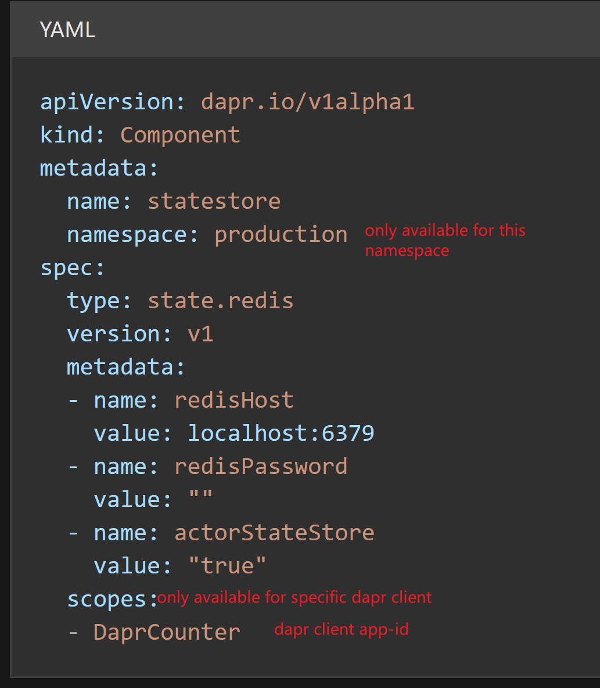
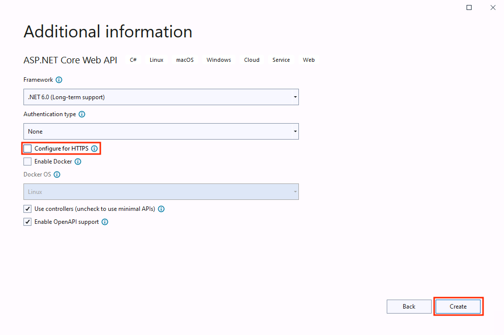

# 组件配置

> 治理留痕（2026-09-30）：原 `Dapr/命名空间.md` 全文并入本文件"可访问性"一节（同主题去重合并），源文件已 `git rm`；"HTTPS"一节空 alt 图片已补描述。

## 可访问性

`Dapr` 有自己一套命名空间机制。

当使用 `K8S` 方式部署时，微服务的命名空间采用的就是`K8S`的命名空间。

而组件的命名空间，实际上是可以配置为全局访问的，即绕过`K8S`命名空间限制，将组件公布给`Dapr`下所有微服务。

A namespaced component is only accessible to applications running in the same namespace. If your Dapr application fails to load a component, make sure that the application namespace matches the component namespace. This can be especially tricky in self-hosted mode where the application namespace is stored in a NAMESPACE environment variable.



将组件配置为全局访问（`metadata` 中不指定 `namespace` 限制）的示例：

[操作：配置具有多个命名空间的 Pub/Sub 组件 | Dapr 文档库](https://docs.dapr.io/zh-hans/operations/components/setup-pubsub/pubsub-namespaces/)

```yaml
apiVersion: dapr.io/v1alpha1
kind: Component
metadata:
  name: pubsub # 这里删掉了namespace限制，可以应用使得全局使用
spec:
  type: pubsub.redis
  version: v1
  metadata:
  - name: "redisHost"
    value: "redis-master.namespace-a.svc:6379"
  - name: "redisPassword"
    value: "YOUR_PASSWORD"
```

## HTTPS



If you leave the Configure for HTTPS checkbox checked, the generated ASP.NET Core API project includes middleware to redirect client requests to the HTTPS endpoint. This breaks communication between the Dapr sidecar and your application, unless you explicitly configure the use of HTTPS when running your Dapr application. To enable the Dapr sidecar to communicate over HTTPS, include the `--app-ssl` flag in the Dapr command to start the application. Also specify the HTTPS port using the `--app-port` parameter. The remainder of this walkthrough uses plain HTTP communication between the sidecar and the application, and requires you to clear the Configure for HTTPS checkbox.

## 状态存储

Care must be taken to always pass an explicit app-id parameter when consuming the state management building block. The block uses the application id value as a prefix for its state key for each key/value pair. If the application id changes, you can no longer access the previously stored state.
