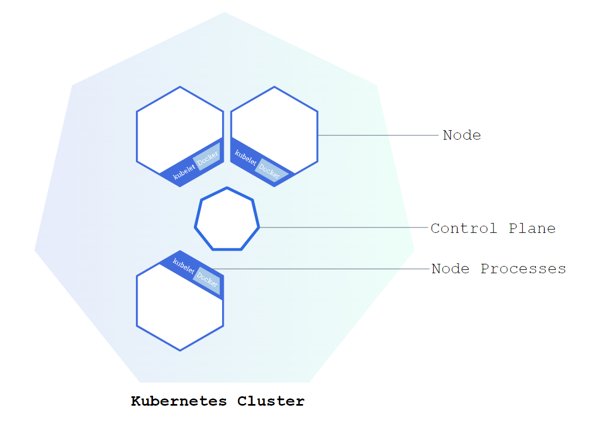
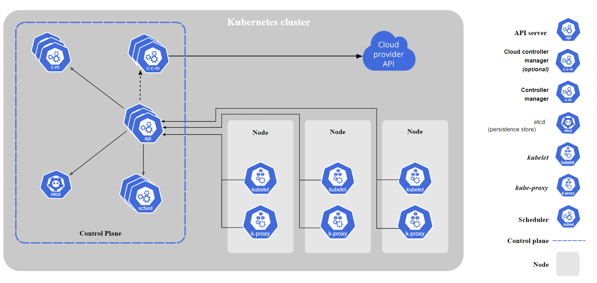

# Kubernetes 概述

> 治理留痕（2026-09-30）：本文件由原 `概述.md` 全文 + `Node.md`（节点架构章节）+ `命令.md`（kubectl 命令表）合并而成，后两者已 `git rm`。合并时修正 `Node.md` 两处事实错误：
> ① `Master Node` "实际上就是 `Control Panel`" → `Control Plane`；
> ② `Kubelet` 职责由"调度 `Pod`，以及提供接口"修正为"节点代理：确保容器按 `PodSpec` 运行（调度决策由 `Scheduler` 负责）"。

`Kubernetes`（编排工具）用于容器编排。

部署一个 `Kubernetes`，实际上就是部署了一个 `Cluster`。

`Kubernetes` 每个实例是以 `Cluster` 为单位的。每个 `Work Node`（`VM` 或物理机）中有 `Kubelet`，即一个 `agent`，由 `Control Plane` 进行中心化调度管理（由 `Master Node` 组成）。

用户可以通过 `Kubectl`（`Kubernetes Client`），通过它调用 `Kubernetes` 的 `API` 进行管理。

一个 `k8s` 集群，可以通过 `namespace` 区分区域。

## 节点架构

一个 `Node` 即一个 `VM` 或物理机，分为 `Work Node` 和 `Master Node`。

### Work Node

一个 `Work Node` 至少需要运行：

#### Container Runtime

如 `Docker`，用以运行容器实例，即 `Pod`。

#### Kubelet

节点代理：确保容器按 `PodSpec` 运行（调度决策由 `Scheduler` 负责），以及提供接口。

#### Kube Proxy

用于代理，转发来自各个 `Service` 的 `Request` 到各个对应的 `Pod` 中去。

### Master Node

实际上就是 `Control Plane`。

一个 `Master Node` 至少要运行：

#### Api server

用于用户通过 `Kubernetes Client`（如 `K8S dashboard` 或 `Kubectl`）进行 `Cluster` 的管理，其实就是 `Cluster` 的 `API Gateway`。

#### Scheduler

资源调度中心，可以根据资源情况、环境，决定新的 `Node`、`Pod` 该如何安排。

#### Controller manager

监测 `Pod` 的状态，提醒 `Scheduler` 进行恢复等。

#### etcd

是一个 `Key-value store` 服务，用于存储 `Cluster` 的状态，是整个 `k8s Cluster` 的大脑。

## Kubectl

| Command  | Function        | Remark                                                                               |
|----------|-----------------|--------------------------------------------------------------------------------------|
| get pods | 获取k8s集群pods | --namespace 指定获取某个名称空间的k8s集群pods  不指定默认是获取default命名空间的pods |
