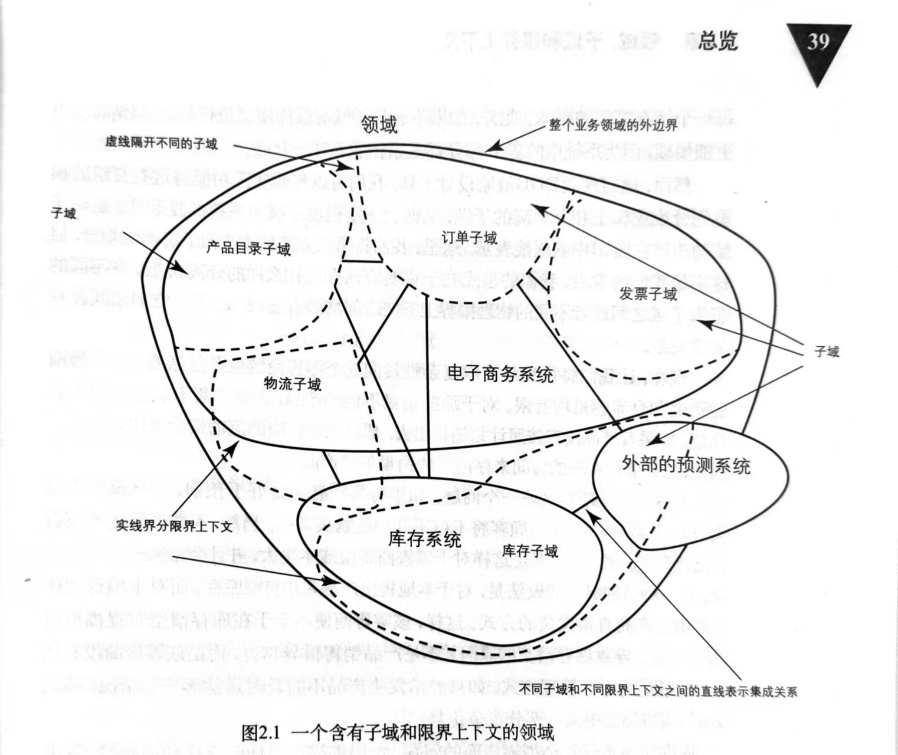
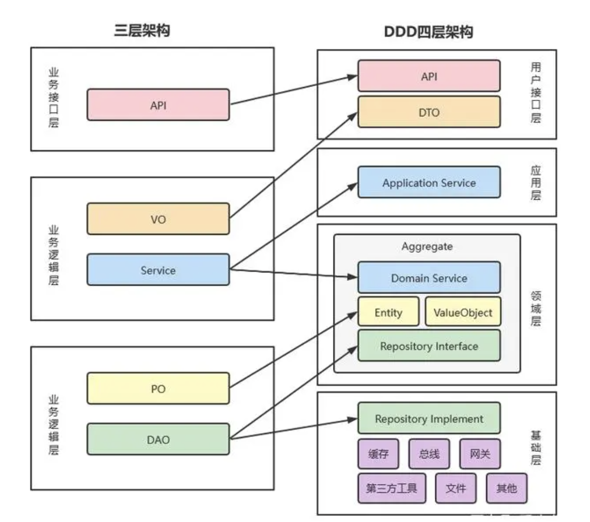

# DDD基础

## `DDD` 是什么

`DDD` 是 `Domain-Driven Design`，即领域驱动设计，是一套面向复杂软件系统分析与设计的建模方法论。

参考链接：

[DDD 相关文章 - CSDN](https://blog.csdn.net/lq0954/article/details/114996971)

可以把它理解为：面向业务领域的 `OOP`。它通过对业务进行抽象建模，明确对象之间的关系、职责与边界，也是微服务划分和业务架构设计的重要指导思想。

## 领域与子域

领域可以理解为整个业务系统的问题空间。一个领域通常会继续划分为多个子域，而子域又常按重要性和职责划分为：

1. 核心子域
2. 支撑子域
3. 通用子域

### 核心子域

核心业务能力所在的子域，通常是系统的竞争力来源。

### 支撑子域

支撑其他子域实现自身能力的子域，往往会被依赖。

### 通用子域

很多系统都需要的通用能力，例如身份认证、权限控制等。这类能力往往可以复用成熟方案。

## 子域与限界上下文

领域是业务上的抽象概念，而限界上下文（`Bounded Context`）更偏技术实现。

原稿中的例子是一个零售系统，可以包含：

1. 电子商务系统
2. 库存系统
3. 外部预测系统

如果没有经过 `DDD` 设计，子域和限界上下文之间的映射关系通常会很混乱。



一个较好的 `DDD` 设计，应该尽量让子域划分与限界上下文边界趋于一致。

## 术语

### 业务领域术语

| 名词 | 英文 | 备注 |
| --- | --- | --- |
| 领域 | `Domain` | 一个完整业务系统的问题空间，内部可继续划分多个子域 |
| 领域模型 | `Domain Model` | 对领域中业务对象、关系与行为的抽象建模 |
| 核心子域 | `Core Sub-domain` | 核心业务能力所在子域 |
| 支撑子域 | `Support Sub-domain` | 支撑其他子域工作的子域 |
| 通用子域 | `Generic Sub-domain` | 许多系统都会用到的通用能力子域 |
| 通用语言 | `Ubiquitous Language` | 领域专家、开发者、分析师共同使用的一套业务语言 |
| 领域事件 | `Domain Event` | 领域中发生过的重要业务事实，通常用“名词 + 过去分词动词”命名 |

### 技术领域术语

| 名词 | 英文 | 备注 |
| --- | --- | --- |
| 限界上下文 | `Bounded Context` | 技术实现上的边界，通常可对应一个工程、一个模块或一组服务 |
| 实体 | `Entity` | 以身份标识定义、可修改、常需要持久化的对象 |
| 值对象 | `Value Object` | 无身份标识、不可变、强调值语义的对象 |
| 聚合 | `Aggregate` | 在同一限界上下文中由实体和值对象组成的一致性边界 |
| 聚合根 | `Aggregate Root` | 聚合的访问入口，必定也是实体 |
| 充血模型 | `Rich Domain Model` | 既包含状态又包含行为的领域模型 |
| 贫血模型 | `Anemic Domain Model` | 只有属性、缺少行为的模型，通常不适合承载领域逻辑 |
| 应用服务 | `Application Service` | 位于应用层，负责协调流程，不承载核心业务规则 |
| 领域服务 | `Domain Service` | 位于领域层，承载不适合放进实体或值对象中的业务逻辑 |

## 战略设计与战术设计

### 战略设计（`Strategic Design`）

战略设计关注：

1. 划分领域
2. 划分子域
3. 划分限界上下文
4. 明确上下文之间的关系

它解决的是全局边界和团队协作问题。

### 战术设计（`Tactical Design`）

战术设计关注：

1. 如何定义领域模型
2. 如何组织实体、值对象、聚合
3. 如何在单个限界上下文内表达规则

它解决的是单个上下文内部如何精确建模的问题。

## 通用语言

领域专家与开发人员应该建立并持续使用通用语言进行沟通。

通用语言可以表现为：

1. 一组稳定术语
2. 一套业务流程描述
3. 一个简单的用例场景

如果团队没有共享语言，模型边界和代码命名就会持续漂移。

## 领域事件

领域事件表示领域中已经发生的事情，通常使用“名词 + 过去分词动词”的形式命名，例如：

```txt
UserPasswordChanged
```

## 应用服务与领域服务

### 应用服务

应用服务位于 `DDD` 分层架构的应用层，通常具备以下特征：

1. 无状态
2. 面向外部调用
3. 协调资源库、聚合、值对象、领域服务
4. 不承载具体业务规则

它负责组织流程，而不是表达业务本身。

### 领域服务

领域服务位于领域层，也通常是无状态的，但它与应用服务不同：

1. 领域服务承载真正的业务逻辑
2. 它用于处理不适合放进实体或值对象的方法
3. 不应把所有逻辑都堆到领域服务，否则模型会退化成贫血模型

## 模型种类

### `POCO`

`POCO` 是 `Plain Old CLR Object`，即简单的 `C#` 对象。

典型特点：

1. 只有公开属性或字段
2. 通常不继承复杂框架基类
3. 通常不实现额外接口
4. 常用于序列化和 `DTO`

原稿中的定义强调：`POCO` 的价值在于简单和灵活。它本质上只是普通的 `C#` 对象，但可以根据需要演变成不同用途的对象。

### 由 `POCO` 扩展出的常见模型

1. 加入持久化行为后，可演化为 `PO`（`Persistent Object`）
2. 加入数据绑定能力后，可演化为 `View Object` 或 `UI Model`
3. 加入业务行为后，可演化为 `Domain Model`
4. 保持纯数据结构时，也可以作为 `DTO`


