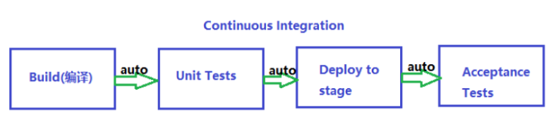
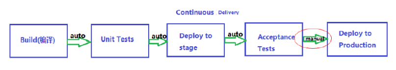
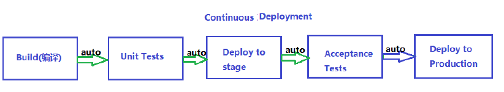

# 交付流程与软件工程

## 新模式（云原生）

参考链接：

[云原生架构模式详解 - CSDN博客](https://blog.csdn.net/u010099177/article/details/125378140)

### `CQRS`

`CQRS` 是 `Command Query Responsibility Segregation`，即命令查询职责分离。

原稿里给出的直观理解是：读写分离。

### `Scheduler Agent Supervisor Pattern`

原稿仅列出了该模式名称，未展开说明。可以暂时将其视为一种“调度者负责协调、代理负责执行、主管负责监督”的多角色协作模式，后续适合单独补充。

## 软件自动化交付周期

### 持续集成（`Continuous Integration`, `CI`）

持续集成强调开发人员频繁地将代码集成到主干，并尽快通过自动化构建与测试发现问题。



### 持续交付（`Continuous Delivery`, `CD`）

持续交付强调：软件始终保持在“可以发布”的状态，但是否真正部署到生产环境，仍然可以由人工控制。

原稿中的英文定义如下：

```txt
Continuous delivery is the ability to deliver software that can be deployed at any time through manual releases; this is in contrast to continuous deployment which uses automated deployments.
```



### 持续部署（`Continuous Deployment`, `CD`）

持续部署是在持续交付的基础上，进一步把部署到生产环境这一步也自动化。



## 软件工程

### 软件版本

常见版本号说明：

1. `Alpha`：内部测试版本，通常有较多 `Bug`
2. `Beta`：公开测试版本，新功能较多，也可能存在较多问题
3. `Gamma`：接近成熟的版本，只需少量改进即可发行
4. `RC`（`Release Candidate`）：候选发布版本，通常不再加入新功能
5. `RTM`（`Release To Manufacturing`）：交付生产线的版本
6. `GA`（`General Availability`）或 `Golden Master`：正式发布版本
7. `RTL`（`Retail`）：零售版本

一个常见成熟度顺序是：

```txt
Alpha < Beta < Gamma < RC < RTM < GA = RTL
```

补充：

1. `RVL` 并不是标准版本名称，很多时候只是民间传播中的说法。
2. `EVAL` 通常表示评估版。

## 修订说明

1. 将持续集成中的 `Continuous integration` 统一规范为 `Continuous Integration`。
2. 将 `GA` 解释修正为更常见的 `General Availability`，同时保留原稿里“正式发布版本”的语义。
