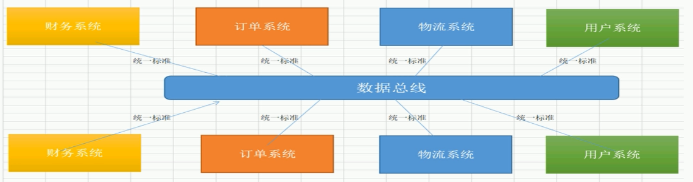
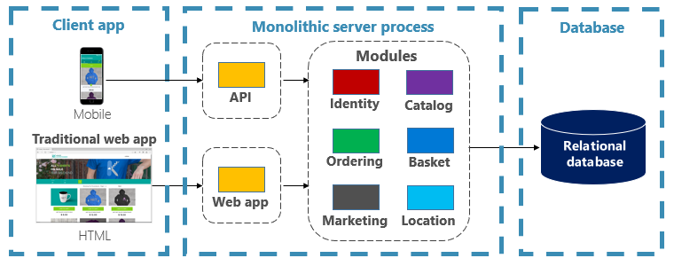
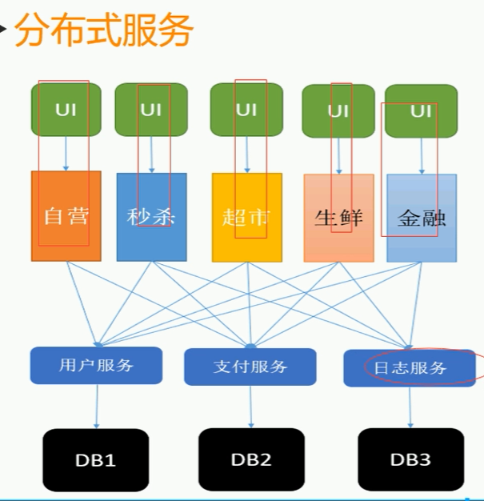
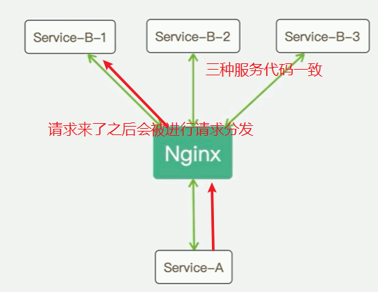
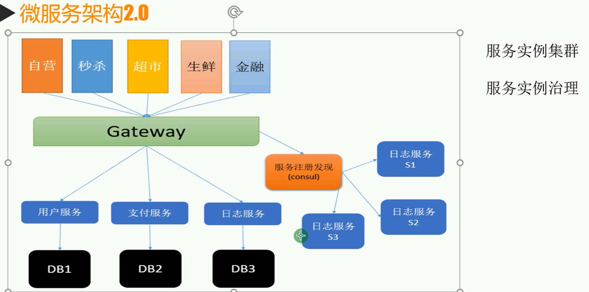
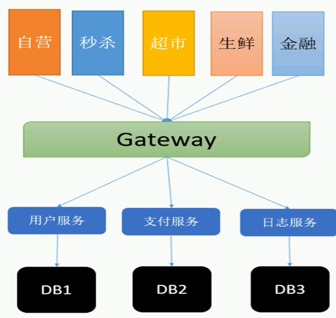

# 微服务与分布式架构

## `SOA`

`SOA` 是 `Service-Oriented Architecture`，即面向服务架构。

它是一种组件模型，通过定义良好的接口和协议，把应用程序拆分成多个可复用服务，并借助统一的中介进行交互。

## 微服务架构

### 单体架构

单体架构（`Monolithic`）通常指整个应用就是一个项目，整体在一个进程里运行。

优点：

1. 开发和部署相对简单
2. 集中管理方便
3. 没有分布式带来的额外网络损耗

缺点：

1. 难维护
2. 升级困难
3. 无法快速独立迭代

### 微服务的目标

微服务强调把系统拆成一组可独立部署、独立运行、独立开发、独立维护的服务，以增强隔离性和可扩展性。

分布式架构虽然带来了灵活性，但也引入了额外代价，例如：

1. 数据一致性
2. 网络通信开销
3. 服务治理复杂度
4. 运维复杂度

### 践行微服务时的典型问题

#### 进程间通信

常见方式包括：

1. 共享存储：如 `Redis`、数据库、队列、文件
2. 服务通信：如 `WebService`、`WCF`、`WebAPI`
3. `RPC`：如 `gRPC`

特点说明：

1. 共享存储门槛较低，但偏被动式通信。
2. 服务通信偏主动触发，适合跨平台、跨语言场景。
3. `gRPC` 是高性能、通用的 `RPC` 框架，基于 `HTTP/2`。

#### 服务实例集群

如果单个服务只部署在一个节点上，可能因为访问压力过大而成为单点故障。因此需要：

1. 集群部署
2. 负载均衡
3. 可扩展伸缩
4. 高可用

`Nginx` 可以承担请求分发与负载均衡职责。

但仅靠 `Nginx` 仍然不够，因为它本身不擅长解决：

1. 动态服务注册与发现
2. 实例增减时的自动感知
3. 健康检查与自动摘除故障实例

这些问题通常需要配合注册中心和服务治理组件，例如 `Consul`。

#### 网关（`Gateway`）

在微服务架构演进中，客户端不应直接面对大量服务地址，因此需要一个统一入口。

网关的作用通常包括：

1. 提供统一访问入口
2. 屏蔽后端服务地址变化
3. 聚合服务，减少请求次数
4. 提供鉴权、授权、过滤、流控等统一能力

常见服务治理能力：

1. 缓存
2. 熔断
3. 限流
4. 降级

网关本身也应该具备集群能力，以避免成为单点故障。

### 微服务与经典分层

可以把微服务理解为：将过去三层架构里比较集中的业务逻辑能力拆分为多个独立服务，由进程内调用演变为跨进程服务调用。

这类对外统一封装的思路，也和 `Façade` 模式有相通之处。

补充：

在 `.NET` 中，三层架构通常指：

1. 表现层（`UI`）
2. 业务逻辑层（`BLL`）
3. 数据访问层（`DAL`）
4. 实体类库（`Model`）

## 修订说明

1. 将原文中的 `http` 统一规范为 `HTTP`。
2. 将“网关 `Gateway`”补充为标准术语形式，便于和其他架构概念并列理解。
