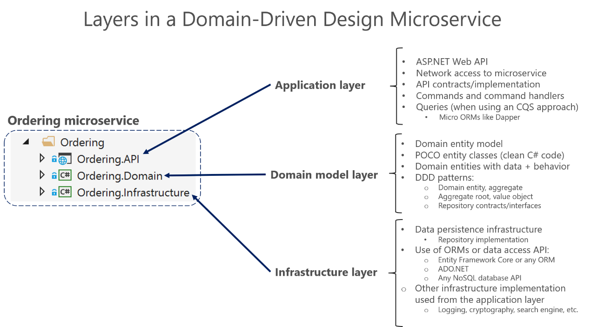
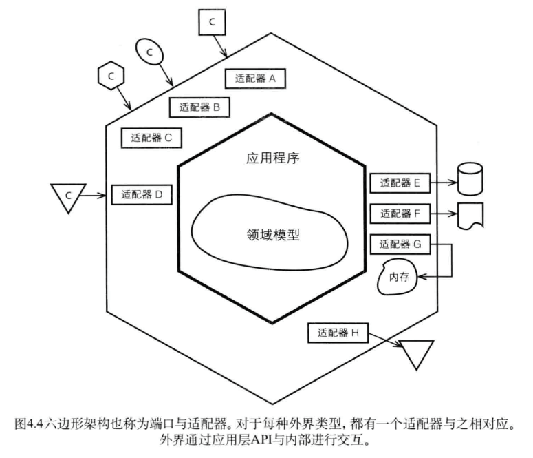
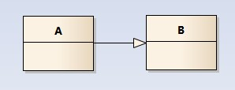
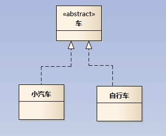
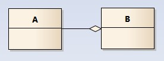
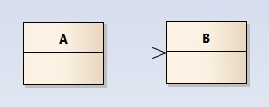
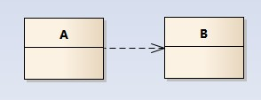

# 架构模式与UML

## 项目结构

## 六边形架构（端口与适配器）

六边形架构（`Hexagonal Architecture`）又常被称为“端口与适配器架构”。

核心思想是：

1. 内部系统保持统一的领域模型
2. 外部系统通过适配器接入
3. 外部变化不直接侵入内部业务模型

### 结构划分

六边形架构把系统分成内层和外层：

1. 内层：领域层，承载业务逻辑与规则
2. 外层：适配层，负责输入输出、协议转换与技术对接

领域层不应该直接依赖具体技术实现，例如：

1. `HTTP`
2. `gRPC`
3. 消息队列
4. 分布式缓存
5. 数据库访问细节

### 适配器类型

适配层通常可分为两类：

1. 驱动侧适配器：接收外部输入并传入领域层
2. 从动侧适配器：接收领域层输出并访问外部系统

内部通过端口与外部通信，端口代表统一协议。不同外部系统则通过各自的适配器完成协议转换。

### 带来的好处

1. 独立于框架
2. 可测试
3. 独立于 `UI`
4. 独立于数据库
5. 独立于外部机构

参考链接：

[The Clean Architecture](https://blog.cleancoder.com/uncle-bob/2012/08/13/the-clean-architecture.html)

## 事件源（`Event Sourcing`）

事件源的核心思想是：通过记录领域对象发生过的所有事件，而不是只存最终状态，来追溯和重建聚合。

典型特征：

1. 每次命令操作至少发布一个领域事件
2. 事件会存储到 `Event Store`
3. 重建聚合时通过重放事件得到最新状态
4. 事件顺序与时间轴一致

原稿中提到，航班追溯日志的设计思路与此类似。

## `CQRS`

`CQRS` 是 `Command Query Responsibility Segregation`，即命令查询职责分离。

在原稿中的表达很直接：对聚合、实体的修改称命令方法，查询称查询方法。

它的核心思想可以概括为：

1. 写模型负责命令
2. 读模型负责查询
3. 读写职责可以分离

## 长时处理过程（`Long-Running Process` / `Saga Pattern`）

`Saga` 是一种在分布式事务场景中管理跨微服务数据一致性的方法。

核心思路：

1. 一个业务流程被拆成多个本地事务
2. 每一步完成后发布消息或事件触发下一步
3. 如果中途失败，则执行补偿事务抵消前面的影响

## `UML`

统一建模语言（`Unified Modeling Language`）是描述系统结构与行为的通用建模语言。

### `UML` 五种视图

| 视图 | 定义 |
| --- | --- |
| 用例视图 | 从外部参与者角度描述系统功能 |
| 逻辑视图 | 从静态结构和动态行为角度描述系统实现 |
| 组件视图 | 描述代码组件的组织结构 |
| 并发视图 | 描述并发系统中的通信与同步 |
| 配置视图 | 描述系统的物理部署结构 |

## 类图中的常见关系

### 泛化关系（`Generalization`）

泛化关系表示继承关系，通常用带空心三角箭头的实线表示，箭头指向父类。

在代码中通常表现为：继承非抽象类。

### 实现关系（`Realization`）

实现关系通常用带空心三角箭头的虚线表示。

在代码中通常表现为：实现接口或继承抽象类型。

### 聚合关系（`Aggregation`）

聚合关系通常用带空心菱形的实线表示，表达“整体由部分组成，但部分可独立存在”。

例如：一个部门由多个员工组成，但部门撤销后员工仍然存在。

### 组合关系（`Composition`）

组合关系通常用带实心菱形的实线表示，表达“整体与部分强依赖共生”。

例如：公司由多个部门组成，公司不存在时，部门也失去意义。

### 关联关系（`Association`）

关联关系描述对象之间稳定的结构性关系，默认不强调方向。

代码里往往体现为成员变量持有另一个对象。

### 依赖关系（`Dependency`）

依赖关系表示对象在运行过程中临时使用另一个对象。

它与关联关系的区别在于：

1. 依赖更临时
2. 方向更明显
3. 通常体现在方法参数、局部变量或构造注入中

原稿中的关键提醒是：应该尽量保持单向依赖，避免双向依赖。

### 时序图（`Sequence Diagram`）

时序图按时间顺序描述对象之间的消息交互。

常见建模元素包括：

1. 对象（`Actor`）
2. 生命线（`Lifeline`）
3. 控制焦点（`Focus of Control`）
4. 消息（`Message`）
