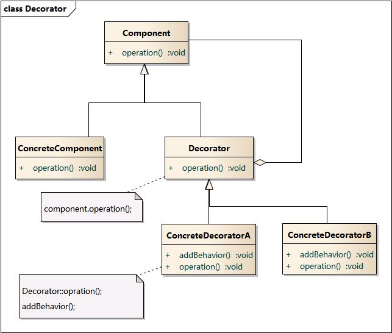

# 设计模式

## 创建型模式（`Creational Pattern`）

创建型模式强调把对象的创建过程与使用过程分离，让调用方不必关心具体创建细节。

### 简单工厂模式（`Simple Factory Pattern`）

简单工厂通常通过一个静态方法，根据传入参数返回不同产品的抽象父类实例。

优点：

1. 使用简单
2. 屏蔽对象创建细节

缺点：

1. 新增产品时通常要修改工厂方法
2. 不符合开闭原则

### 工厂方法模式（`Factory Method Pattern`）

工厂方法模式是简单工厂的改进版本。

核心思想：

1. 抽象出工厂接口
2. 每种产品对应各自的具体工厂
3. 对象创建由具体工厂负责

它比简单工厂更符合开闭原则。

#### 为什么不直接 `new` 对象

原稿中的要点可以整理为：

1. 框架或 `SDK` 不希望向客户端暴露具体实例创建过程
2. 希望把实例化策略集中管理
3. 如果后续要切换成单例或其他创建方式，只需修改工厂，而不必改动所有调用点

### 抽象工厂模式（`Abstract Factory`）

抽象工厂适用于一组有关联的产品族。

原稿中的例子是“手机”和“电脑”两类产品，每类产品又有“苹果”和“安卓”等不同品牌。此时如果继续用工厂方法，会出现大量工厂类。

抽象工厂的核心是：

1. 工厂面向产品族，而不是单个产品
2. 一个具体工厂可以同时生产同一品牌下的多类产品

它的典型权衡是：

1. 增加新产品类别相对容易
2. 增加新产品族往往需要修改更多地方

### 建造者模式（`Builder Pattern`）

建造者模式适用于对象构建过程复杂、需要分步骤组装的场景。

典型角色包括：

1. `Director`
2. `Builder`
3. `ConcreteBuilder`

`Director` 负责组织构建过程，`Builder` 与 `ConcreteBuilder` 负责构建各部分。

原稿中还提到，当构建方式只有一种时，`Director` 和 `Builder` 可以合并为一个更简化的构建器。

### 单例模式（`Singleton Pattern`）

单例模式对外只暴露同一个实例。

相比静态类，它的优势在于：

1. 仍然保持面向对象调用形式
2. 以后可以平滑切换成非单例
3. 更容易配合接口、多态和继承

## 结构型模式（`Structural Pattern`）

结构型模式关注如何把类或对象组合起来形成更大结构。

### 适配器模式（`Adapter Pattern`）

适配器模式把旧接口适配成新接口，使双方无需改动即可协同工作。

典型角色：

1. `Target`
2. `Adapter`
3. `Adaptee`

本质上是：通过 `Adapter` 把旧接口包装成符合新接口约定的对象。

### 桥接模式（`Bridge Pattern`）

桥接模式强调把两个可独立变化的维度拆开，再通过组合连接。

原稿中的例子是“形状”和“颜色”：

1. 形状可以独立扩展
2. 颜色也可以独立扩展
3. 二者通过桥接组合，而不是为每种组合都创建一个子类

### 装饰模式（`Decorator Pattern`）

装饰模式通过层层包装的方式，在不修改原对象的前提下动态附加能力。

它常被视为实现 `AOP` 思想的一种手段。

典型结构：

1. 抽象组件 `Component`
2. 装饰器 `Decorator`
3. 装饰器内部继续持有 `Component`

这样就可以多次嵌套装饰。

### 门面模式（`Façade Pattern`）

门面模式为多个子系统提供一个统一入口，降低客户端对多个子系统的耦合。

当客户端只关心“完成一个整体能力”时，它不需要了解多个子系统如何协作，只依赖门面类即可。

### 享元模式（`Flyweight Pattern`）

享元模式通过共享相似或相同对象，减少重复创建带来的资源浪费。

典型特征：

1. 有享元池
2. 有共享对象复用机制
3. 常用于对象数量很大、可共享部分较多的场景

### 代理模式（`Proxy Pattern`）

代理模式在目标类前增加一个代理层，由代理类间接调用目标类。

常见作用：

1. 权限控制
2. 延迟加载
3. 访问控制
4. 降低客户端对目标类的直接耦合

## 行为型模式（`Behavioral Pattern`）

行为型模式关注对象之间如何协作与交互。

### 命令模式（`Command Pattern`）

命令模式把请求封装成对象，从而把请求发起方和请求接收方解耦。

### 中介者模式（`Mediator Pattern`）

中介者模式通过一个中介对象协调多个对象之间的协作，避免对象间形成复杂网状依赖。

参考链接：

1. [MediatR GitHub 项目](https://github.com/jbogard/MediatR)
2. [Why Do We Need MediatR? - CodeProject](https://www.codeproject.com/Articles/5317666/Why-Do-We-Need-MediatR)

### 观察者模式（`Observer Pattern`）

观察者模式中，一个对象状态变化后会通知观察者。

原稿中的典型例子是 `MVVM`：`ViewModel` 改变后，`View` 会随之更新。

参考链接：

[Observer design pattern - .NET | Microsoft Learn](https://learn.microsoft.com/en-us/dotnet/standard/events/observer-design-pattern)

补充：

订阅-发布模式可以视为观察者模式的变种。它通过中间件解耦发布者与订阅者，而经典观察者模式里双方通常彼此感知。

### 状态模式（`State Pattern`）

状态模式把对象在不同状态下的不同行为封装起来，使对象行为随着状态改变而改变。

### 策略模式（`Strategy Pattern`）

策略模式把同一种能力的不同算法实现封装成可替换策略，并在运行时按需要选择。

原稿中的例子是请求限流器，可以在令牌桶和漏桶算法之间切换。
