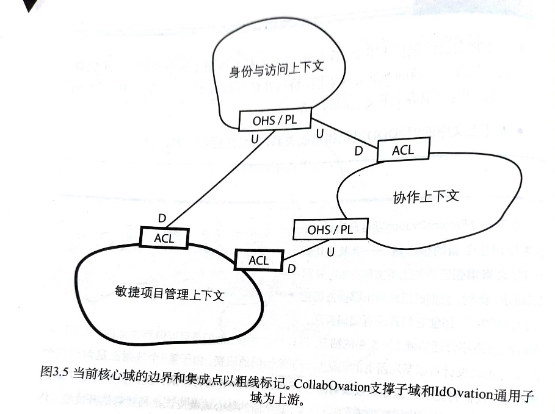

# 限界上下文与领域模型

## 限界上下文

限界上下文（`Bounded Context`）是技术上的边界划分，用来落实业务上的领域划分。

可以把它理解为：

1. 一个工程项目
2. 一个模块边界
3. 一组高内聚的服务边界

在原稿里，限界上下文内部的空间被称为“解决方案空间”（`solution space`），而领域本身对应的是“问题空间”（`problem space`）。

## 上下文映射

### 常见术语

| 中文 | 英文 | 备注 |
| --- | --- | --- |
| 另谋他路 | `Separate Way` | 如果两个上下文能完全解耦，就不要引入共享内核 |
| 上下文映射图 | `Context Mapping Diagram` | 对多个限界上下文及其关系的结构化描述 |
| 上游 / 下游 | `Upstream` / `Downstream` | 下游依赖上游 |
| 开放主机服务 | `Open Host Service`, `OHS` | 为其他上下文公开的一套协议，可理解为 `API` |
| 发布语言 | `Published Language`, `PL` | 在不同上下文之间传递信息时采用的共享表达形式，可理解为 `DTO` |
| 防腐层 | `Anticorruption Layer`, `ACL` | 两个上下文之间的翻译层，防止外部模型污染本上下文 |
| 共享内核 | `Shared Kernel`, `SK` | 多个上下文共享的少量稳定模型或代码 |
| 大泥球 | `Big Ball of Mud` | 难以划分、结构混乱的遗留系统 |
| 合作关系 | `Partnership` | 两个上下文共同成功或失败，协调成本高 |
| 客户方-供应方开发 | `Customer Supplier Development` | 上游为下游提供面向其需求的接口 |
| 遵奉者 | `Conformist` | 下游直接接受并依赖上游模型 |

### 上下文映射图



参考工具：

[ContextMapper](https://contextmapper.org/docs/)

## 模块

模块可以简单理解为项目内进一步细分的命名空间或逻辑分区，例如：

```txt
CustomService.Domain.Model
CustomService.Infrastructure
```

## 实体（`Entity`）

英文定义：

```txt
An object primarily defined by its identity is called an Entity.
```

实体通常具备以下特征：

1. 通过身份标识定义，而不是通过值定义
2. 通常需要持久化
3. 可以被修改
4. 维护成本通常高于值对象

原稿中的关键提醒：

1. 同一种业务概念可能在不同限界上下文中表现为不同实体模型。
2. 同一实体跨上下文时，不应默认共享完整对象模型，而应通过事件、标识或视图模型解耦。

例如一个航班领域和告警领域都可能出现“告警”概念，但二者承担的职责不同。此时更合理的做法通常是通过 `GUID`、事件或视图投影建立联系，而不是跨上下文直接共享完整实体。

## 值对象（`Value Object`）

值对象没有身份标识，更强调不可变和值语义。

典型特征：

1. 不需要进行身份追踪
2. 构造完成后通常不可修改
3. 方法通常只接收值对象或值类型
4. 结果通常也是值对象或值类型

示例：

```txt
this.Name = new Name("xx")
```

修改值对象时，通常是整体替换成新的值对象，而不是原地修改。

## 聚合（`Aggregate`）

聚合是同一个限界上下文内，由实体和值对象组合而成的一致性边界。

### 聚合根

聚合根是聚合的根部，必定也是实体，并且外部通常通过聚合根访问聚合内部对象。

### 聚合设计原则

1. 聚合尽量保持小而清晰
2. 不要在一个事务中修改多个聚合实例
3. 可以通过标识值对象引用其他聚合，而不是直接持有对象引用
4. 聚合内部命令方法负责维护一致性边界

如果聚合设计过大，会更容易引发：

1. 并发冲突
2. 一致性边界过重
3. 修改范围过大

原稿中给出的建议是：尽量通过最终一致性等手段，避免把多个聚合绑进同一个事务。

## 基本原则

尽量避免在聚合内部直接使用资源库。

例如一个统计方法如果需要查询资源库，再基于一组实体计算 `Priority` 值对象，这类逻辑通常更适合落在领域服务中，而不是直接塞进聚合类。
