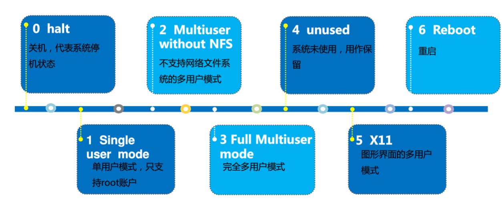
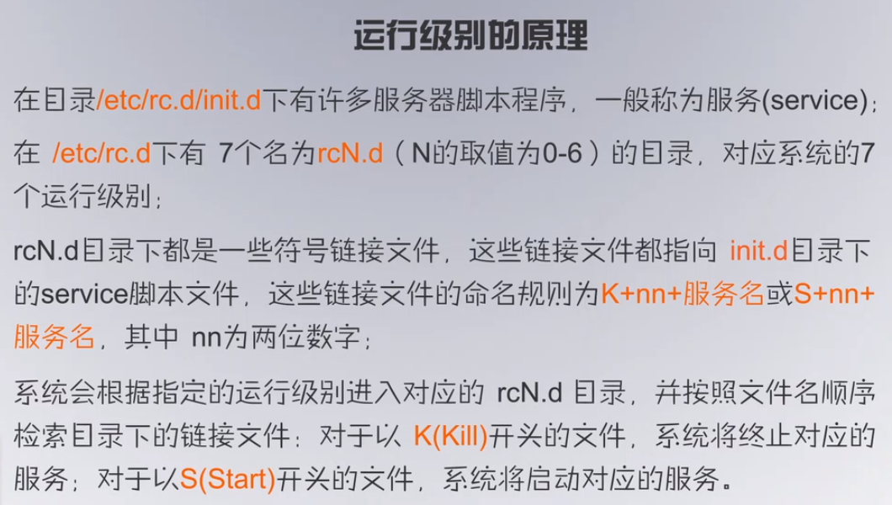

# Linux 命令速查

| 命令                                           | 全称（辅助记忆）                                                                              | 作用                                                                                      | 选项                                                                                                                                                                                                                                                                                                                                                                                                                                                                                                                                                                                                                                                                                                                                                                                                         |
| -------------------------------------------- | ------------------------------------------------------------------------------------- | --------------------------------------------------------------------------------------- | ---------------------------------------------------------------------------------------------------------------------------------------------------------------------------------------------------------------------------------------------------------------------------------------------------------------------------------------------------------------------------------------------------------------------------------------------------------------------------------------------------------------------------------------------------------------------------------------------------------------------------------------------------------------------------------------------------------------------------------------------------------------------------------------------------------- |
| 文件操作                                         |                                                                                       |                                                                                         |                                                                                                                                                                                                                                                                                                                                                                                                                                                                                                                                                                                                                                                                                                                                                                                                            |
| lsof                                         | List Open Files                                                                       | 系统级的监控、诊断工具，列出符合条件的进程信息                                                                 | `lsof /path/file` 列出谁在访问该文件<br />`lsof -i :80` 列出使用了 80 端口的进程                                                                                                                                                                                                                                                                                                                                                                                                                                                                                                                                                                                                                                                                                                                                              |
| pandoc                                       |                                                                                       | 文档文件转换                                                                                  | pandoc -f docx -t markdown foo.docx -o foo.markdown --extract-media=./ 转换doc为markdown格式文件，并将所有图片等媒体文件打包到media文件夹                                                                                                                                                                                                                                                                                                                                                                                                                                                                                                                                                                                                                                                                                           |
| which                                        |                                                                                       | 用于查找命令/可执行文件所在的路径。                                                                      | locate a command，从环境变量PATH中，定位/返回与指定名字相匹配的可执行文件所在的路径 有时候可能在多个路径下存在相同的命令，该命令可用于查找当前所执行的命令到底是哪一个位置处的命令                                                                                                                                                                                                                                                                                                                                                                                                                                                                                                                                                                                                                                                                                                       |
| whereis                                      |                                                                                       | locate the binary, source, and manual page files for a command.                         | 定位/返回与指定名字匹配的二进制文件、源文件和帮助手册文件所在的路径。 whereis命令首先会去掉filename中的前缀空格和以.开头的任何字符，然后再在数据库（var/lib/slocate/slocate.db）中查找与上述处理后的filename相匹配的二进 制文件、源文件和帮助手册文件,使用之前可以使用updatedb命令手动更新数据库                                                                                                                                                                                                                                                                                                                                                                                                                                                                                                                                                                                                                            |
| cp                                           | copy                                                                                  | 复制文件                                                                                    | -a：此选项通常在复制目录时使用，它保留链接、文件属性，并复制目录下的所有内容。其作用等于dpR参数组合。 -d：复制时保留链接。这里所说的链接相当于Windows系统中的快捷方式。 -f：覆盖已经存在的目标文件而不给出提示。 -i：与-f选项相反，在覆盖目标文件之前给出提示，要求用户确认是否覆盖，回答"y"时目标文件将被覆盖。 -p：除复制文件的内容外，还把修改时间和访问权限也复制到新文件中。 -r：若给出的源文件是一个目录文件，此时将复制该目录下所有的子目录和文件。 -l：不复制文件，只是生成链接文件。                                                                                                                                                                                                                                                                                                                                                                                                                                                                                                                                           |
| ls                                           | list                                                                                  | 列出目录文件信息                                                                                | -a all -l long 开头第一个字符是文件类型，之后才是权限，默认显示的是字节为单位的大小 -R 递归 -i 查看文件inode信息 -S 以文件大小排序 -h 会根据文件的大小选择显示的单位是“K”、“M”还是“G”。如果希望指定显示的单位，可以使用--block-size M等。                                                                                                                                                                                                                                                                                                                                                                                                                                                                                                                                                                                                                                                         |
| du                                           | disk usage                                                                            | 列出文件夹磁盘占用大小                                                                             | -h 以单位显示 --max-depth：表示要查看几层目录, 也可以用 -d 1表示查看1层目录  sort -r：反向显示 sort -h：compare human readable numbers (e.g., 2k 1G) 1. 在有些情况下，du -h不能显示所有的文件，例如iso文件，通用的方法为 du -h \* \| sort -hr 2. du -sh . 表示查看当前目录总占用空间 3. du -h -d 2 \| sort -hr 命令最好配合使用du -sh查看完某个目录大小后，再进入到某个目录查看内部文件大小，否则文件太多会很慢。                                                                                                                                                                                                                                                                                                                                                                                                                                                                                                                 |
| rm                                           | remove                                                                                | 删除                                                                                      | -r 递归删除 能删除目录下文件 -f 强制删除 rm -rf \* 删除当前目录下所有文件                                                                                                                                                                                                                                                                                                                                                                                                                                                                                                                                                                                                                                                                                                                                                             |
| find                                         |                                                                                       | 在指定目录下查找文件                                                                              | find 目录 -各种参数  参数内容  任何位于参数之前的字符串都将被视为欲查找的**目录名**。如果使用该命令时，不设置任何参数，则 find 命令将在当前目录下查找子目录与文件。并且将查找到的子目录和文件全部进行显示。 支持参数： -mount, -xdev : 只检查和指定目录在同一个文件系统下的文件，避免列出其它文件系统中的文件  -amin n : 在过去 n 分钟内被读取过 -anewer file : 比文件 file 更晚被读取过的文件 -atime n : 在过去n天内被读取过的文件 -cmin n : 在过去 n 分钟内被修改过 -cnewer file :比文件 file 更新的文件 -ctime n : 在过去n天内被修改过的文件 -empty : 空的文件-gid n or -group name : gid 是 n 或是 group 名称是 name -ipath p, -path p : 路径名称符合 p 的文件，ipath 会忽略大小写 -name name, -iname name : 文件名称符合 name 的文件或目录 (**需要用””括起来用\*才会支持模糊查询**)。iname 会忽略大小写 -size n : 文件大小 是 n 单位，b 代表 512 位元组的区块，c 表示字元数，k 表示 kilo bytes，w 是二个位元组。 -type d: 目录（directory） c: 字型装置文件（character） b: 区块装置文件（block） s: 套接字文件（socket） p: 具名贮列；命名管道文件（pipe） f: 一般文件 l: 符号链接文件（link） -perm  接-mode 大于等于该权限 mode 完全匹配 /mode或+mode 部分匹配 即-755之类的 |
| locate                                       |                                                                                       | 查找文件和目录                                                                                 | 也是从数据库建立的索引中查找，不同的是该命令查找所有部分匹配的文件，使用之前可以使用updatedb命令手动更新数据库。 默认情况下(当filename中不包含通配符\*)，locate会给出所有与\*filename\*相匹配的文件的路径。 因为文件路径都是绝对路径，所以flename\*将匹配不到                                                                                                                                                                                                                                                                                                                                                                                                                                                                                                                                                                                                                                                    |
| file                                         |                                                                                       | 查看文件类型                                                                                  |                                                                                                                                                                                                                                                                                                                                                                                                                                                                                                                                                                                                                                                                                                                                                                                                            |
| man                                          | manual                                                                                | 查询某命令用法                                                                                 | man mv --help： date –help                                                                                                                                                                                                                                                                                                                                                                                                                                                                                                                                                                                                                                                                                                                                                                                  |
| touch                                        |                                                                                       |                                                                                         |                                                                                                                                                                                                                                                                                                                                                                                                                                                                                                                                                                                                                                                                                                                                                                                                            |
| \>                                           |                                                                                       | 覆盖写入                                                                                    |                                                                                                                                                                                                                                                                                                                                                                                                                                                                                                                                                                                                                                                                                                                                                                                                            |
| \>\>                                         |                                                                                       | 追加写入                                                                                    |                                                                                                                                                                                                                                                                                                                                                                                                                                                                                                                                                                                                                                                                                                                                                                                                            |
| cat                                          | concatenate（串联）                                                                       | 连接文件并打印到标准输出设备                                                                          | -e 可以显示换行符、结束符等，检查CRLF等                                                                                                                                                                                                                                                                                                                                                                                                                                                                                                                                                                                                                                                                                                                                                                                    |
| awk                                          | 之所以叫AWK是因为其取了三位创始人 Alfred Aho，Peter Weinberger, 和 Brian Kernighan 的 Family Name 的首字符。 | 是一种处理文本文件的语言，是一个强大的文本分析工具。                                                              | -F fs or --field-separator fs fs是一个字符串或者是一个正则表达式 例如： -F’:’ ‘{print \$1,\$3}’ 用：分隔并输出\$1、\$3号的内容                                                                                                                                                                                                                                                                                                                                                                                                                                                                                                                                                                                                                                                                                                            |
| tail                                         |                                                                                       | 查看文件的内容                                                                                 | -f 循环读取 //不断刷新，文件更新会显示最新内容 -n\<行数\> 显示文件的尾部 n 行内容 -v 显示详细的处理信息                                                                                                                                                                                                                                                                                                                                                                                                                                                                                                                                                                                                                                                                                                                                             |
| ln                                           | link                                                                                  | 为某一个文件在另外一个位置建立一个同步的链接                                                                  | -b 删除，覆盖以前建立的链接 <br />-d 允许超级用户制作目录的硬链接 <br />-f 强制执行 <br />-i 交互模式，文件存在则提示用户是否覆盖 <br />-n 把符号链接视为一般目录 <br />-s 软链接(符号链接) <br />-v 显示详细的处理过程 软链接类似win快捷方式，可以指向目录，但是硬链接不可以<br />创建后的软链接删除用`rm`命令即可，但注意不要`rm softlink/`多加了个`/`，会导致识别为目录。                                                                                                                                                                                                                                                                                                                                                                                                                                                                                                                                                                     |
| 一般                                           |                                                                                       |                                                                                         |                                                                                                                                                                                                                                                                                                                                                                                                                                                                                                                                                                                                                                                                                                                                                                                                            |
| bash                                         |                                                                                       | 执行命令                                                                                    | 命令shell可以有其他的，比如zsh，相关配置文件是用户目录下\~/.zshrc                                                                                                                                                                                                                                                                                                                                                                                                                                                                                                                                                                                                                                                                                                                                                                  |
| crontab                                      |                                                                                       | 定时任务                                                                                    | -u user 用来设定某个用户的 crontab 服务，例如 "-u demo" 表示设备 demo 用户的 crontab 服务，此选项一般有 root 用户来运行。 -e 编辑某个用户的 crontab 文件内容。如果不指定用户，则表示编辑当前用户的 crontab 文件。 -l 显示某用户的 crontab 文件内容，如果不指定用户，则表示显示当前用户的 crontab 文件内容。 -r 从 /var/spool/cron 删除某用户的 crontab 文件，如果不指定用户，则默认删除当前用户的 crontab 文件。  -i 在删除用户的 crontab 文件时，给确认提示。                                                                                                                                                                                                                                                                                                                                                                                                                                                                                                   |
| wc                                           | word count                                                                            | 计算文件的Byte数、字数、或是列数                                                                      | 若不指定文件名称、或是所给予的文件名为"-"，则wc指令会从标准输入设备读取数据。 默认按照行数、字数、字节数输出 -c或--bytes或--chars 只显示Bytes数。 -l或--lines 只显示行数。 -w或--words 只显示字数。                                                                                                                                                                                                                                                                                                                                                                                                                                                                                                                                                                                                                                                                                |
| xargs                                        | eXtended ARGuments                                                                    | 转换参数，它将标准输入转换为命令行参数                                                                     | xargs实现的是将管道传递过来的stdin进行处理然后传递到命令的参数位置上。 例： 批量转unix格式.sh find ./ -name "\*.sh" \| xargs dos2unix  [xargs 用法参考 - 简书](https://www.jianshu.com/p/676353506f0b)                                                                                                                                                                                                                                                                                                                                                                                                                                                                                                                                                                                                                                                                 |
| dos2unix                                     |                                                                                       | Windows换行转linux换行                                                                       | 脚本文件中常常出现的换行问题，可用`cat -v`查看是否有`^M`（CR字符）确认                                                                                                                                                                                                                                                                                                                                                                                                                                                                                                                                                                                                                                                                                                                                                                 |
| date                                         |                                                                                       | 输出当前日期                                                                                  | +'%Y-%m-%d %H:%M:%S' 按格式输出 %Y xxxx 年 %y xx 年份  %m month %d day日期 %H hour %M minute %S second                                                                                                                                                                                                                                                                                                                                                                                                                                                                                                                                                                                                                                                                                                               |
| pwd                                          | print working directory                                                               | 查看当前工作目录                                                                                | 当前路径                                                                                                                                                                                                                                                                                                                                                                                                                                                                                                                                                                                                                                                                                                                                                                                                       |
| cd                                           | change directory                                                                      | 切换目录                                                                                    | 参数为空等同于\~: 进入当前用户的主目录<br /> **“-”：返回刚才的工作目录** <br />“/”：直接切换到根目录                                                                                                                                                                                                                                                                                                                                                                                                                                                                                                                                                                                                                                                                                                                                           |
| runlevel                                     |                                                                                       | 查看运行级别                                                                                  |                                                                                                                                                                                                                                                                                                                                                                                                                                                                                                                                                                                                                                                                                                                                                                                                            |
| init                                         |                                                                                       | 切换运行级别（临时）                                                                              |                                                                                                                                                                                                                                                                                                                                                                                                                                                                                                                                                                                                                                                                                                                                                                                                            |
| systemctl                                    | system control                                                                        | 服务管理                                                                                    | set-default  multi-user.target 默认为多用户模式 graphical.target 默认为图形界面模式 get-default 获取默认运行级别 \# 启动服务 systemctl start xxxx \# 关闭服务 systemctl stop xxxx \# 查看状态 systemctl status xxxx  \# 开机禁用  systemctl disable xxxx \# 开机启用 systemctl enable xxxx                                                                                                                                                                                                                                                                                                                                                                                                                                                                                                                                                              |
| rebot                                        |                                                                                       | 重启                                                                                      |                                                                                                                                                                                                                                                                                                                                                                                                                                                                                                                                                                                                                                                                                                                                                                                                            |
| grep                                         | Global Regular Expression Print                                                       | 查找文件里符合条件的字符串并打印（正则表达式）                                                                 | -i 忽略大小写 -c 计算找到的符号行的次数 -o 或 --only-matching : 只显示匹配PATTERN 部分。  -E扩展的正则表达式：ERP（egrep或grep -E) +重复一个或一个以上前面的字符 ？复0个或一个0前面的字符 \|用或的方式查找多个符合的字符串                                                                                                                                                                                                                                                                                                                                                                                                                                                                                                                                                                                                                                                             |
| bc                                           |                                                                                       | 任意精度计算器语言                                                                               |                                                                                                                                                                                                                                                                                                                                                                                                                                                                                                                                                                                                                                                                                                                                                                                                            |
| cal                                          |                                                                                       | 日历                                                                                      |                                                                                                                                                                                                                                                                                                                                                                                                                                                                                                                                                                                                                                                                                                                                                                                                            |
| poweroff shutdown halt init                  |                                                                                       | 关机                                                                                      |                                                                                                                                                                                                                                                                                                                                                                                                                                                                                                                                                                                                                                                                                                                                                                                                            |
| su                                           | switch user                                                                           | 切换用户                                                                                    |                                                                                                                                                                                                                                                                                                                                                                                                                                                                                                                                                                                                                                                                                                                                                                                                            |
| chmod                                        | change mode                                                                           | 修改文件mode 权限等                                                                            | r ————4 w ———–2 x ————1 - ————0 r 表示文件可以被读（read） w 表示文件可以被写（write） x 表示文件可以被执行（如果它是程序的话） 用字母： chmod u+x 文件名 u：用户 g：组 o：其他用户 a：所有人 +：增加权限 -：减少权限 =：赋予权限   777 = rwx rwx rwx 所有者、组群、其他人 1+2+4=7  特殊权限： SetUID（简称suid）（数字权限是4000）针对用户位 临时使用命令的属主权限执行该命令。即如果文件有suid权限时，那么普通用户去执行该文件时，会以该文件的所属用户的身份去执行。主要是对命令，或者二进制文件，以该二进制文件的属主权限来执行该文件。 用户位拥有执行权限的执行权限位变为s否则是S  setGID（简称sgid）（数字权限是2000）针对用户组位 多个用户共享一个组（仅作了解）。主要是针对目录进行授权，共享目录。组权限位拥有执行权限改写s，否则是S  sbit 粘滞位（数字权限是1000）粘滞位，针对其他用户位 即便是该目录拥有w权限，但是除了root用户，其他用户只能对自己的文件进行删除、移动操作。其他用户位由执行权限的变为t否则是T                                                                                                                                                                                                                                                           |
| chattr                                       |                                                                                       | 设置特殊权限                                                                                  | 凌驾于r、w、x、suid、sgid之上的权限。 -i \#锁定文件，不能编辑，不能修改，不能删除，不能移动，可以执行 -a \#仅可以追加文件，不能编辑，不能删除，不能移动，可以执行 +是给权限 -是减权限                                                                                                                                                                                                                                                                                                                                                                                                                                                                                                                                                                                                                                                                                                   |
| umask                                        |                                                                                       | 进程掩码（设定文件初始权限时会用到）                                                                      | 当我们登录系统之后，创建一个文件总是有一个默认权限，比如： 目录默认权限：755 文件默认权限：644 那么这个权限是怎么来的呢？ 不瞒你说，这就是umask做的，umask设置了用户创建文件的默认权限。 系统默认umask为022，那么当我们创建一个目录时，正常情况下目录的权限应该是777，但是umask表示要减去的值，所以新目录文件的权限应该是777-022=755。至于文件的权限也依次类推：666-022=644 umask涉及到的相关文件/etc/bashrc /etc/profile \~/.bashrc \~/.bash_profile                                                                                                                                                                                                                                                                                                                                                                                                                                                                                                                      |
| chown                                        |                                                                                       | 改变文件所有者或组                                                                               | chown 用户[:组] 文件名 -R参数是对文件夹内的文件递归进行修改                                                                                                                                                                                                                                                                                                                                                                                                                                                                                                                                                                                                                                                                                                                                                                       |
| chgrp                                        |                                                                                       | 改变文件所有组                                                                                 |                                                                                                                                                                                                                                                                                                                                                                                                                                                                                                                                                                                                                                                                                                                                                                                                            |
| whoami                                       |                                                                                       | 查看当前用户名                                                                                 | 使用sudo的话会显示的是root 环境变量\$USER                                                                                                                                                                                                                                                                                                                                                                                                                                                                                                                                                                                                                                                                                                                                                                               |
| who am i                                     |                                                                                       | 显示的是“登录用户”的用户名（用户登录时用过的id）                                                              |                                                                                                                                                                                                                                                                                                                                                                                                                                                                                                                                                                                                                                                                                                                                                                                                            |
| who                                          |                                                                                       | 显示系统中有哪些使用者正在上面，显示的资料包含了使用者 ID、使用的终端机、从哪边连上来的、上线时间、呆滞时间、CPU 使用量、动作等等。                   | 使用权限：所有使用者都可使用。                                                                                                                                                                                                                                                                                                                                                                                                                                                                                                                                                                                                                                                                                                                                                                                            |
| type                                         |                                                                                       | 查看命令信息或是否存在                                                                             |                                                                                                                                                                                                                                                                                                                                                                                                                                                                                                                                                                                                                                                                                                                                                                                                            |
| alias                                        |                                                                                       | 给命令设置别名                                                                                 | unalias 删除别名 用户可利用alias，自定指令的别名。若仅输入alias，则可列出目前所有的别名设置。alias的效力仅及于该次登入的操作。若要每次登入是即自动设好别名，可在.profile或.cshrc中设定指令的别名。 alias xxx=’xxx’ 注意=两边不能包含空格                                                                                                                                                                                                                                                                                                                                                                                                                                                                                                                                                                                                                                                           |
| diff                                         |                                                                                       | 比较两个文件                                                                                  | 不相同就会输出differ                                                                                                                                                                                                                                                                                                                                                                                                                                                                                                                                                                                                                                                                                                                                                                                              |
| chsh                                         | change shell                                                                          | 切换Shell                                                                                 | chsh -s /bin/bash 通过 -s 参数改变当前的shell设置 cat /etc/shells可以看安装了哪些shell -u \| --help显示帮助文档 -v \| --version 显示命令版本 -s \| --shell改变登录后使用的shell环境 -l \| --list-shells显示系统当前可以用的shell                                                                                                                                                                                                                                                                                                                                                                                                                                                                                                                                                                                                                              |
| 用户                                           |                                                                                       |                                                                                         |                                                                                                                                                                                                                                                                                                                                                                                                                                                                                                                                                                                                                                                                                                                                                                                                            |
| useradd                                      |                                                                                       | 添加用户                                                                                    | uid从1000开始 -u 用户ID 指定用户UID -g 组ID或组名  指定新用户的主组 -G 组ID或组名 指定新用户的附加组 -d 主目录 指定新用户的主目录 -s 登录shell 指定新用户使用的shell，默认为/bin/bash -e 有效期限 指定用户的登录失效时间，例如：11/30/2012 -f 缓冲天数 设置在密码过期后多少天关闭该帐号 -c 备注 为账户加上备注 -m 默认主目录  自动创建与用户名同名目录 -n  取消建立以用户名称为名的组 -r 建立系统帐号 注意：由于新增加的用户还未设置密码，因此还不能使用该用户的帐号登录系统。                                                                                                                                                                                                                                                                                                                                                                                                                                                                                                                 |
| passwd                                       |                                                                                       | 修改密码                                                                                    | passwd用户名 修改密码 passwd -d 用户名 删除密码 -d （delete） 删除用户的口令，则该用户账号无需口令即可登录。 -l （lock） 锁住口令。 -u （unlock） 恢复禁用用户账号。 -S （status） 显示指定用户账号的状态                                                                                                                                                                                                                                                                                                                                                                                                                                                                                                                                                                                                                                                                        |
| usermod                                      |                                                                                       | 修改用户的属性信息                                                                               | -g 组ID或组名 指定新用户的主组 -G 组ID或组名 指定新用户的附加组 -d 主目录  指定新用户的主目录 -s 登录shell  指定新用户使用的shell，默认为bash -e 有效期限  指定用户的登录失效时间 -u 用户ID  指定用户UID -c 全名  指定用户全称 -f 缓冲天数  指定口令过期后多久将关闭此账号 -l 用户名  指定用户的新名称 -L 用户名  锁定用户密码，使密码无效 -U 用户名  解除密码锁定。 注意：usermod命令与useradd命令的区别在于 usermod命令可以修改用户名且在禁用和恢复账号功能上，命令usermod不等同于 passwd。                                                                                                                                                                                                                                                                                                                                                                                                                                                                                               |
| userdel                                      |                                                                                       | 删除指定的用户账号                                                                               | -r  用于删除用户的Home目录和邮件  -f  强制删除用户登录目录及目录中的所有文件 注意：正在使用系统的用户不能被删除，必须先终 止该用户的所有进程才能删除该用户                                                                                                                                                                                                                                                                                                                                                                                                                                                                                                                                                                                                                                                                                                                      |
| id                                           |                                                                                       | 查看一个用户的UID和GID                                                                          |                                                                                                                                                                                                                                                                                                                                                                                                                                                                                                                                                                                                                                                                                                                                                                                                            |
| 组                                            |                                                                                       |                                                                                         |                                                                                                                                                                                                                                                                                                                                                                                                                                                                                                                                                                                                                                                                                                                                                                                                            |
| groupadd                                     |                                                                                       | 添加组                                                                                     | gid从1000开始 该指令的执行将在/etc/group文件和/etc/gshadow文件中分别增加一行记录 -r：用于创建系统组账号（GID小于1000 ） -g：用于指定GID                                                                                                                                                                                                                                                                                                                                                                                                                                                                                                                                                                                                                                                                                                                |
| groupmod                                     |                                                                                       | 修改指定组群                                                                                  | -g：改变组账号的GID ，组账号名保持不变。 -n：改变组账号名。                                                                                                                                                                                                                                                                                                                                                                                                                                                                                                                                                                                                                                                                                                                                                                         |
| groupdel                                     |                                                                                       | 删除指定组群                                                                                  | 被删除的组账号必须存在；当有用户使用组账号作为私有组时不能删除；与用户名同名的私有组账号在使用userdel命令删除用户时被同时删除                                                                                                                                                                                                                                                                                                                                                                                                                                                                                                                                                                                                                                                                                                                                         |
| 进程管理                                         |                                                                                       |                                                                                         |                                                                                                                                                                                                                                                                                                                                                                                                                                                                                                                                                                                                                                                                                                                                                                                                            |
| &                                            |                                                                                       | 启动后台进程                                                                                  | 命令最后加一个&即是启动了一个后台进程                                                                                                                                                                                                                                                                                                                                                                                                                                                                                                                                                                                                                                                                                                                                                                                        |
| jobs                                         |                                                                                       | 查看当前shell中后台进程的执行状态                                                                     | -l                                                                                                                                                                                                                                                                                                                                                                                                                                                                                                                                                                                                                                                                                                                                                                                                         |
| fg %n                                        | ForeGround                                                                            | 将后台进程唤回前台执行                                                                             | n代表后台进程的工作号                                                                                                                                                                                                                                                                                                                                                                                                                                                                                                                                                                                                                                                                                                                                                                                                |
| uptime                                       |                                                                                       | 使用uptime命令可显示系统当前时间、用户已登录系统的时间、系统中登录用户的数量、过去的1、5、15分钟内运行队列中的平均进程数量                      | 注意：通常，只要每个cpu的当前活动进程数不大于3，则表示系统的性能良好，如果每个cpu的进程数大于5，则表示这台计算机的性能有严重问题。（？）                                                                                                                                                                                                                                                                                                                                                                                                                                                                                                                                                                                                                                                                                                                                   |
| ps                                           | process status                                                                        | 监控后台进程的工作情况                                                                             | -e：显示所有进程。 -f：全格式。 -h：不显示标题。 -l：长格式。 -w：宽输出。 -a：显示终端上的所有进程，包括其他用户的进程。  -r：只显示正在运行的进程。                                                                                                                                                                                                                                                                                                                                                                                                                                                                                                                                                                                                                                                                                                                      |
| top                                          |                                                                                       | 动态查看系统中正在运行的进程的状态                                                                       | 使用ps命令查看的是进程在过去某一时间的情况，要动态查看系统中正在运行的进程的状态，可使用top命令。默认情况下，top显示的信息每隔3秒刷新一次。 用户还可以在top程序的执行过程中输入命令，以交互方式控制执行结果。  常用的命令有以下几种： \<空格\>：立即刷新显示。 h：显示帮助信息。 k：终止一个进程。 r：设置进程的优先级别。 s：改变两次刷新之间的延迟时间。 M：根据驻留内存大小进行排序。 P：根据CPU使用百分比大小进行排序。 T：根据时间/累计时间进行排序。 W：将当前设置写入\~/.toprc文件中。 q：退出程序。 top -bn1 //一次性显示全部的进程信息并退出top环境                                                                                                                                                                                                                                                                                                                                                                                                                                                                                            |
| [ctrl+c]                                     |                                                                                       | 终止前台进程                                                                                  |                                                                                                                                                                                                                                                                                                                                                                                                                                                                                                                                                                                                                                                                                                                                                                                                            |
| kill                                         |                                                                                       | 终止后台进程                                                                                  | kill [选项] [信号代码] [进程ID] <br />`kill -l` 列出kill命令支持的信号类型 <br />例如代码15所对应的信号为SIGTERM，使用该信号可正常结束一个进程。<br />而代码9所对应的信号为SIGKILL，使用该信号可用来强行终止一个进程。                                                                                                                                                                                                                                                                                                                                                                                                                                                                                                                                                                                                                                                               |
| 软件包管理                                        |                                                                                       |                                                                                         |                                                                                                                                                                                                                                                                                                                                                                                                                                                                                                                                                                                                                                                                                                                                                                                                            |
| rpm                                          | redhat package management                                                             | 安装、删除、更新rpm软件包，root用户才行，除非普通用户有安装目录的权限，否则只有查询功能                                         | 包与包之间相互依赖，卸载也会将依赖卸载。 软件包格式： name-version-release.arch.rpm release[.os].arch release指rpm包版本 os指所用的操作系统（可省略） arch指所用的CPU类型 软件包名只是name                                                                                                                                                                                                                                                                                                                                                                                                                                                                                                                                                                                                                                                                        |
| -ivh 软件包全名.rpm                               |                                                                                       | 安装rpm软件包                                                                                | -i：install 安装一个新的软件包 -v：显示详细信息 -h：显示安装进度条                                                                                                                                                                                                                                                                                                                                                                                                                                                                                                                                                                                                                                                                                                                                                                  |
| -Uvh 包全名 -Fvh 包全名                            |                                                                                       | 升级rpm                                                                                   | -U update原来没有安装过的，直接安装；如果已安装过，则更新至新版 -F Freshen 原来没有安装过的，不安装；如果已安装过，则更新至新版                                                                                                                                                                                                                                                                                                                                                                                                                                                                                                                                                                                                                                                                                                                                 |
| -q 包名（非全名） -qa                               |                                                                                       | 查询已安装的rpm包                                                                              | -a (all) //当前系统全部已安装的 -q (query) //查询 -ql //列出rpm包的文件 -qf 文件的绝对路径 //列出文件属于哪个rpm包 -qi //得到已安装rpm包的信息                                                                                                                                                                                                                                                                                                                                                                                                                                                                                                                                                                                                                                                                                                        |
| -e 包名（非全名）                                   |                                                                                       | 删除已经安装的rpm包                                                                             | -e erase 删除                                                                                                                                                                                                                                                                                                                                                                                                                                                                                                                                                                                                                                                                                                                                                                                                |
| --force                                      |                                                                                       |                                                                                         | 强制安装，比如你装过这个rpm的版本1，如果你想装这个rpm的版本2，就需要用--force强制安装。                                                                                                                                                                                                                                                                                                                                                                                                                                                                                                                                                                                                                                                                                                                                                        |
| --nodeps                                     |                                                                                       |                                                                                         | 安装时不检查依赖关系，比如你这个rpm需要A，但是你没装A，这样你的包就装不上，用了--nodeps你就能装上了。                                                                                                                                                                                                                                                                                                                                                                                                                                                                                                                                                                                                                                                                                                                                                  |
| yum                                          | Yellow dog Updater Modified                                                           | 软件包管理器 联网安装 使用配置文件/etc/yum.conf 自动解决增加或删除rpm包的时候的依赖关系 更方便的添加/删除/更新包，要配置资源仓库（Repository） | 是一个在Fedora和RedHat以及SUSE中的Shell前端软件包管理器。基於RPM包管理，能够从指定的服务器自动下载RPM包并且安装，可以自动处理依赖性关系，并且一次安装所有依赖的软体包，无须繁琐地一次次下载、安装。 rpm 只能安装已经下载到本地机器上的rpm 包. yum能在线下载并安装rpm包,能更新系统,且还能自动处理包与包之间的依赖问题,这个是rpm 工具所不具备的。  yum属于Redhat、Centos包管理工具                                                                                                                                                                                                                                                                                                                                                                                                                                                                                                                                                                                 |
| yum list                                     |                                                                                       | 列出所用可用的rpm包                                                                             | 可用`yum list \| grep [关键字]`过滤<br />`yum list installed` 列出目前已经安装的包，可以看`yum list --help`                                                                                                                                                                                                                                                                                                                                                                                                                                                                                                                                                                                                                                                                                                                     |
| yum search [包名]                              |                                                                                       | 搜索一个rpm包                                                                                |                                                                                                                                                                                                                                                                                                                                                                                                                                                                                                                                                                                                                                                                                                                                                                                                            |
| yum install [包名]                             |                                                                                       | 安装rpm包                                                                                  | -y 参数是默认yes                                                                                                                                                                                                                                                                                                                                                                                                                                                                                                                                                                                                                                                                                                                                                                                                |
| yum remove                                   |                                                                                       | 卸载rpm包                                                                                  |                                                                                                                                                                                                                                                                                                                                                                                                                                                                                                                                                                                                                                                                                                                                                                                                            |
| yum update                                   |                                                                                       | 升级rpm包                                                                                  |                                                                                                                                                                                                                                                                                                                                                                                                                                                                                                                                                                                                                                                                                                                                                                                                            |
| apt-get                                      |                                                                                       |                                                                                         | 属于ubuntu、Debian的包管理工具                                                                                                                                                                                                                                                                                                                                                                                                                                                                                                                                                                                                                                                                                                                                                                                      |
| 归档/压缩文件                                      |                                                                                       |                                                                                         |                                                                                                                                                                                                                                                                                                                                                                                                                                                                                                                                                                                                                                                                                                                                                                                                            |
| tar                                          |                                                                                       | tar归档（打包但未压缩）                                                                           | -c: 建立归档文件 -x：从归档中抽取文件。 -t：显示包括在tar文件中的文件列表。 -r：向压缩归档文件末尾追加文件 -u：更新原压缩包中的文件 tar -cvf 只有这样建立的归档文件才用-rvf追加文件，如果是压缩过的则无法追加  这五个是独立的命令，压缩解压都要用到其中一个，可以和别的命令连用但只能用其中一个。下面的参数是根据需要在压缩或解压档案时可选的。  -z：使用gzip来压缩tar文件。 -j：使用bzip2来压缩tar文件。 -Z：有compress属性的 -v：显示文件的归档进度 -O：将文件解开到标准输出  下面的参数-f是必须的  -f: 使用压缩文件名字，切记，这个参数是最后一个参数，后面接压缩文件名。  -cvf firzle.tar file1 file2 …                                                                                                                                                                                                                                                                                                                                                                                                                                            |
| gzip/gunzip(gzip -d)                         | \*.gz                                                                                 |                                                                                         |                                                                                                                                                                                                                                                                                                                                                                                                                                                                                                                                                                                                                                                                                                                                                                                                            |
| compress/uncompress                          | \*.z                                                                                  |                                                                                         |                                                                                                                                                                                                                                                                                                                                                                                                                                                                                                                                                                                                                                                                                                                                                                                                            |
| bzip2/bunzip2(bzip2 -d)                      | \*.bz2                                                                                |                                                                                         |                                                                                                                                                                                                                                                                                                                                                                                                                                                                                                                                                                                                                                                                                                                                                                                                            |
| zcat                                         |                                                                                       | 打开\*.gz、\*.z文件                                                                          |                                                                                                                                                                                                                                                                                                                                                                                                                                                                                                                                                                                                                                                                                                                                                                                                            |
| bzcat                                        |                                                                                       | 打开\*.bz2文件                                                                              |                                                                                                                                                                                                                                                                                                                                                                                                                                                                                                                                                                                                                                                                                                                                                                                                            |
| rz                                           |                                                                                       |                                                                                         | 用于linux与windows之间的文件上传（需要在window安装xshell）                                                                                                                                                                                                                                                                                                                                                                                                                                                                                                                                                                                                                                                                                                                                                                  |
| sz                                           |                                                                                       |                                                                                         | 用于linux与windows之间的文件下载（需要在window安装xshell）                                                                                                                                                                                                                                                                                                                                                                                                                                                                                                                                                                                                                                                                                                                                                                  |
| 网络管理                                         |                                                                                       |                                                                                         |                                                                                                                                                                                                                                                                                                                                                                                                                                                                                                                                                                                                                                                                                                                                                                                                            |
| hostname                                     |                                                                                       | 查看、设置主机名                                                                                | hostname +新名字 //临时生效 永久生效： vi /etc/hostname hostname -I 查看本机IP                                                                                                                                                                                                                                                                                                                                                                                                                                                                                                                                                                                                                                                                                                                                             |
| tcpdump src host 192.168.1.100 -w result.cap |                                                                                       | Tcpdump抓包指定ip并保存到result.cap到当前目录                                                        | [tcpdump 抓包用法参考 - 知乎](https://zhuanlan.zhihu.com/p/74812069)                                                                                                                                                                                                                                                                                                                                                                                                                                                                                                                                                                                                                                                                                                                                                                    |
| ifconfig                                     |                                                                                       | 显示或设置网络设备                                                                               |                                                                                                                                                                                                                                                                                                                                                                                                                                                                                                                                                                                                                                                                                                                                                                                                            |
| route                                        |                                                                                       | 设置网关                                                                                    |                                                                                                                                                                                                                                                                                                                                                                                                                                                                                                                                                                                                                                                                                                                                                                                                            |
| ping                                         |                                                                                       | 检测网络连通性                                                                                 | -c 次数 -s 设置数据包大小 -i 间隔时间                                                                                                                                                                                                                                                                                                                                                                                                                                                                                                                                                                                                                                                                                                                                                                                   |
| netstat                                      | netstatus                                                                             | 显示与IP、TCP、UDP和ICMP协议相关的统计数据，一般用于检验本机各端口的网络连接情况                                          | -tanp 去显示端口状态                                                                                                                                                                                                                                                                                                                                                                                                                                                                                                                                                                                                                                                                                                                                                                                              |
| nslookup                                     |                                                                                       | 测试域名解析                                                                                  |                                                                                                                                                                                                                                                                                                                                                                                                                                                                                                                                                                                                                                                                                                                                                                                                            |
| nmap                                         |                                                                                       | 端口扫描工具                                                                                  | nmap x.x.x.x -p 端口或端口范围， 如果是扫UDP端口多加个-sU参数，实际上默认是-sT，扫描TCP端口                                                                                                                                                                                                                                                                                                                                                                                                                                                                                                                                                                                                                                                                                                                                               |
| 查看开放端口                                       |                                                                                       |                                                                                         | iptables -L -n 查看开放端口 nmap -sS 127.0.0.1                                                                                                                                                                                                                                                                                                                                                                                                                                                                                                                                                                                                                                                                                                                                                                   |
| iptables                                     |                                                                                       | IP 信息包过滤系统（防火墙）                                                                         | 启动/关闭防火墙 service iptables start、stop 临时添加端口 iptables -I INPUT -p tcp --dport 8080 -j ACCEPT 查看当前input的filter规则 iptables --line -vnL INPUT                                                                                                                                                                                                                                                                                                                                                                                                                                                                                                                                                                                                                                                                  |
| nginx                                        |                                                                                       |                                                                                         | 启动关闭nginx 其实可以直接用nginx 启动： /usr/ sbin/nginx -c /usr/local/nginx/conf/nginx.conf 关闭： /usr/ sbin/nginx -s stop ./nginx -t \#检查配置文件是否正确无误 /nginx -c /usr/local/nginx/conf/nginx.conf \#使用上一步配置的nginx.conf启动nginx服务 vi /etc/nginx/nginx.conf nginx配置文件                                                                                                                                                                                                                                                                                                                                                                                                                                                                                                                                                         |
| firewalld                                    |                                                                                       | CentOS7                                                                                 | \# 查看全部打开的端口 firewall-cmd --zone=public --list-ports \#开放33061端口tcp --permanent永久生效，没有此参数重启后失效 firewall-cmd --zone=public --add-port=33061/tcp --permanent  重新载入防火墙 firewall-cmd --reload                                                                                                                                                                                                                                                                                                                                                                                                                                                                                                                                                                                                                  |
| vi /etc/hosts                                |                                                                                       | 设置本机Hosts                                                                               |                                                                                                                                                                                                                                                                                                                                                                                                                                                                                                                                                                                                                                                                                                                                                                                                            |
| ssh root@ip -p 22                            |                                                                                       | 使用ssh登录其他linux机器                                                                        | 机器互相需要安装 (redhat，fedora，centos) sudo yum install sshd 或 sudo yum install openssh-server  (debian，ubuntu，linux mint) sudo apt-get install sshd 或 sudo apt-get install openssh-server  服务开启 service sshd start  编辑配置文件 sudo vi /etc/ssh/sshd_config PermitRootLogin需要置yes                                                                                                                                                                                                                                                                                                                                                                                                                                                                                                                                    |
| 配置代理                                         |                                                                                       |                                                                                         | export http_proxy=http://proxyAddress:port export https_proxy=http://127.0.0.1:12333 export http_proxy="socks5://127.0.0.1:1080" 当写在bashrc文件中时，需要使用source bashrc生效配置文件                                                                                                                                                                                                                                                                                                                                                                                                                                                                                                                                                                                                                                     |
| 硬盘分区管理                                       |                                                                                       |                                                                                         |                                                                                                                                                                                                                                                                                                                                                                                                                                                                                                                                                                                                                                                                                                                                                                                                            |
| fdisk                                        |                                                                                       | 磁盘分区工具                                                                                  | -t 改分区ID -p print 打印分区表 -m 帮助信息 -n 添加分区                                                                                                                                                                                                                                                                                                                                                                                                                                                                                                                                                                                                                                                                                                                                                                    |
| mkfs                                         |                                                                                       | 格式化分区                                                                                   | mkfs -t ext4 /dev/sdc1 将主分区格式化为ext4系统                                                                                                                                                                                                                                                                                                                                                                                                                                                                                                                                                                                                                                                                                                                                                                      |
| fsck                                         |                                                                                       | 检查未挂载的分区是否正常                                                                            |                                                                                                                                                                                                                                                                                                                                                                                                                                                                                                                                                                                                                                                                                                                                                                                                            |
| badblocks                                    |                                                                                       | 检查是否有坏的扇区                                                                               |                                                                                                                                                                                                                                                                                                                                                                                                                                                                                                                                                                                                                                                                                                                                                                                                            |
| mount                                        |                                                                                       | 挂载分区/光驱/U盘等等                                                                            | mount /dev/sdc5 /usr/music 即访问/usr/music即是访问sdc5分区内容  不带任何参数显示当前系统挂载的所有系统文件列表  -a 当修改完/etc/fstab文件后检查是否有错误 （修改fstab文件可以系统启动自动挂载分区）   挂载光盘文件/ext234文件、镜像等文件 mount -o loop file.iso /mnt/dir 不过挂载之前，如果/mnt目录下没有dir的话，得先mkdir一个挂载点  The "-o loop" option tells the mount command to treat the file as a loop device, which allows the contents of the ISO file to be accessed as if it were a physical device                                                                                                                                                                                                                                                                                                                                                                                                 |
| umount                                       |                                                                                       | 卸载设备                                                                                    | umount \<设备名或挂载点\> 即/dev/sdc5或者/usr/music                                                                                                                                                                                                                                                                                                                                                                                                                                                                                                                                                                                                                                                                                                                                                                  |
| mkswap                                       |                                                                                       | 制作swap分区                                                                                | mkswap /dev/xxx                                                                                                                                                                                                                                                                                                                                                                                                                                                                                                                                                                                                                                                                                                                                                                                            |
| swapon                                       |                                                                                       | 将swap分区on，增加虚拟内存                                                                        | swapon /dev/xxx                                                                                                                                                                                                                                                                                                                                                                                                                                                                                                                                                                                                                                                                                                                                                                                            |
| swapoff                                      |                                                                                       | 删除虚拟内存                                                                                  | swapoff /dev/xxx                                                                                                                                                                                                                                                                                                                                                                                                                                                                                                                                                                                                                                                                                                                                                                                           |
| quota                                        |                                                                                       | 磁盘配额工具                                                                                  | 从block（磁盘容量）inode（文件个数）限制配额                                                                                                                                                                                                                                                                                                                                                                                                                                                                                                                                                                                                                                                                                                                                                                                |
| quotacheck                                   |                                                                                       | 扫描文件系统，生成quota日志文件aquota.user和aquota.group                                              |                                                                                                                                                                                                                                                                                                                                                                                                                                                                                                                                                                                                                                                                                                                                                                                                            |
| warnquota                                    |                                                                                       | 对超过磁盘限额者发出警告信                                                                           |                                                                                                                                                                                                                                                                                                                                                                                                                                                                                                                                                                                                                                                                                                                                                                                                            |
| quotaon/quotaoff                             |                                                                                       | 开启/关闭磁盘配额                                                                               |                                                                                                                                                                                                                                                                                                                                                                                                                                                                                                                                                                                                                                                                                                                                                                                                            |

## 快捷键

|                                    | **命令** | **功 能**                                                                                               |
|------------------------------------|----------|---------------------------------------------------------------------------------------------------------|
|                                    | Tab      | 1、命令补全； 2、文件名或者路径补全 3、连续按2次Tab键，显示以已输入字符开头的所有命令、文件名或路径     |
|                                    | Ctrl + D | 1、 退出终端 2、 如处于编辑状态，则直接退出编辑状态 3、 从光标处向右删除；                              |
|                                    | Ctrl + C | 1、取消当前命令行的编辑；2、结束当前执行的命令                                                          |
|                                    | Ctrl + L | 终端清屏clear                                                                                           |
|                                    | Ctrl + Z | 将正在运行的程序送到后台。                                                                              |
|                                    | Ctrl + R | 搜索历史命令                                                                                            |
| **移动 光标**                      | Ctrl + A | 移动光标到所在行的行首                                                                                  |
|                                    | Ctrl + E | 移动光标到所在行的行尾                                                                                  |
| **剪** **切** **、** **粘** **贴** | Ctrl + U | 输入了错误的命令， 使用该快捷键会擦除从当前光标位置到行首的全部内容。                                   |
|                                    | Ctrl + K | 输入了错误的命令， 使用该快捷键会擦除从当前光标位置到行尾的全部内容。                                   |
|                                    | Ctrl + W | 擦除光标位置前的单词(以空格划分)；如果光标在一个单词本身上， 它将擦除从光标位置到该单词词首的全部字母。 |
|                                    | Ctrl + Y | 粘贴使用 Ctrl+W，Ctrl+U 和 Ctrl+K 快捷键擦除的文本。                                                    |


## 运行级别runlevel



级别1相当于windows下的安全模式

如果丢失了root账户的口令可以进入单用户模式使用passwd命令重置root用户密码



## 命令补遗

> 以下条目并入自 `Koubot/Linux命令.md`（2026-09 阶段C3 治理；原文空的「介绍」「备注」占位节已清理）。

### 查看当前操作系统信息

```shell
cat /etc/os-release
```

### 查看历史命令

`fc -l`

The command "fc -l" is a command used in the command line interface of a computer. "fc" stands for "fix command" and is used to edit and re-execute previously entered commands. The "-l" option is used to list the last executed commands. Therefore, "fc -l" will display a list of the most recent commands that have been executed in the command line interface.

> 2026-09 核查确认：`fc` 确为 "fix command"（POSIX 规范 RATIONALE 原文：`fc ("fix command")`），`fc -l` 列出最近执行的历史命令，表述无误。补充：`fc` 是 shell 内建命令（bash 手册将其列于 "Bash History Builtins" 节），并非独立的外部命令/可执行文件，POSIX 将其定为 shell 实用工具（来源：POSIX.1-2017 fc 规范 pubs.opengroup.org/onlinepubs/9699919799/utilities/fc.html；GNU Bash Manual — Bash History Builtins）。

### 学习资源

- [GitHub - jlevy/the-art-of-command-line: Master the command line, in one page](https://github.com/jlevy/the-art-of-command-line)
