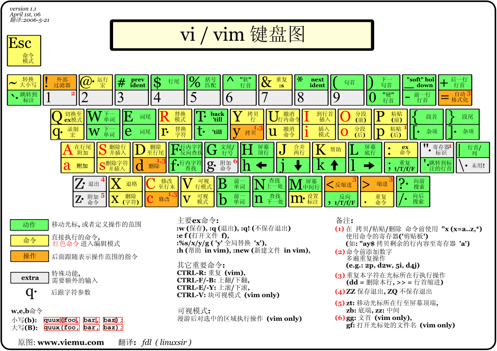

# Vim

vi是Visual Editor的缩写

vim是Vi IMproved 的缩写 vi的升级版 用彩色显示文本，可以视作程序编辑器

**命令模式（Command mode）一般模式** 一开始进入文件的模式

移动光标、删除字符或行、复制和粘贴

移动光标：

n（数字） + 方向键（h或者左方向键）比如20h即向左移动20个字符

数字0或者home移动到本行行首

\$或者End移动到本行行尾

G是文本的最末行 nG是移动到文本第n行 gg是文本首行 n+回车向下移动n行

**编辑模式（Insert mode）**

屏幕最后一行有INSERT或REPLACE字样 返回命令模式用ESC

**末行/底线命令模式（Last line mode）**

输入”:”替换/搜索/显示行号/shell命令执行

| 命令                        | 记忆           | 作用                                          | 用法                                                                                                  |
|-----------------------------|----------------|-----------------------------------------------|-------------------------------------------------------------------------------------------------------|
| 移动光标                    |                |                                               |                                                                                                       |
| n+方向键（h/j/k/l/↑/↓/←/→） |                | 光标向某方向移动n个个字符                     |                                                                                                       |
| ctrl+f PgDn                 |                | 屏幕向下翻一页                                |                                                                                                       |
| ctrl+b PgUp                 |                | 屏幕向上翻一页                                |                                                                                                       |
| n+空格                      |                | 向右移动n个字符，不受行限制                   |                                                                                                       |
| 数字0/Home                  |                | 本行行首                                      |                                                                                                       |
| \$/End                      |                | 本行行尾                                      |                                                                                                       |
| H                           |                | 当前屏幕最顶行                                |                                                                                                       |
| M                           |                | 当前屏幕 中间行                               |                                                                                                       |
| L                           |                | 当前屏幕最底行                                |                                                                                                       |
| G                           |                | 文本最末行                                    |                                                                                                       |
| nG                          |                | 定位到文本第n行                               |                                                                                                       |
| gg                          |                | 文本的首行                                    |                                                                                                       |
| n回车                       |                | 向下移动n行                                   |                                                                                                       |
| v                           |                | 字符选择                                      | 会将光标经过的地方的字符选择                                                                          |
| V                           |                | 行选择                                        | 将光标经过的行选择                                                                                    |
| [ctrl]+v                    |                | 区块选择                                      |                                                                                                       |
| 删除、复制和粘贴            |                |                                               |                                                                                                       |
| x                           |                | 向后删除一个字符                              |                                                                                                       |
| X                           |                | 向前删除一个字符                              |                                                                                                       |
| nx                          |                | 向后删除n个字符                               |                                                                                                       |
| dd                          |                | 删除光标所在行                                |                                                                                                       |
| ndd                         |                | 删除光标所在下n行                             |                                                                                                       |
| d1G                         |                | 删除光标所在行到第一行所有数据                |                                                                                                       |
| dG                          |                | 删除光标所在行到末行所有数据                  | gg 移动到行首 dG 快速清除文件所有内容                                                                 |
| y                           | yank           | 复制光标所选                                  |                                                                                                       |
| yy                          |                | 复制光标所在行                                |                                                                                                       |
| nyy                         |                | 复制光标所在行开始的向下n行                   |                                                                                                       |
| p                           | paste          | 将复制的数据从光标下一行粘贴                  |                                                                                                       |
| P                           |                | 从光标上一行粘贴                              |                                                                                                       |
| y1G                         |                | 复制光标所在行到第一行所有数据                |                                                                                                       |
| yG                          |                | 复制光标所在行到末行所有数据                  |                                                                                                       |
| J                           |                | 将光标与下一行数据结合成一行                  |                                                                                                       |
| u                           |                | 还原过去的操作                                |                                                                                                       |
| ctrl+r                      |                | 重做上一个操作                                |                                                                                                       |
| .                           |                | 重复前一个操作                                |                                                                                                       |
| 查找和替换                  |                |                                               |                                                                                                       |
| /keyword                    |                | 向光标之后寻找名为keyowrd的字符串，并高亮显示 | 按下“n”继续查找下一个，“N”反方向查找下一个                                                            |
| ？keyword                   |                | 向光标之前寻找名为keyowrd的字符串，并高亮显示 | 按下“n”继续查找下一个，“N”反方向查找下一个                                                            |
| :n1,n2s/word1/word2/g       |                | 在n1和n2行之前查找word1字符串并替换为word2    | n2填\$是到最末行 将g换成gc，替换时会要用户进行确认 global/confirm                                     |
| 进入编辑模式                |                |                                               |                                                                                                       |
| i                           | insert         | 光标前插入字符                                |                                                                                                       |
| I                           |                | 光标所在行首插入字符                          |                                                                                                       |
| a                           | append         | 光标后插入字符                                |                                                                                                       |
| A                           |                | 光标所在行末插入字符                          |                                                                                                       |
| o                           |                | 光标所在行下插入新一行                        |                                                                                                       |
| O                           |                | 光标所在行上插入一行                          |                                                                                                       |
| r                           |                | 替换光标所在的字符，只替换一次                |                                                                                                       |
| R                           |                | 一直替换光标所在的字符，直到按下Esc键         |                                                                                                       |
| 命令行/底线命令模式         |                |                                               |                                                                                                       |
| :w                          | write          | 保存文本                                      | ！强制 文件属性为只读也可以？ :w [filename] 将文件另存为filename                                      |
| :q                          | quit           | 退出vim                                       | ！强制                                                                                                |
| :wq / ZZ                    | write and quit | 保存并退出                                    |                                                                                                       |
| :e！                        |                | 将文档还原成最原始状态                        |                                                                                                       |
| :r [filename]               | read           | 在光标所在行读入filename文档内容              |                                                                                                       |
| :set nu                     |                | 设置行号                                      | nonu 取消行号                                                                                         |
| :n1,n2 w [filename]         |                | 将n1到n2行的内容另存为filename文件中          |                                                                                                       |
| :! [command]                |                | 暂时离开vim，执行某linux命令                  | :! ls /home 暂时列出/home下文件然后会提示按回车返回vim                                                |
| :sp                         |                | 同一个文件显示在两个窗口中                    | :sp filename 新窗口启动另一个文件                                                                     |
| :n                          |                | 编辑下一个文件                                | N：编辑上一个文件                                                                                     |
| :files                      |                | 列出目前vim开启的所有文件                     |                                                                                                       |
| vim -On [File1] [File2]     |                | 多窗口编辑                                    | -O 垂直分割 -o 水平分割 -n 表示分几个屏 默认按照文件个数分屏 可缺省 [ctrl] +w +方向键 分开按 切换窗口 |
| :only 或 [ctrl+w+o]         |                | 取消分屏，只保留当前窗口                      |                                                                                                       |
