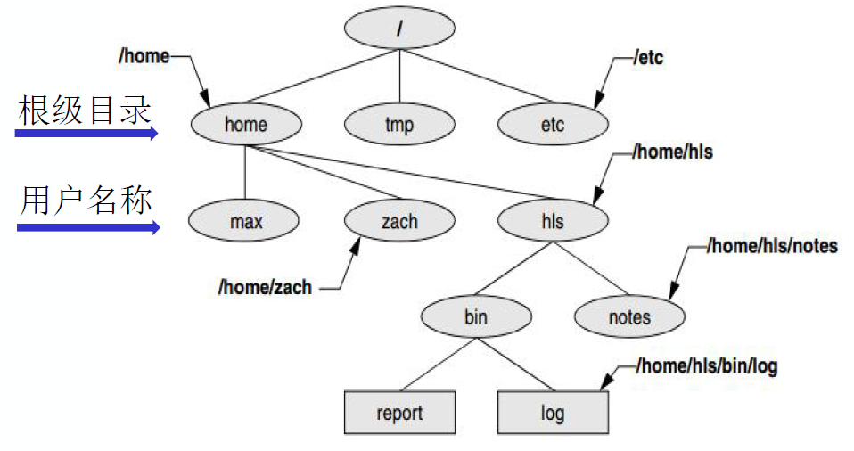
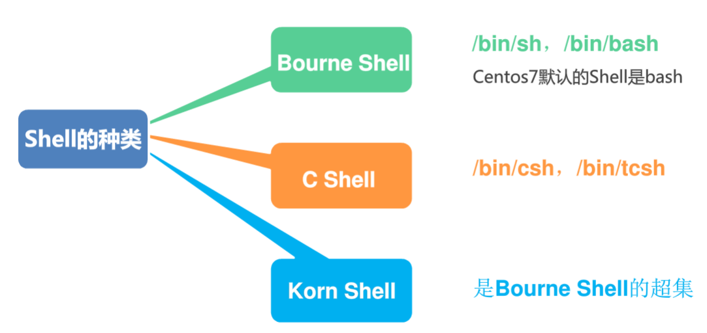

# Shell

Shell是介于使用者和操作系统核心程序（Kernel）间的一个接口。Linux中的Shell又被称为命令行，在这个命令行窗口中，用户输入指令，操作系统执行指令并将结果回显在屏幕上。

windows系统的shell就是cmd（command），linux是叫bash（Bourne Again Shell）

内核文件的名字:vmlinuz+版本号

## Shell脚本

以.sh为后缀

第一行以”\#!/bin/bash”开头，告诉系统，该文件后面的代码将用/bin/bash来执行

具有执行权限的可以直接执行。也可以用bash命令执行， bash xxx.sh，若是需要调试执行，要加-x

关键字都是小写字母表示的

### 变量

**环境变量**

是指与Shell执行的环境相关的一些变量。Shell环境变量在Shell启动时，就已定义好，如PATH，HOME，MAIL等，这些变量用户还可以重新定义。Shell程序中所有变量保存的值都是字符串。用大写字母表示

创建环境变量：export ABCD = 2 （但是这是临时的，当前bash有效，需要永久有效修改当前用户目录下的\~/.bashrc 添加export命令）

查看环境变量：

echo命令查看单个环境变量，echo \$PATH

printenv查看所有环境变量

set命令查看所有本地定义的环境变量

**预定义变量**

用户不能修改只能引用的变量，由“\$+另一个符号”组成，常用的Shell预定义变量有以下几个：

\$\#:位置参数的数量

\$\*:所有位置参数的内容

\$?:命令执行后返回的状态

\$\$:当前进程的进程号

\$!:后台运行的最后一个进程号

\$0:当前执行的进程名

**标准变量**

也是环境变量，在bash环境建立时生成，可以用printenv查看

**自定义变量**

变量名=变量值（变量名前不需加\$，等号两边不能用空格）

**位置变量**

在执行脚本时，传入到脚本中对应位置的变量，比如\$1，\$2，\$3

| 语法                                                                                      | 作用                                                                                                                                                                   | 详解                                                                                                                                                                                                                                                                                                                                                                                                                                                                                                                                          |
|-------------------------------------------------------------------------------------------|------------------------------------------------------------------------------------------------------------------------------------------------------------------------|-----------------------------------------------------------------------------------------------------------------------------------------------------------------------------------------------------------------------------------------------------------------------------------------------------------------------------------------------------------------------------------------------------------------------------------------------------------------------------------------------------------------------------------------------|
| read                                                                                      | 输入                                                                                                                                                                   | read -p “Enter:” VAR1 VAR2 输入的会传入到var1和var2两个字符串变量中                                                                                                                                                                                                                                                                                                                                                                                                                                                                           |
| echo                                                                                      | 输出                                                                                                                                                                   | -e 开启转义 echo “xx” \> file 结果重定向至文件  单引号  转义字符： \\n 换行 \\c 不换行 \\a 发出警告声； \\b 删除前一个字符； \\c 最后不加上换行符号； \\f 换行但光标仍旧停留在原来的位置； \\n 换行且光标移至行首； \\r 光标移至行首，但不换行； \\t 插入tab； \\v 与\\f相同； \\\\ 插入\\字符； \\nnn 插入nnn（八进制）所代表的ASCII字符；                                                                                                                                                                                                   |
| bash                                                                                      | 执行shell脚本                                                                                                                                                          |                                                                                                                                                                                                                                                                                                                                                                                                                                                                                                                                               |
| sed                                                                                       | 利用脚本来处理文本文件。主要用来自动编辑一个或多个文件、简化对文件的反复操作、编写转换程序等。                                                                         | 全称Stream Editor sed [options] 'command' file(s) sed [options] -f scriptfile file(s)  options： -i：默认其实不会修改文件内容，只是将文件中的每一行读入缓存，执行修改，然后输出到屏幕，文件内容并没有发生改变。除非加了该-i参数 -n选项和p命令一起使用表示只打印那些发生替换的行  command中的动作： s：substitute 替换操作，没有g则只有每行第一个匹配 g：global 全局 c：取代， c 的后面可以接字串，这些字串可以取代 n1,n2 之间的行！                                                                                                           |
| if [[ condition ]]; then  \#statements  elif [[ condition ]]; then  \#statements  else fi | 判断语句                                                                                                                                                               |  if 和then 在同一行 要加； [ -e 文件 ] 为真 如果 文件 存在。 [ -d 文件 ] 为真 如果 文件 存在 而且 是一个 目录。 [ -x 文件 ] 为真 如果 文件 存在 而且 是可执行的。 [ -r 文件 ] 为真 如果 文件 存在 而且 是可读的。 [ -w 文件 ] 为真 如果 文件 为真 如果 文件 存在 而且 是可写的。 [ -f 文件 ] 为真 如果 文件 存在 而且 是一个 普通 文件。 [-O file ] 检查file是否存在并属当前用户所有 [-G file] 检查file是否存在并且默认组与当前用户相同 [file1 -nt file2] 检查file1是否比file2新(new than) [file1 -ot file2] 检查file1是否比file2旧(old than) |
| 单中括号 [ ]                                                                              |                                                                                                                                                                        | a. [ ] 两个符号左右都要有空格分隔 b. 内部操作符与操作变量之间要有空格：如 [ “a” = “b” ] c. 字符串比较中，\> \< 需要写成\> \< 进行转义 d. [ ] 中字符串或者\${}变量尽量使用”” 双引号扩住，以避免值未定义引用而出错 e. [ ] 中可以使用 **–a –o** 进行逻辑运算 f. [ ] 是bash 内置命令：[ is a shell builtin                                                                                                                                                                                                                                        |
| 双中括号[[ ]]                                                                             |                                                                                                                                                                        | a. [[ ]] 两个符号左右都要有空格分隔 b. 内部操作符与操作变量之间要有空格：如 [[ “a’ = “b” ]] c. 字符串比较中，可以直接使用 \> \< 无需转义 d. [[ ]] 中字符串或者\${}变量尽量使用”” 双引号扩住，如未使用”“会进行模式和元字符匹配 e. [[ ]] 内部可以使用 **&& \|\|** 进行逻辑运算 f. [[ ]] 是bash keyword：[[ is a shell keyword                                                                                                                                                                                                                   |
| 整数比较                                                                                  |                                                                                                                                                                        | -eq 等于equal,如:if [ "\$a" -eq "\$b" ] -ne 不等于no equal,如:if [ "\$a" -ne "\$b" ] -gt 大于 greater than,如:if [ "\$a" -gt "\$b" ] -ge 大于等于greater euqal,如:if [ "\$a" -ge "\$b" ] -lt 小于less than,如:if [ "\$a" -lt "\$b" ] -le 小于等于less equal,如:if [ "\$a" -le "\$b" ] \> 大于(需要双括号),如:(("\$a" \> "\$b")) \>= 大于等于(需要双括号),如:(("\$a" \>= "\$b"))                                                                                                                                                               |
| let                                                                                       | 用于计算的工具，用于执行一个或多个表达式                                                                                                                               | 变量计算中不需要加上 \$ 来表示变量。如果表达式中包含了空格或其他特殊字符，则必须引起来 a=\$((\$a+1))  a=\$[\$a+1]  a=\`expr \$a + 1\`  let a++  let a+=1                                                                                                                                                                                                                                                                                                                                                                                      |
| 字符串比较                                                                                |                                                                                                                                                                        | [ “\$var1”x = “\$var2”x ] 不能用-eq因为eq是比较整数。可以加个x防止报错因为如果有个变量是空的话就会报错                                                                                                                                                                                                                                                                                                                                                                                                                                        |
| 变量                                                                                      |                                                                                                                                                                        |                                                                                                                                                                                                                                                                                                                                                                                                                                                                                                                                               |
| 定义变量                                                                                  | 不加\$符号来定义变量 变量名和等号之间不能有空格                                                                                                                        | 命名只能使用英文字母，数字和下划线，首个字符不能以数字开头。 已定义的变量，可以被重新定义 第二次赋值也不能用\$来赋值，而是重新定义                                                                                                                                                                                                                                                                                                                                                                                                            |
| 使用变量                                                                                  | 在变量名前加\$即可 也可以\${var}，花括号可选，因为比如在echo “I am good at \${skill} Script”里如果不加花括号则找不到变量                                               |                                                                                                                                                                                                                                                                                                                                                                                                                                                                                                                                               |
| readonly                                                                                  | 只读变量，变量定义后 使用 readonly var（没有\$符号） 若是下一次再赋值则会报错                                                                                          |                                                                                                                                                                                                                                                                                                                                                                                                                                                                                                                                               |
| unset                                                                                     | 删除变量，变量被删除后不能再次使用。无法删除只读变量                                                                                                                   |                                                                                                                                                                                                                                                                                                                                                                                                                                                                                                                                               |
| （类型）局部变量                                                                          | 局部变量在脚本或命令中定义，仅在当前shell实例中有效，其他shell启动的程序不能访问局部变量                                                                               |                                                                                                                                                                                                                                                                                                                                                                                                                                                                                                                                               |
| （类型）环境变量                                                                          | 所有的程序，包括shell启动的程序，都能访问环境变量，有些程序需要环境变量来保证其正常运行。必要的时候shell脚本也可以定义环境变量。                                       |                                                                                                                                                                                                                                                                                                                                                                                                                                                                                                                                               |
| （类型）shell变量                                                                         | shell变量是由shell程序设置的特殊变量。shell变量中有一部分是环境变量，有一部分是局部变量，这些变量保证了shell的正常运行                                                 |                                                                                                                                                                                                                                                                                                                                                                                                                                                                                                                                               |
| 字符串类型变量                                                                            |                                                                                                                                                                        |                                                                                                                                                                                                                                                                                                                                                                                                                                                                                                                                               |
| 单引号                                                                                    | （与php类似）                                                                                                                                                          | 单引号里的任何字符都会原样输出，单引号字符串中的变量是无效的；单引号字串中不能出现单独一个的单引号（对单引号使用转义符后也不行），但可成对出现，作为字符串拼接使用                                                                                                                                                                                                                                                                                                                                                                            |
| 双引号                                                                                    |                                                                                                                                                                        | 双引号里可以有变量，访问变量加\$符号 双引号里可以出现转义字符                                                                                                                                                                                                                                                                                                                                                                                                                                                                                 |
| 拼接字符串                                                                                | 单引号或双引号直接拼接即可，注意成对，不需要加什么分隔符                                                                                                               |                                                                                                                                                                                                                                                                                                                                                                                                                                                                                                                                               |
| 获取字符串长度                                                                            | \${\#var}，即获取var字符串长度                                                                                                                                         |                                                                                                                                                                                                                                                                                                                                                                                                                                                                                                                                               |
| 提取子字符串                                                                              | \${var:1:4}，从第二个字符开始截取四个长度的字符                                                                                                                        |                                                                                                                                                                                                                                                                                                                                                                                                                                                                                                                                               |
| 数组                                                                                      | 支持一维数组                                                                                                                                                           | 没有限定数组的大小                                                                                                                                                                                                                                                                                                                                                                                                                                                                                                                            |
| 定义数组                                                                                  | array_name=(value0 value1 value2 value3) 或者 array_name=( value0 value1 value2 value3 ) 也可以单独定义 array_name[0]=value0 array_name[1]=value1 array_name[n]=valuen | 用括号来表示数组，数组元素用"空格"符号分割开                                                                                                                                                                                                                                                                                                                                                                                                                                                                                                  |
| 读取数组                                                                                  | valuen=\${array_name[n]}                                                                                                                                               | 使用 @ 符号可以获取数组中的所有元素 echo \${array_name[@]}                                                                                                                                                                                                                                                                                                                                                                                                                                                                                    |
| 获取数组的长度                                                                            | length=\${\#array_name[@]} \#数组元素个数，或者： length=\${\#array_name[\*]}                                                                                          |                                                                                                                                                                                                                                                                                                                                                                                                                                                                                                                                               |
| 执行脚本/调试跟踪                                                                         |                                                                                                                                                                        |                                                                                                                                                                                                                                                                                                                                                                                                                                                                                                                                               |
| -n                                                                                        | 不执行脚本，仅检查脚本中的语法问题                                                                                                                                     |                                                                                                                                                                                                                                                                                                                                                                                                                                                                                                                                               |
| -v                                                                                        | 将执行过的每一个脚本命令都原样输出到终端                                                                                                                               |                                                                                                                                                                                                                                                                                                                                                                                                                                                                                                                                               |
| -x                                                                                        | 和-v差不多，但是每个命令前面都有个+号而且会输出变量的值                                                                                                                |                                                                                                                                                                                                                                                                                                                                                                                                                                                                                                                                               |

## 目录结构

etc:

etcetera directory 英 [*et*'s*et*ərə] 美 [*et*'s*et*ərə] n.附加的人；附加物；以及其它；等等

Extended Tool Chest 扩展工具包 规定放配置文件

/etc/hosts ---主机名与IP地址的映射关系文件

**超级用户的目录在根一级**

**普通用户 who w**

/home/\$username, 每个用户的主目录 也可以是”\~”

\~/.bash_profile 用户环境文件（.表示隐藏）

**环境变量**

/etc/profile 系统级；例如在最后一行，添加java路径；

/etc/sysconfig/network 主机名在此文件设置

/ 根目录

├── bin 存放用户二进制文件；bin是binary的缩写。这个目录存放着使用者最经常使用的命令。例如cp、ls、cat等等。

├── boot 存放内核引导配置文件；这里存放的是启动Linux时使用的一些核心文件。

├── dev 存放设备文件；这个目录下是Linux所有的外部设备，在Linux中设备也是文件，使用访问文件的方法访问设备。例如：/dev/sda代表第一个物理SCSI硬盘。

├── etc 存放系统配置文件；这个目录用来存放系统管理所需要的配置文件和子目录。这其中的`/etc/os-release`存放着操作系统的版本，可以使用`cat`命令查看。

├── home 用户主目录；比如说有个用户叫sy，那么他的主目录就是/home/sy。注意：root用户的目录不在这里，而在/root里。

├── lib 动态共享库；这个目录里存放着系统最基本的动态链接共享库，其作用类似于Windows里的.dll文件。几乎所有的应用程序都需要用到这些共享库。

├── lost+found 文件系统恢复时的恢复文件

├── media 可卸载存储介质挂载点

├── mnt 文件系统临时挂载点；这个目录在刚安装好系统时是空的，系统提供这个目录的目的是让用户临时挂载别的文件系统。

├── **opt** (optional software and packages)附加的应用程序包

├── proc 系统内存的映射目录，提供内核与进程信息; 这个目录是一个虚拟的目录，它是系统内存的映射，我们可以通过直接访问这个目录来获取系统信息。也就是说，这个目录的内容不在硬盘上而是在内存里。

├── root root 用户主目录

├── sbin 存放系统二进制文件；s就是Super User的意思，也就是说这里存放的是系统管理员使用的管理命令和管理程序。例如 cfdisk、dhcpcd、dump、e2fsck、fdisk、halt、ifconfig、ifup、 ifdown、init、insmod、lilo、lsmod、mke2fs、modprobe、quotacheck、reboot、rmmod、 runlevel、shutdown等。

├── srv 存放服务相关数据

├── sys sys 虚拟文件系统挂载点

├── tmp 存放临时文件

├── usr 存放用户应用程序；我们要用到的应用程序和文件几乎都存放在这个目录下。

├── bin 存放用户后期安装的一些软件的运行命令。

├── sbin 用户安装的系统管理命令，例如 dhcpd、httpd、imap、in.\*d等。

└── var 存放邮件、系统日志等变化文件；这个目录中存放着那些不断在扩充着的东西，为了保持/usr的相对稳定，那些经常被修改的目录可以放在这个目录下

## 种类

**Bash（Bourne Again Shell）**

包括了早期的Bourne Shell和Korn Shell的所有功能，并且加入了C Shell的某些功能
