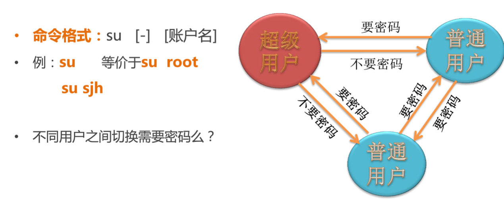
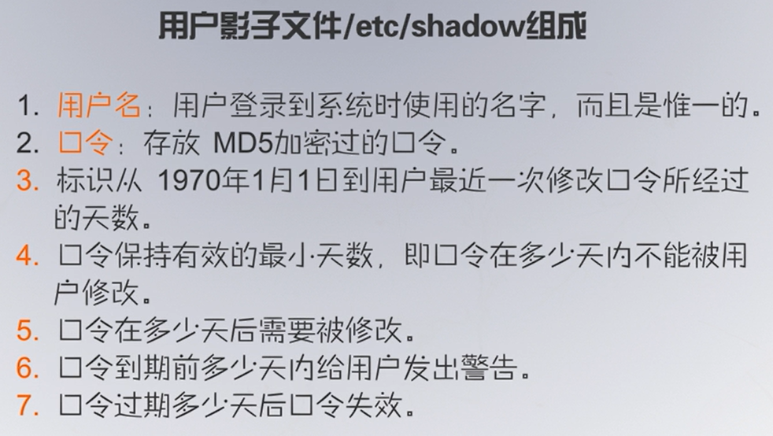
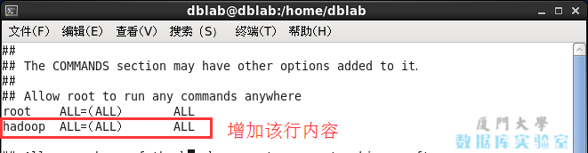
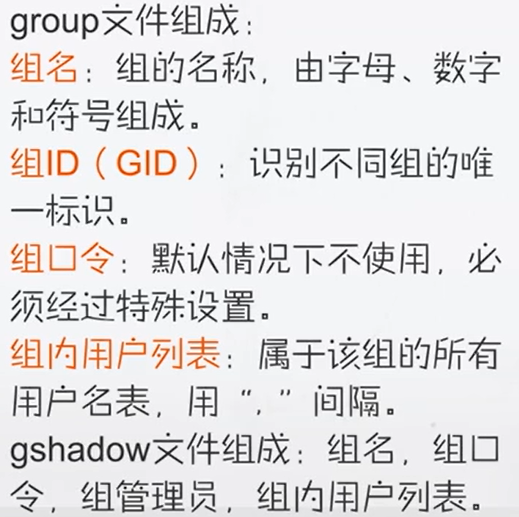

# 用户与权限

## 文件权限

rwx：可读可写可执行

read write execute

权限显示是 ---（所有者权限） ---（同组） ---（其他用户）

数字表示：R=4；w=2；x=1；-=0；

### 特殊权限

**s或S（SUID,Set UID）**：临时以执行文件的所有者的权限执行文件。可执行的文件搭配这个权限，便能得到特权，任意存取该文件的所有者能使用的全部系统资源。

> 注意具备SUID权限的文件，黑客经常利用这种权限，以SUID配上root帐号拥有者，无声无息地在系统中开扇后门，供日后进出使用。

**t或T（Sticky）**：/tmp和 /var/tmp目录供所有用户暂时存取文件，亦即每位用户皆拥有完整的权限进入该目录，去浏览、删除和移动文件。

## 用户




**用户影子文件**

/etc/shadow 存储关于账户口令相关设置(普通用户无法读取)




**用户账户文件**

/etc/passwd中组成

root:x:0:0:root:/root:/bin/bash

用户：用户密码(用x表示)：UID：GID:用户信息（用户全名等）:用户主目录:用户第一次登陆Shell环境

密码这里可以看到3类，分别是奇奇怪怪的字符串、\*和！！其中，奇奇怪怪的字符串就是加密过的密码文件。星号代表帐号被锁定，双叹号表示这个密码已经过期了。奇奇怪怪的字符串是以\$6\$开头的，表明是用SHA-512加密的，\$1\$ 表明是用MD5加密的、\$2\$ 是用Blowfish加密的、\$5\$是用 SHA-256加密的。

**用户ID（UID）**

系统内部用它来标识用户且唯一

超级用户：UID=0，GID=0

系统用户：0\<UID\<1000

与系统运行和系统提供的服务密切相关的用户，不能用于登陆计算机

普通用户：UID\>=1000

**组ID（GID）**

系统内部用它来标识组属性

**给用户添加sudo权限：**

1. 设置用户目录和用户名

   ```shell
   useradd -m hadoop -s /bin/bash  # 创建新用户hadoop
   ```

2. 给新用户设置密码

   ```shell
   passwd hadoop
   ```

按提示输入两次密码，可简单的设为 “hadoop”（密码随意指定，若提示“无效的密码，过于简单”则再次输入确认就行）

执行 `visudo`

如下图，找到 root ALL=(ALL) ALL 这行（应该在第98行，可以先按一下键盘上的 ESC 键，然后输入 :98 (按一下冒号，接着输入98，再按回车键)，可以直接跳到第98行 ），然后在这行下面增加一行内容：hadoop ALL=(ALL) ALL （当中的间隔为tab），如下图所示：



### 配置

.bashrc是在系统启动后就会自动运行。

profile是在用户登录后才会运行。

进行设置后，可运用source bashrc命令更新bashrc，也可运用source profile命令更新profile。

PS：通常我们修改bashrc,有些linux的发行版本不一定有profile这个文件

/etc/profile中设定的变量(全局)的可以作用于任何用户，而\~/.bashrc等中设定的变量(局部)只能继承/etc/profile中的变量，他们是"父子"关系。

\~/.bash_profile: 每个用户都可使用该文件输入专用于自己使用的shell信息，当用户登录时，该文件仅仅执行一次!默认情况下,他设置一些环境变量,执行用户的.bashrc文件。

\~/.bash_logout: 当每次退出系统(退出bash shell)时，执行该文件。

\~/.bash_profile 是交互式、login方式进入bash运行的。

\~/.bashrc是交互式non-login方式进入bash运行的，通常二者设置大致相同，所以通常前者会调用后者。

当使用诸如oh-my-zsh之类使用zsh时，配置文件变成了.zshrc

rc means "run commands". In fact, this is exactly what the file contains, commands that bash should run.

## 组

组是有相同特性的用户集合，对组操作等价于对组中每个成员进行操作，设计目的主要是便于权限的统一组织和分配

组中的每个用户可共享组中的资源。组按性质划分为：系统组和私有组账户。

组管理文件构成



账户文件：/etc/group

影子文件：/etc/gshadow
