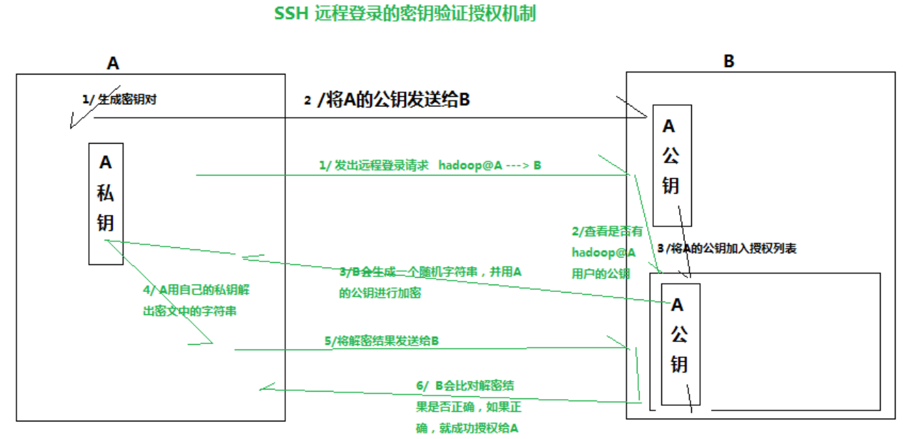

# SSH



如果失败，有可能是以下原因：

1. 权限问题

`.ssh` 目录，以及 `/home/当前用户` 需要 700 权限，参考以下操作调整

```shell
sudo chmod 700 ~/.ssh
sudo chmod 700 /home/当前用户
```

`.ssh` 目录下的 `authorized_keys` 文件需要 600 或 644 权限，参考以下操作调整

```shell
sudo chmod 600 ~/.ssh/authorized_keys
```

2. StrictModes 问题

编辑

```shell
sudo vi /etc/ssh/sshd_config
```

找到

```ini
#StrictModes yes
```

改成

```ini
StrictModes no
```

[SSH 连接失败排查参考 - 博客园](https://www.cnblogs.com/276815076/p/10449354.html)
