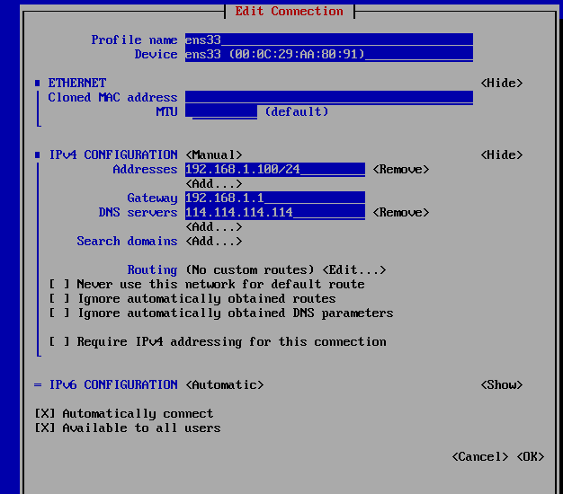
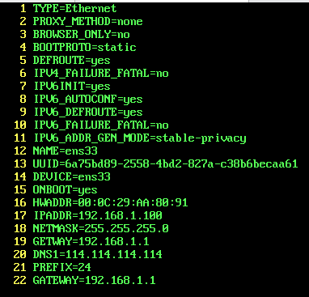
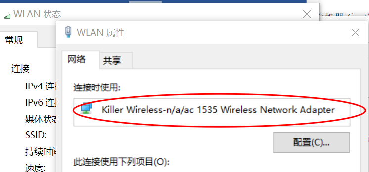

# 网络配置

`/etc/sysconfig/network-scripts/ifcfg-xxx`

也可以使用 `NetworkManager` 进行配置，效果一样

使用 `nmtui` 进行设置 NetworkManager文本用户界面工具 NetworkManager Text User Interface

如果打不开 `nmtui` 需要 `service NetworkManager start`

设置好后使用 `service network restart`

桥接模式下的设置：



对应的ifcfg-ens33文件



hwaddr是对应的mac地址

注意桥接的话使用vmware如果无法上外网需要去设置vmnet0的桥接网卡自动改为宿主的网卡地址，在联网的适配器属性的上面可以看见



## 出现莫名奇妙无法连接其他子节点时

1. 关闭 SELinux，但是这样会不太安全，不是很推荐

   ```shell
   setenforce 0
   ```

2. 开放通讯端口（推荐）

   ```shell
   yum install -y policycoreutils-python
   semanage port -a -t mysqld_port_t -p tcp 33081
   ```

`mysql` 虚拟机克隆会导致重复 `uuid`，通过修改 `/var/lib/mysql/auto.cnf`
