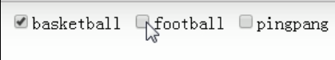
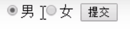

# Web服务器与表单基础

## `Web` 服务器

`Web` 服务端架构通常包括：

1. `Web` 服务器
2. 语言解释器或运行时
3. 数据库

常见组合：

```txt
IIS + ASP(.NET) + SQL Server
Apache + PHP + MySQL
Tomcat + JSP + Oracle
```

### `Apache`

`.htaccess` 文件名本身必须带前导点，才能按 `.htaccess` 文件生效。

## `HTML` 标记与注释

### 常见标记

```html
<hr />
```

### 注释

`HTML` 注释：

```html
<!-- 这是单行注释 -->

<!--
这是多行注释
这是多行注释
这是多行注释
-->
```

`JavaScript` / `jQuery` 注释：

```javascript
// 这是单行注释

/*
这是多行注释
这是多行注释
这是多行注释
*/
```

`CSS` 注释：

```css
/* 这是单行注释 */

/*
这是多行注释
这是多行注释
这是多行注释
*/
```

## `form` 表单

### 一般 `POST` 表单

```html
<form method="POST" action="xx.php">
  <input type="text" name="username" value="" />
  <input type="password" value="" />
  <input type="submit" name="sub" value="submit" />
</form>
```

说明：

1. `password` 输入框如果没有 `name` 属性，浏览器提交时不会带上该字段。
2. `submit` 按钮如果有 `name` 和 `value`，后端可以在 `$_POST["sub"]` 中接收到对应值。

### 复选框

复选框使用 `type="checkbox"`，若多个字段同名而不做数组化处理，后端接收时可能发生覆盖。

错误示例：

```html
<form method="POST" action="xx.php">
  <input type="checkbox" name="hobby" value="basketball" />basketball
  <input type="checkbox" name="hobby" value="football" />football
  <input type="checkbox" name="hobby" value="pingpang" />pingpang
  <input type="submit" name="sub" value="submit" />
</form>
```

推荐写法：

```html
<form method="POST" action="xx.php">
  <input type="checkbox" name="hobby[]" value="basketball" />basketball
  <input type="checkbox" name="hobby[]" value="football" />football
  <input type="checkbox" name="hobby[]" value="pingpang" />pingpang
  <input type="submit" name="sub" value="submit" />
</form>
```

这样 `PHP` 会把同名元素组合成数组。

相关示意：



### 单选框

单选框使用 `type="radio"`：

```html
<form method="POST" action="xx.php">
  <input type="radio" name="gender" value="1" checked="checked" />男
  <input type="radio" name="gender" value="2" />女
  <input type="submit" name="sub" value="submit" />
</form>
```

`checked="checked"` 可以设置默认选中，避免用户漏选。

相关示意：


