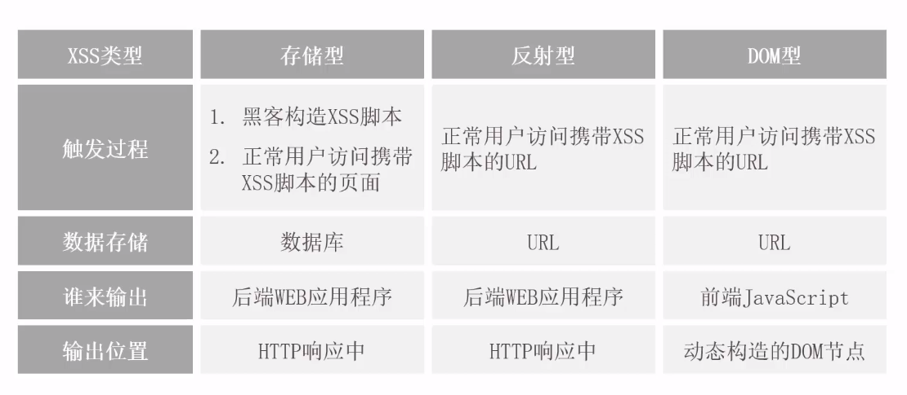
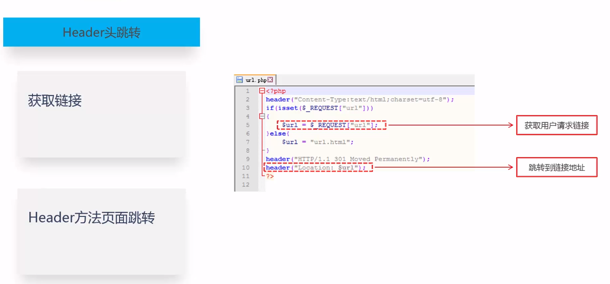
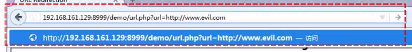
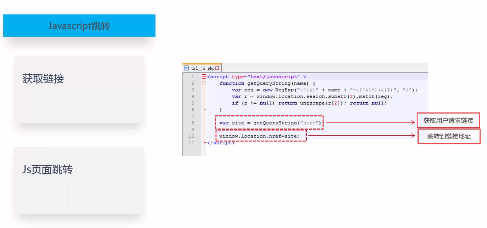
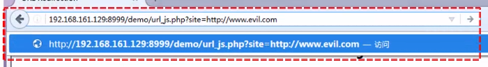
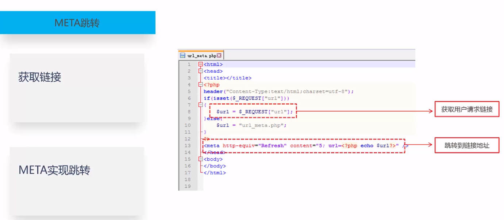
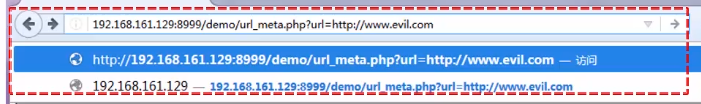
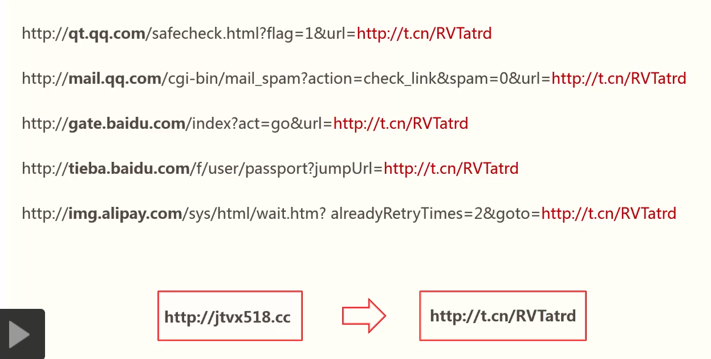

# 常见Web漏洞

## 跨站脚本（`XSS`）

`XSS` 的全称是 `Cross-Site Scripting`，中文通常称为“跨站脚本”。它属于典型的前端注入问题，本质上是把恶意脚本插入页面，在用户浏览页面时执行，从而影响浏览器行为。

常见危害：

1. 窃取用户信息
2. 钓鱼
3. 制造蠕虫

常见类型：

1. 存储型：恶意内容被写入网站，用户访问页面时触发。
2. 反射型：恶意内容存在于请求中，服务端将其写回响应页面后触发。
3. `DOM` 型：恶意内容主要通过前端 `JavaScript` 操作 `DOM` 触发，常见于 `hash`、查询参数等场景。

示意图：



## 跨站请求伪造（`CSRF`）

`CSRF` 的全称是 `Cross-Site Request Forgery`，中文通常称为“跨站请求伪造”。

常见危害：

1. 冒用用户身份执行恶意操作
2. 被动转账
3. 被动发表评论、提交表单
4. 制造蠕虫

核心概念：

用户已经登录站点 `A` 且认证状态仍然有效，此时又访问了攻击者控制的站点 `B`。站点 `B` 构造一个请求，让浏览器去访问站点 `A` 的接口。由于浏览器会自动携带相关 `Cookie`，服务器可能会把这个请求误认为是用户本人发起的合法请求。

常见防御思路：

1. 在表单或关键请求中增加随机 `Token`
2. 对敏感操作增加验证码、二次确认等校验
3. 对来源和会话进行更严格的校验

技巧说明：

攻击页面可以使用隐藏的 `iframe` 或自动提交的表单，将宽高设为 `0`，从而降低页面跳转带来的可见性。

## 点击劫持

点击劫持通常通过覆盖不可见的 `iframe`、透明层或诱导性页面元素，引导用户点击，实际完成攻击者希望执行的敏感操作。

## 开放重定向

原文中的“`URL` 跳转漏洞”更准确的名称通常是“开放重定向”。其核心问题是：程序在没有充分校验目标地址的前提下，允许用户控制跳转目标。

### `Header` 头跳转

```php
$url = $_REQUEST["url"];
header("Location: $url");
```





### `JavaScript` 跳转

```javascript
var site = getQueryString("site");
window.location.href = site;
```





### `meta` 跳转

```html
<meta http-equiv="refresh" content="0;url=https://example.com" />
```



`content` 属性可用于指定延时与跳转目标。



### 其他方式



有时也会借助短链接、参数拼接或页面脚本来掩饰真实跳转目标。

## 修订说明

1. 将原文中的 `Cross Site Script` 更正为 `Cross-Site Scripting`，这是 `XSS` 的标准展开形式。
2. 将“`URL` 跳转漏洞”统一表述为“开放重定向”，更贴近常见安全术语。
3. 将 `window.location.herf` 更正为 `window.location.href`。
