# 文件上传与命令执行

## 命令注入

命令注入通常发生在应用程序把用户输入直接拼接到系统命令中执行、且缺少有效过滤或隔离时。

示意图：

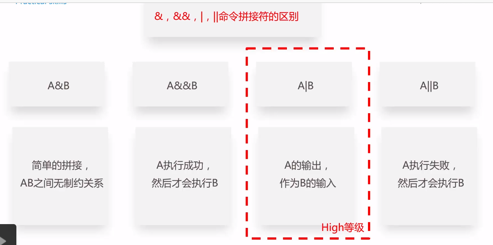

## 文件上传漏洞

必要条件：

补充说明：

1. 某些场景中还可以结合本地文件包含漏洞进一步利用。
2. 是否能够真正落地利用，往往取决于上传目录是否可访问、文件是否会被解析、以及后端校验强度。

### 服务器端检测绕过

#### `MIME` 类型检测绕过

`MIME` 是 `Multipurpose Internet Mail Extensions` 的缩写，用于描述消息体的内容类型。浏览器上传文件时，通常会根据扩展名附带一个 `Content-Type`。

常见绕过思路：

1. 直接修改请求报文中的 `Content-Type`
2. 利用服务端只校验 `MIME` 而不校验内容的缺陷

#### 文件内容检测绕过

1. 如果仅检查文件头标记，可以在恶意文件前追加合法文件头尝试绕过。
2. 如果使用更完整的文件结构校验，绕过难度会更高。

相关示意：

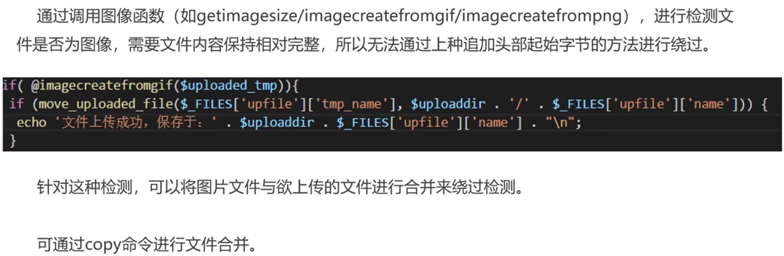

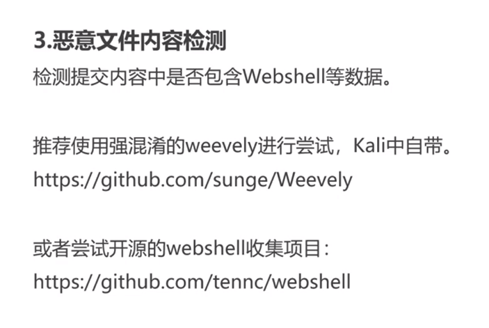

如果上传目录被禁止直接访问，有时还会尝试结合目录穿越等问题访问目标文件。

#### 文件名绕过

白名单绕过技巧：

1. `0x00` 截断绕过
2. 基于解析逻辑或解析漏洞的绕过

黑名单绕过技巧：

1. 后缀名大小写绕过
2. 名单列表不完整导致的绕过
3. 特殊文件名绕过
4. `0x00` 截断绕过
5. 双扩展名解析绕过，基于 `Web` 服务的解析逻辑
6. 双扩展名解析绕过，基于 `Web` 服务的解析方式

补充：

某些环境中，以 `.asa`、`.cer`、`.cdx` 等后缀结尾的文件，可能在特定 `IIS` 配置下被按脚本文件处理。

### 解析漏洞

1. `IIS` / `Nginx + PHP-FastCGI` 的取值错误解析漏洞，通常和配置错误有关。
2. `Nginx` 文件名逻辑漏洞：`CVE-2013-4547`。
3. `Apache` 解析漏洞，通常也和配置有关。
4. `IIS 5.x/6.0` 曾存在经典解析问题。

相关示意：

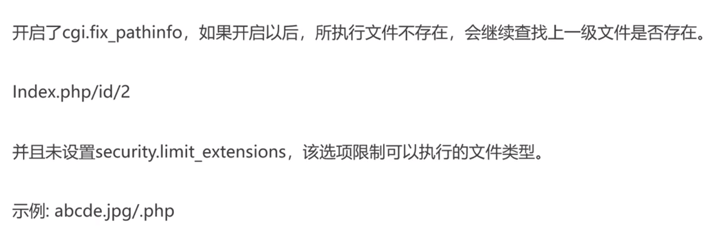

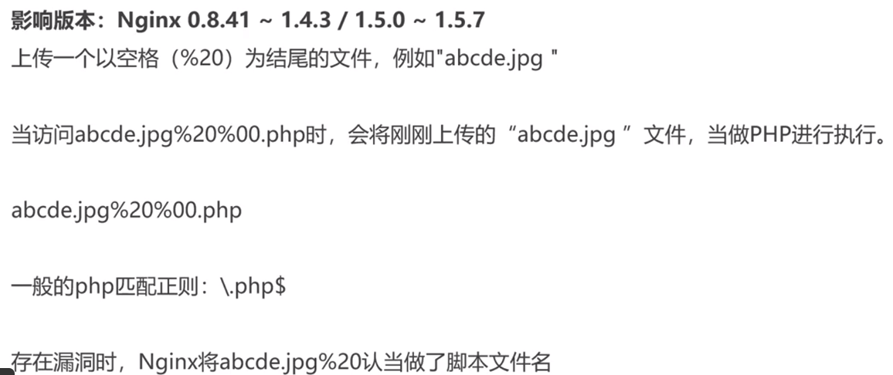

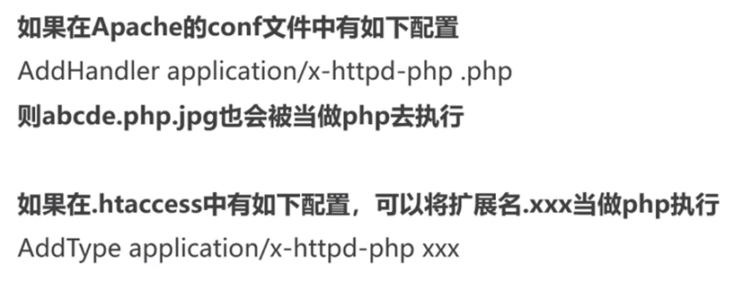

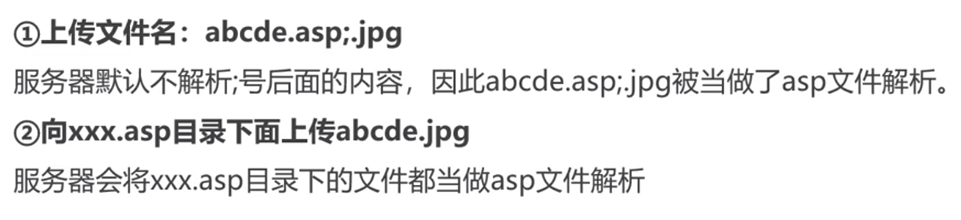

### 高级利用

1. 重绘图
2. 结合 `phpinfo()` 与本地文件包含进行利用
3. 利用在线解压缩功能
4. 文件软链接，即快捷方式

相关示意：

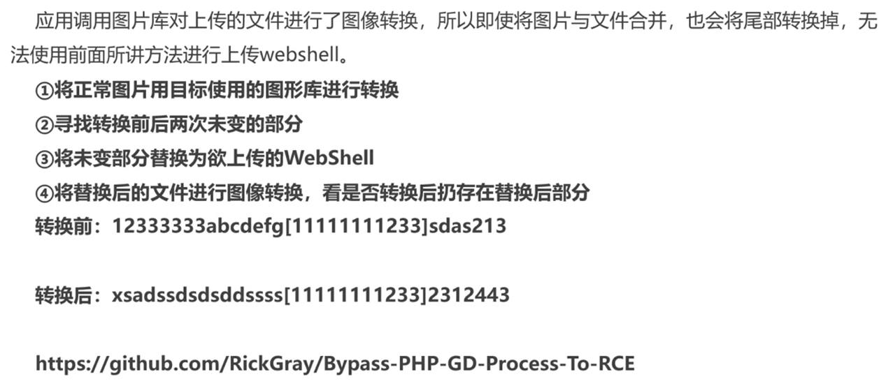

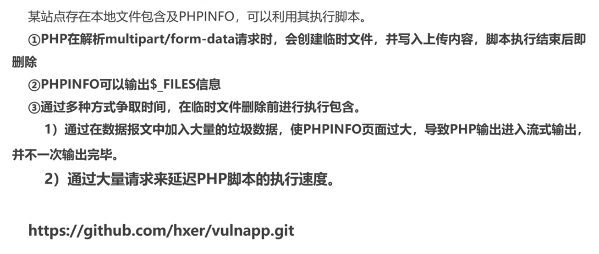

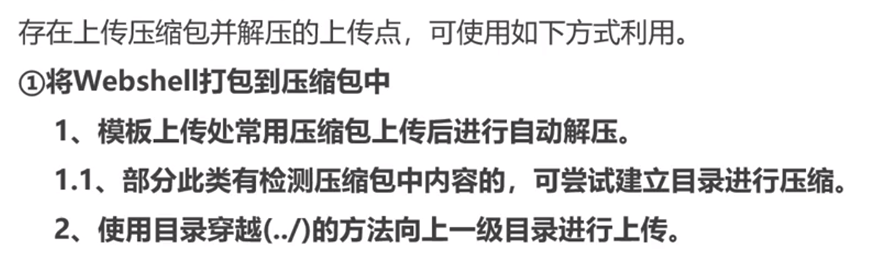

### 防御

核心思路是把校验、存储、解析、访问权限隔离开，而不是依赖单点规则。

过程示意：

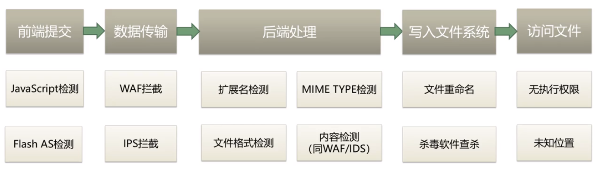

## 修订说明

1. 将原文中的利用与绕过方式按“检测绕过 -> 解析漏洞 -> 高级利用 -> 防御”重新组织，便于建立完整攻击链。
2. 补充说明 `0x00` 截断和解析漏洞都高度依赖具体语言、运行时与服务器配置，不能脱离环境泛化。
