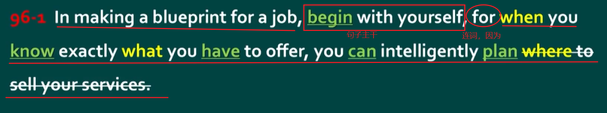
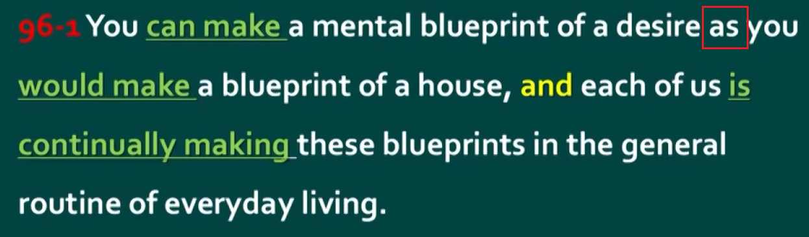
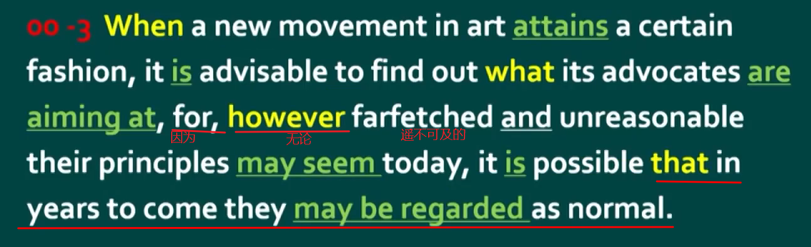
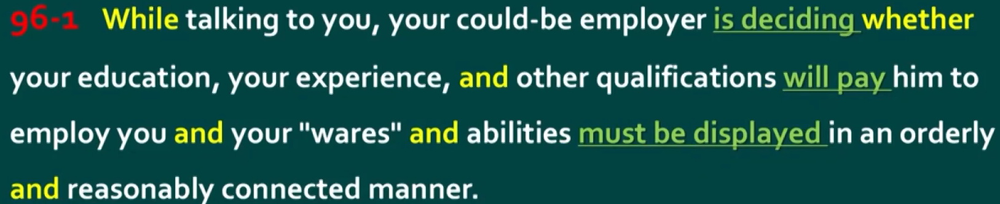
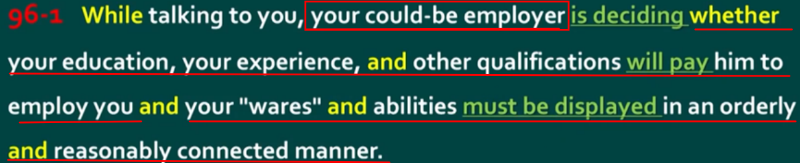
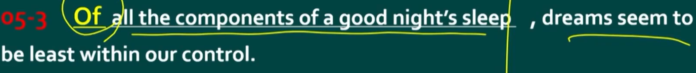
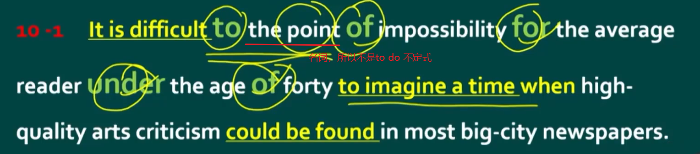

# 长难句解析

句子的主干是主语、谓语、宾语。非主干是定语、状语、补语，非主干都是起修饰作用的。所以理解一个句子的核心是找到句子的主干，更进一步要找到句子非主干、更上一层则是能补充还原句子的逻辑结构(省略句，结合语境找到合适的关联词从非谓语结构还原；从整体结构来进行翻译，比如`that`、`that`并列的，可以翻译为…从两点，一点是…另一点是…)

另外如果是系动词，那么就是主语、系动词、表语的结构

破折号相当于逗号

## 找连词 `conj`(`conjunction`) -> 分清谁是句子

因为连接两个句子必须要使用连词；从后往前找。n个连词需要n+1个谓语，找不到连词一定是某个连词没认出来。

如果是连接两句话，若它们之间主语不一样，表达的意思不要弄混了。还可能的是一个主语连接两个并列句子，是这个主语做的两句话的事情，比如下面提到的例子。

### 并列连词

`and`、`or`、`but`、`yet`，功能上都表示并列（不一定是逻辑上），并列连词连接前后相同的成分，比如名词连接名词，动词连接动词，句子连接句子，词连接词。

注意用`and`并列三个词以上只需要用一个`and`即可，如果出现两个`and`并列三个词，则三个词之间不是两两并列关系。

`and`要从后往前找并列


这里的`factual errors and spelling and grammar mistakes`，是`factual errors`并列`spelling and grammar mistakes`，然后后者的`and`又是并列`spelling`和`grammar mistakes`。

另外这里有一个高级的并列方式表达，区别于一般的`a, b and c`。这里使用了`a and b, combined with c`。

`combined with`也只是一个介词短语修饰，而不是连词。

`either…or…`（對兩事物的選擇）要麼…要麼，不是…就是，或者…或者。

其实没啥就近就远原则，就是两个连词，`either + 句子 or + 句子`，句子中主谓一致罢了。

`neither… nor…`（否定的陳述適用於兩方面）既不…也不…

### 从属连词

连接从句和主句的连词称为从属连词

从句还可以这样组成：w开头的从属连词+`to do`动词不定式（是非谓语动词），比如`where to go`、`what to do`。

但注意`to + 名词`这不是做主语，不是动词不定式，这里的`to`是副词。

#### 易混连词/重点连词

`for`，作连词意思为"因为"；



`as`，`prep.`作为；`conj.`像…一样；当…时；因为；尽管



`let alone`更别提，更不用说。两词连用作连词，用法类似`and`，可以连接句子等，表示一种否定递进。

`however`、`whatever + adj/adv + 句子`

翻译为无论…（如何如何），先翻译句子：无论…（句子）…+`adj/adv`（怎么怎么样），



当一个在艺术领域的一个新的运动开始流行的时候，找到它的倡导者的目标所在是明智的，因为，无论他们的原则在今天看来是遥不可及和不理智的，但很有可能他们将来可能会被认为是正常的

#### 不做成分

`that`、`if`、`whether`、`though`、`although`、`since`、`even if`（整体来看是引导让步状语从句，即使，尽管。但`even`若是单独作副词，那么`if`是唯一的连词，这时就是甚至如果）、`even though`（相比`even if`通常是假设性的，这个通常是真实的事情。尽管、虽然）等

#### 连接代词

`who`、`whom`、`whose`、`what`、`which`、`whatever`、`whoever`、`whichever`

#### 连接副词

`when`、`where`、`why`、`how`、`however`、`whenever`、`wherever`

## 找（谓语 `Predicate`）动词 -> 分清谁是句子

要分清谁是句子，就要抓住句子的灵魂，即谓语，一个句子谓语最重要。

谓语动词即动词做谓语



`while`从句这里省略了主语和`be`动词，补全是

```text
while your could-be employer（你可能的雇佣者） is talking to you
```text

第二个`and`连接的是两个句子。



小心非谓语动词和谓语，比如一个过去分词和过去式，如果形式一致，出现在句子中，不能贸然就判断它是谓语，它还可能是非谓语动词中的过去分词形式，表修饰，而不是谓语动词的过去式语态，要分清主被动关系。

```text
The railway companies, though still private business managed for the benefit of shareholders, were very unlike old family business.
```text

这里的`managed`！！就不是`though`这个从句的谓语！而是过去分词！修饰的是`private business`！然后真正的谓语在哪呢，这是状语从句的省略句，主语一致，主语省略，如果有系动词同时也省略。那么还原回去就是：

```text
The railway companies, though the railway companies were still private business managed for the benefit of shareholders.
```text

## 找介词 -> 简化句子结构

介词引导的成分永远不做句子主干，所以一开始可以先把介词开头的短语（起到修饰作用的）扔到一边。句子的主干是主语、谓语、宾语。非主干是定语、状语、补语。

`in`、`on`、`at`、`of`、`off`、`with`、`to`等等





这里的一连串介词分隔开真正的主谓老远。

`to`修饰`difficult`、`of`修饰`the point`、`for`修饰`impossibility`、`under`修饰`reader`、`of`修饰`forty`，所以介词老是逆向修饰前面的那个东西

## 常见句型结构的组成

### `__, S+V+O`

这里的`__`非主干结构统统作状语

#### 1. 状语结构

```text
when I was young, I could play football.
```text

#### 2. 介词结构

```text
On Sunday morning, we go to school.
```text

#### 3. 分词结构（[非谓语动词](03-短语与非谓语.md#非谓语动词又名nonfinite-verb-非限定动词的一般结构)，即动词三种分词形式）

若前后主语不一致变为独立主格结构

```text
Finishing my homework, I start to watch TV.
```text

#### 4. 独立主格结构、`with`复合结构

就是一句中主语不一致的情况，主语一致变为分词结构

```text
He finishing his homework, I start to watch TV.
```text

#### 5. 副词

```text
Surprisingly, he is still alive.
```text

### `S, __ V+O`

在上面的`__, S+V+O`结构中，`__`非主干结构都作状语，而状语的位置非常灵活，前、中、后都可，所以可以直接：

1. 状语结构

```text
I, when I was young could play football.
```text

2. 介词结构

```text
we, on Sunday morning, go to school.
```text

3. 分词结构（[非谓语动词](03-短语与非谓语.md#非谓语动词又名nonfinite-verb-非限定动词的一般结构)，即动词三种分词形式）

```text
I, finishing my homework, start to watch TV.
```text

4. 独立主格结构、`with`复合结构

```text
I, he finishing his homework, start to watch TV.
```text

5. 副词

```text
he, Surprisingly, is still alive.
```text

#### 6. 定语从句

```text
Shanghai, which is a moving city is my hometown.
```text

#### 7. 名词结构

```text
Shanghai, a moving city is my hometown.
```text

这里`a moving city`叫做同位语，其实是前面定语从句的省略结构，省略了`which is`。另外名词结构这里常常后面又跟着各种定语从句修饰这个名词`a moving city`，将句子拉的很长，将后面的`is my hometown`变得难以找到主语或者弄混。

注意这里的定语从句和名词结构都是修饰主语，所以放在中间即主语后面。

### `S+V+O, __`

状语不解释了，和前面第二种一样情况。

而后面的定语从句和名词结构，与第二种结构不一样的是，第二种结构修饰主语，而这里修饰的是宾语，所以可以放在宾语后面。

1. 状语结构

```text
I could play football, when I was young.
```text

2. 介词结构

```text
we go to school, on Sunday morning.
```text

3. 分词结构（[非谓语动词](03-短语与非谓语.md#非谓语动词又名nonfinite-verb-非限定动词的一般结构)，即动词三种分词形式）

```text
I start to watch TV, finishing my homework.
```text

4. 独立主格结构、`with`复合结构

```text
I start to watch TV, he finishing his homework.
```text

5. 副词

```text
he is still alive, Surprisingly.
```text

6. 定语从句

```text
I love Shanghai, which is a moving city.
```text

7. 名词结构

```text
I love Shanghai, a moving city.
```text

### 句子的排列组合

其实句子基本就是上面三种结构的排列组合，比如：

```text
When I was young, I'd listen to the radio, waiting for my favorite song.
```text
