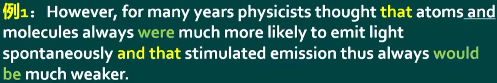
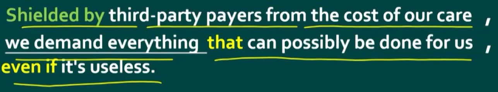

# 从句（`Subordinate`/`dependent Clause`）

由从属连词引导的一个句子叫从句。

XX从句的意思就是，在句子中做XX成分的是个从句（就一个从属的句子）。

判断某个从属连词引导的是什么从句，直接判断它处于句子什么位置，做什么成分即可。

但别忘了`that`不一定就是引导从句的，它还有代词的指代意思，那个。要看`that`是不是引导从句的，就看它后面是不是一个句子（即有没有谓语）

## 从句并列



`that…that…and that…`判断是与哪个并列？可以先从一个角度判断，`that`从句是否完整来判断是否是定语从句，并列的两个从句肯定是同一种从句。

这里的`that`和第二个`that`是并列关系，都是宾语从句。

## 宾语从句

句中作宾语

比较常见的就是`that`来引导从句：

```text
I believe that god is a girl
```text

另外宾语从句也能用关系代词`what`、`who`、`whom`、`which`、`whose`等来引导，此时不仅在主句中从句部分整体作宾语，从句部分的主语和谓语的动作也是修饰了这个关系代词代指的事物。而且是陈述句语序。

## 表语从句

系动词+表语从句，即句中作表语，与宾语从句类似

## 主语从句

`That`也可以拿来做主语从句：

```text
That god is a girl is obvious.
```text

但这样会头重脚轻，所以诞生了使用`It`做形式主语的情况，以上句子改写为：

```text
It is obvious that god is a girl
```text

另外`To do`也能拿来引导，但与`that`相同，通常也会被丢到后边，由`It`来做形式主语，后面`that god is a girl`才是真正的主语。

## 定语从句

在整个主句中作定语，仅作修饰，修饰名词。

用`that`引导的与其他从句相比不一样，因为它用`that`引导的从句成分一定不完整，而其他从句用`that`引导成分都是完整的。

### 判断修饰谁

定语从句修饰的名词（先行词）不一定就是最近的那个词，但有两个原则来判断：

1. 不能跨越谓语动词，太远了语言就晦涩难懂。
2. 代入定语从句根据语境判断。
3. 修饰人的肯定是`who`而不是用`which`
4. 它修饰的不一定就是一个词，也可能是构成了一个整体的名词。

### 翻译

如果定语从句太长了，就不要再倒叙翻译为…的，而是把先行词带入到定语从句中，翻译成而且/并且它…

还是太长了可以使用设问句翻译。

## 状语从句

### 状语从句的省略

若是主句和从句的主语一致，主句已经包含了主语等信息了，状语里面的主语信息要不省略就显得很冗余。

```text
When I was young, I could study English.
```text

省略主语，如果谓语动词有`be`动词也省略（因为没啥实际意义，省了也不影响句子理解）

### 让步状语从句



`even if`这里引导的是让步状语从句，意为即使。

由于医疗费用（`the cost of our care`）是被第三方支付的，我们要求用尽所有的医疗手段，即使它们没有任何作用。

这里前面的非谓语动词短语其实是原因状语从句的省略，还原回去就变成了`Because we are shielded by…`

## 同位语从句

容易与定语从句弄混，都是修饰前面的名词，但同位语从句成分完整，而定语从句成分不完整。同位语只是起到补充说明的作用

```text
I have a piece of news to you that you get an offer from Yale. // 同位语从句
I have a piece of news to you that comes from Yale. // 定语从句
```text

## 名词性从句、形容词性从句和副词性从句

名词性从句（`content clauses (noun clauses)`）：宾语从句、主语从句、同位语从句、表语从句

形容词性从句（`Relative (adjectival) clause`）：定语从句

副词性从句（`Adverbial clause`）：状语从句

### 连接副词和连接代词与关系副词和关系代词

名词性从句本身就是属于句子的成分，它们的从句引导词叫做连接代词/连系代词（`conjunctive/connective pronoun`），这类代词本身是名词性的，所以可以在从句中作主语或者宾语。

连接，连接句子，它是句子的重要组成部分。而关系，关系只是修饰，拿掉并不影响主干。

定语从句的引导词`who`、`which`、`that`等叫做关系代词。

什么是关系代词？

```text
I love the girl and she is beautiful.
= I love the girl who is beautiful.
```text

所以`and she = who`，又因为`she`-> 代词，`and`->连词，`who = and + she`即连词（解释从句与先行词之间的关系）+代词，起了个名字叫关系代词。

介词+`which` = `where`/`when`的时候，这个介词+`which`和`where`和`when`就都叫做关系副词。副词，起修饰作用作状语，就不用在定语从句里面作成分了，所以从句是完整的。

连接代词和关系代词可以在从句中作主语或者宾语。关系副词和连接副词在从句中起修饰作用，作状语。
