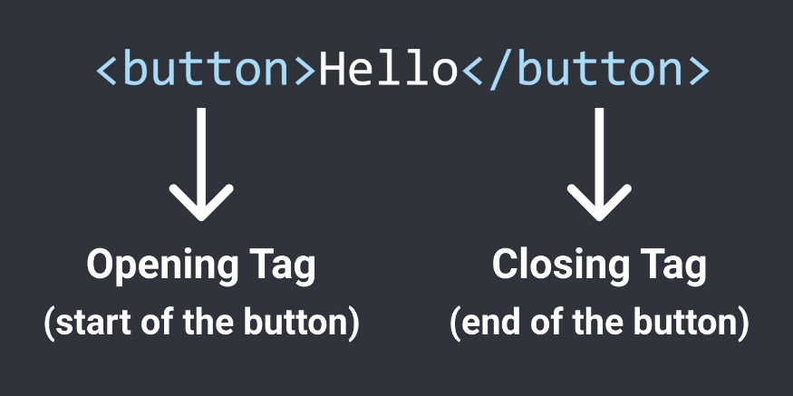
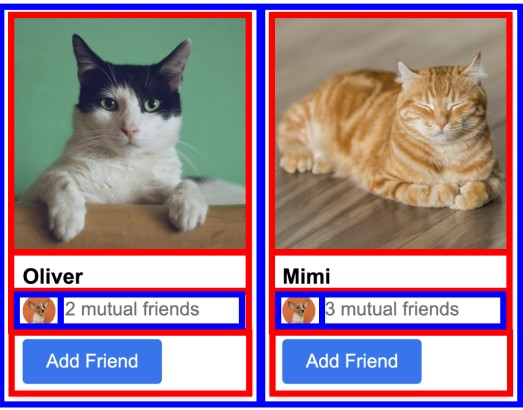
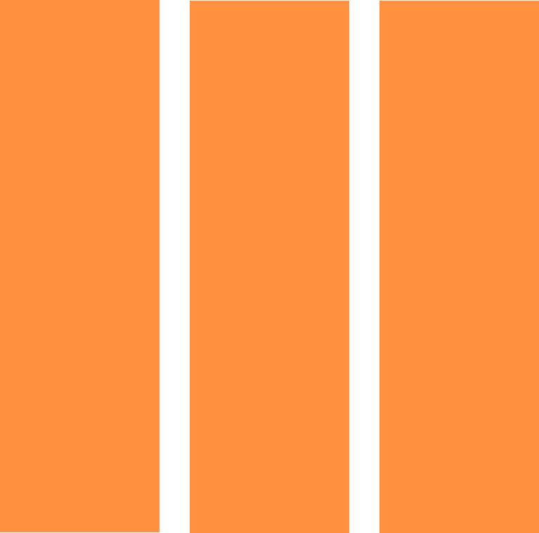

# HTML (Hyper Text Markup Language)

## Syntax

`Syntax` = rules for writing `HTML` code (like grammar in English).

Elements should have an opening tag and a matching closing tag. 

In `HTML`, extra spaces and newlines are combined into 1 space.(you can change text margin to achieve it)

```html
<p>paragraph of text</p>

<p>paragraph of text</p>

<p>
paragraph of text
</p>
```

All 3 examples above will show the same result on the web page.

## HTML Tag/HTML Element

分为三类

**block element:** takes up the entire line (relative to their container) even though they have zero margin. (actually has the default `CSS` property of `display: block`) (such as `<p>` `<div>`)

**inline-block element:** only takes up as much space as needed. (actually has the default `CSS` property of `display: inline-block`) (such as `<input>`)

**inline element:** appears within a line of text. (such as `<strong>`) it doesn't has width.

### Build-in Elements

| Tag or Element | Mean                                       | Remark                                                                                                                                                                                                                                                                                  |
|----------------|--------------------------------------------|-----------------------------------------------------------------------------------------------------------------------------------------------------------------------------------------------------------------------------------------------------------------------------------------|
| `<p>`          | paragraph                                  | is a block element. by default have `margin-top` and `margin-bottom` Reset the default margins. `{ margin-top: 0; margin-bottom: 0; }`                                                                                                                                                       |
| `<a>`          | anchor element                             | link to another website                                                                                                                                                                                                                                                                 |
| `<style>`      | element style                              | content can write `CSS` code. works in current `HTML` file.                                                                                                                                                                                                                                 |
| `<html>`       | a entire webpage                           | not much meaning to it.                                                                                                                                                                                                                                                                 |
| `<head>`       | contains all elements that are not visible | `<title>` `<style>` should put into it.                                                                                                                                                                                                                                                 |
| `<body>`       | contains all elements that are visible     |                                                                                                                                                                                                                                                                                         |
| `<title>`      | webpage title on browser tab               |                                                                                                                                                                                                                                                                                         |
| `<div>`        | division. just a box, container.           | is a block element. can contain other elements.                                                                                                                                                                                                                                         |
| `<table>`      | table element                              | contains table head: `<thead>` table body: `<tbody>` a Table Row element in body: `<tr>` a Table Data Cell element in row: `<td>` a Table Header element in row: `<th>`  use `<th scope="col">` for contents at first row or `<th scope="row">` for contents at first column            |
| `<pre>`        |                                            | has wrap attribute. you will find that it's not working to use `overflow-wrap` to style it. you need to use wrap to tag the element. [MDN Web Docs - pre element wrap attribute](https://developer.mozilla.org/en-US/docs/Web/HTML/Element/pre#attr-wrap)  |
| void elements  | don't need close tag                       |                                                                                                                                                                                                                                                                                         |
| `<link>`       |                                            | when `CSS` code is to long in style, split it into new `CSS` file and use this to link `CSS` file to current `HTML` file. **Attribute:** `rel`: stands for relation what we will link. values: `stylesheet`(`CSS` file) `href`: file path or url.                                                       |
| ``        |                                            | **Attribute:** `src`: img source path or url.                                                                                                                                                                                                                                             |
| `<input>`      |                                            | **Attribute:** `type`: the type of the input. such as text, checkbox `placeholder`: default text to display when it is empty.                                                                                                                                                               |
| `<b>`          | bold                                       | mark text bold.                                                                                                                                                                                                                                                                         |

### `<!DOCTYPE html>`

not a element, it just a special line to tell browser to use modern version of `HTML`.

## HTML Attribute

modify how an `HTML` element behaves.

| Attribute | Name | Remark                                           |
|-----------|------|--------------------------------------------------|
| `href`    |      | [W3Schools - HTML href Attribute](https://www.w3schools.com/tags/att_a_href.asp)  |
| `class`   |      |                                                  |

## HTML Text Element (Inline Elements)

appear within a line of text. Useful if we want to style only a part of the text.

| Text Element                                             | Name                | Remark                                                                |
|----------------------------------------------------------|---------------------|-----------------------------------------------------------------------|
| `<strong>`                                               | bold text           |                                                                       |
| `<u>`                                                    | underline text      |                                                                       |
| `<span>`                                                 | generic normal text | is the most generic text element (it doesn't have any default styles) |
| `<a>`                                                    |                     |                                                                       |
| Semantic Element `<main>` `<section>` `<header>` `<nav>` |                     | same as `<div>` but have meaning to screen readers and robot and so on.   |

## HTML Entity

是一段以 "&" 符号开头,以";" 符号结尾,能够表示 `Unicode` 符号的字符串文本

| HTML Code                    | Result | Name       |
|------------------------------|--------|------------|
| `&#183;` `&middot;`          | ·      | Middle dot |
| `&#10003;` `&#x2713;` `&check;` | ✓      | checkmark  |

## Nested Layouts Technique



There are 2 types of layouts:

### Vertical Layout


Use `<div>`s with `display: block` (most common)

Use `flexbox` with `flex-direction: column`

Use `CSS Grid` with 1 column

### Horizontal Layout



Use `<div>` with `display: inline-block` (not recommended, because it always cause alignment problem because of at the middle of `<div></div>` `<div></div>` has a backspace.)

Use `flexbox` with `flex-direction: row`

Use `CSS Grid` with multiple columns

## Table beautify
