# ASP.NET Core

> [!info] 家族导航
> - **主笔记（本文件）**：架构、管道、`Configuration`、RESTful API、`Swagger`、`gRPC`、`Blazor` 概览
> - [ASP.NET-Core-接口](ASP.NET-Core-接口.md)：请求参数绑定、Minimal API 等接口层细节
> - [ASP.NET-Core-进阶](ASP.NET-Core-进阶.md)：`ApplicationPartManager`、Application Model、`SignalR` 进阶细节
> - [ASP.NET-Core-认证](ASP.NET-Core-认证.md)：`OAuth2.0`/`JWT`/`OIDC`、认证授权体系、Swagger 认证
> - [DependencyInjection](DependencyInjection.md)：`IoC`/DI 生命周期、第三方容器（`Autofac`）、AOP（`Filter`）
> - [Configurations](Configurations.md)：`Options Pattern` 与配置绑定细节
> - [环境部署](../环境部署.md)：部署（局域网/公网/WebAssembly/HTTPS）与发布

## MVC架构

### URL结构

一般：`http://host:port/controller(控制器)/action(方法)`

### Model传值方式

`ViewData`、`ViewBag`、`TempData`、`Model`传值，后台传数据到前台，前台绑定数据

### Session 会话 与 Cookies储存在用户本地终端上的数据

`Session`是在服务端保存的一个数据结构，用来跟踪用户的状态，这个数据可以保存在集群、数据库、文件中；

`Cookie`是客户端保存用户信息的一种机制，用来记录用户的一些信息，也是实现`Session`的一种方式。用户验证这种场合一般会用`Session`

`HTTP`协议是无状态的协议，所以服务端需要记录用户的状态时，就需要用某种机制来识具体的用户，这个机制就是`Session`，标识用户并跟踪，一般放在服务器内存，使用缓存服务等。运行依赖`session_id`，然后`id`在`cookies`中，若是`cookies`禁用，`session`失效，但会使用`url`重写实现传递。`JSESSIONID`只是`tomcat`的对`sessionid`的叫法

> [!note] 2026-09 治理修订
> 原文自注"现在过时"。明确表述：传统服务端 `Session` 方案在现代无状态/分布式架构中已较少直接使用，更常见的做法是使用 `token` 机制（如 `JWT` 形式的 `access_token`）标识用户，其作用与 `session_id` 类似。详见 [Token机制](#token机制) 与 [ASP.NET-Core-认证](ASP.NET-Core-认证.md)。

`ASP.NET`中是在`HttpContext`中，但已经不是标配，不能直接使用，需要进行配置：添加中间件以及服务实例


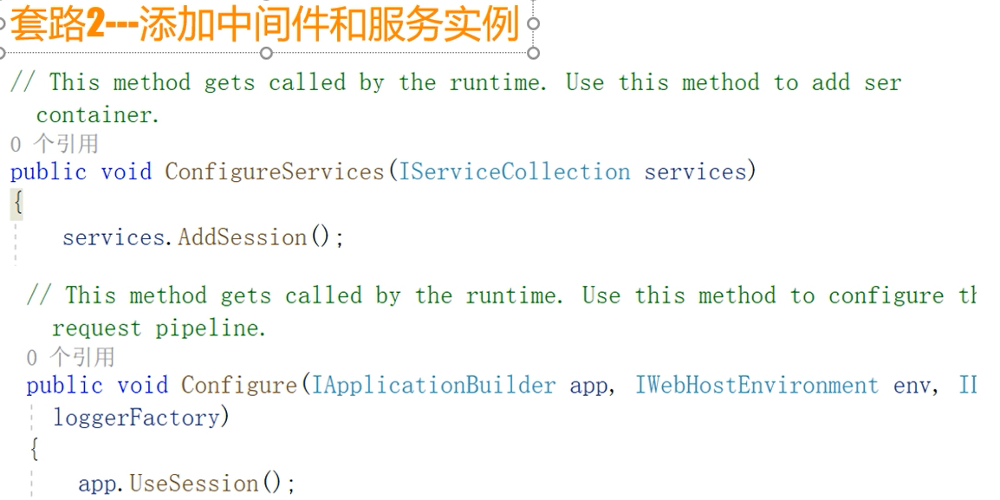

`ASP.NET Core`核心理念之一：pay-for-what-you-use 按需加载，要啥配置啥，不是原来`ASP.NET`的全家桶了。所以简约、高效。

### Token机制

使用`Identity Server4`

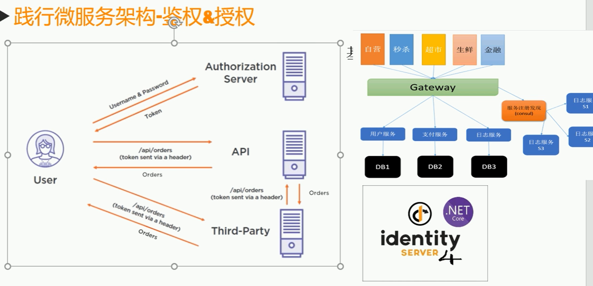

用户先通过登陆获取`token`，然后每次请求都带有`token`，请求到达`Gateway`之后会直接通过一种加密验证机制验证`token`是否有效，所以`Gateway`能够实现鉴权授权的效果。

`OAuth2.0`/`JWT`/`OIDC` 等认证授权细节见 [ASP.NET-Core-认证](ASP.NET-Core-认证.md)。

## 控制台程序为什么变成了网站（原理）

`HTTP`协议是请求响应模型，浏览器访问端口传递数据，请求要进入到代码的话，需要有一个东西负责监听请求然后解析为`HTTPContext`，然后发给`MVC`程序。

`ASP.NET Core`里的这个东西叫做`Kestrel`，是精简高效的`HttpServer`，以包形式提供，自身无法单独运行。内部封装了对`libuv`的调用，作为I/O的底层，屏蔽各系统底层实现的差异，无需依赖`IIS`等，基于`.NET Core CLR`，是一个独立的程序了，因此做到了跨平台。

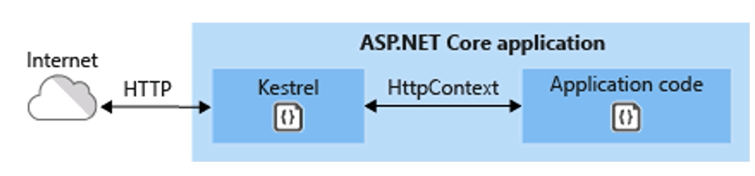

### 创建服务器的入口

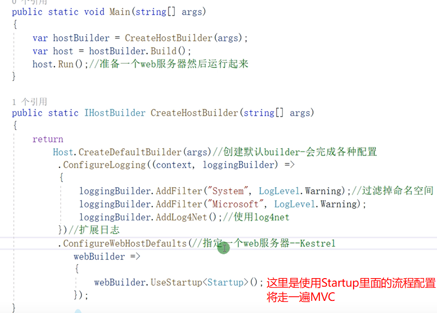

要对`Kestrel`进行配置，需要在`appsettings.json`中添加`Kestrel`节点，因为源代码中有这一操作

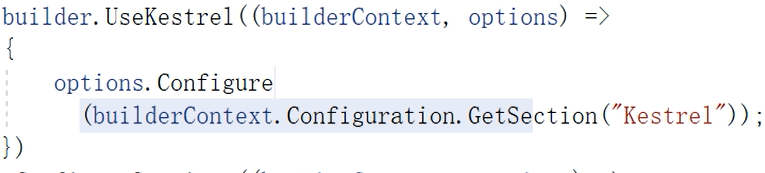

### Startup类

> [!note] 时效说明
> `Startup`/`Configure`/`ConfigureServices` 为 .NET 6 之前的写法，此后用 minimal hosting（`Program.cs` 顶层语句直接使用 `builder`/`WebApplication`）；下述管道与注册原理仍然适用。

是`Kestrel`服务器和`MVC`的关联配置。

`Configure`方法是配置`Http`请求的`pipeline`（管道），即`Http`请求的处理过程。即使`Configure`里面的所有中间件服务注释，仍然会成功运行，响应404，因为源码中的`ApplicationBuilder`管道`Build`里面写了一个默认中间件404。

若只留一个：

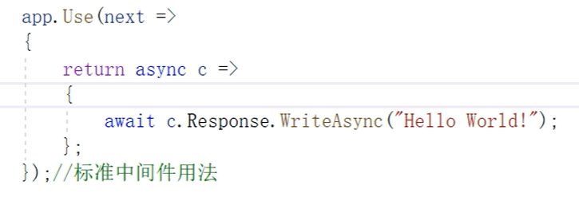

那么也会成功响应，且任何请求都返回Hello World！侧面证明这是从请求层面完整的响应处理。

所以`MVC`框架需要自行设计。即设计管道

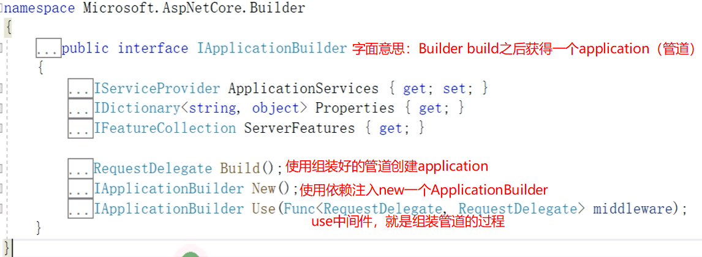

### 管道模型（中间件、洋葱）

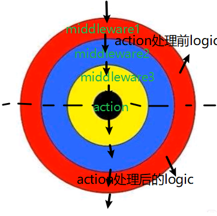

拼接管道原理（如何洋葱般的拼接一系列的`delegate`）

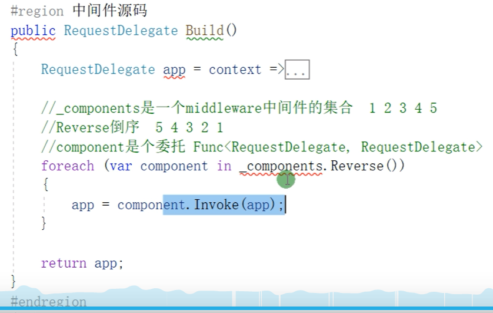

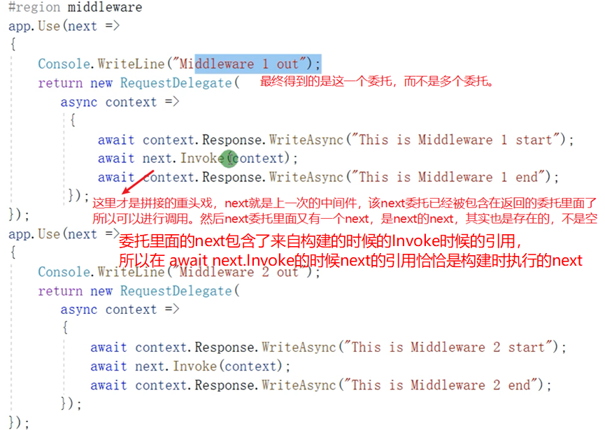

## 开发

使用`VS`开发的时候，`properties`里面的`launchSetting.json`文件配置的`IISExpress`启动、作为脚本命令行的程序启动，都是为开发服务的，在正式环境上是无效的。

- 可以使用**`IIS`**等**服务器**进行托管：

项目右键进行发布然后用`IIS`指向发布的文件夹即可, 不发布无法部署，直接指向则失败，因为没有对`IIS`与`Kestrel`之间的监听转发关系做配置，即缺少了发布时自动生成的`web.config`文件（见下图）

- 可以基于控制台**自托管**（因为内置了`Kestrel`服务器）：

编译运行之后，在`Debug`下的`netcoreapp3.1`文件夹里面使用`cmd`，然后使用`dotnet xxxxx（完整程序集名称）.dll --urls=http://*:8888 --ip="127.0.0.1" --port=8888`。它就会开始监听这个端口。若是编译不是发布，网站能够访问但是里面的资源、样式等一般会无法访问因为路径不对，因为`wwwroot`文件夹内文件没有自动拷入。

若是要调整静态资源文件路径，在`Startup.cs`文件中配置`UseStaticFiles`

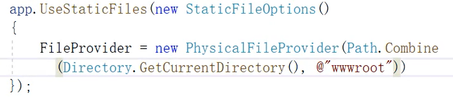

使用`IIS`托管的原理：

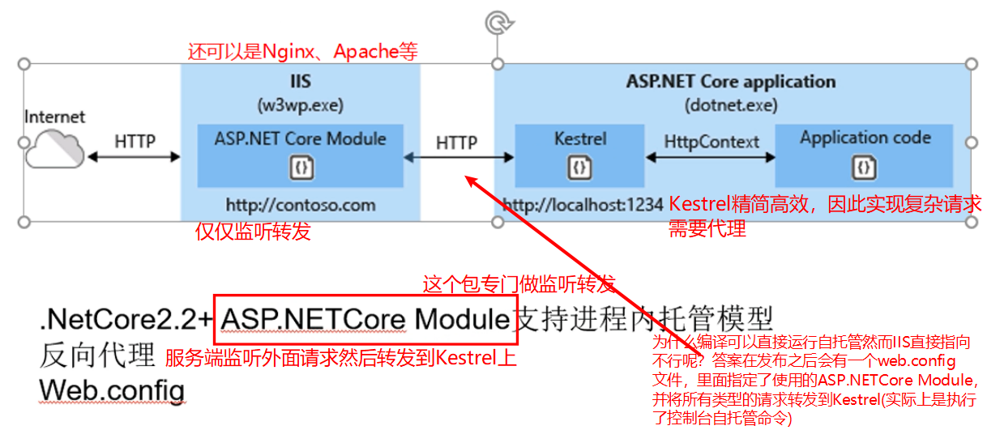

### 使用Configuration

[Configuration in ASP.NET Core | Microsoft Learn](https://learn.microsoft.com/en-us/aspnet/core/fundamentals/configuration/?view=aspnetcore-7.0)

`builder.Configuration`实际上是按下图优先度读取配置（越前面的优先度越高）：

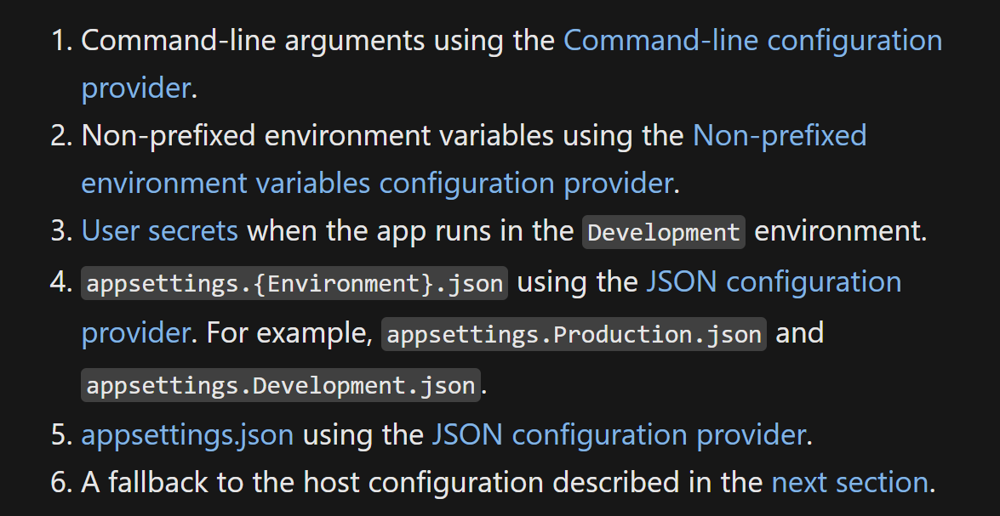

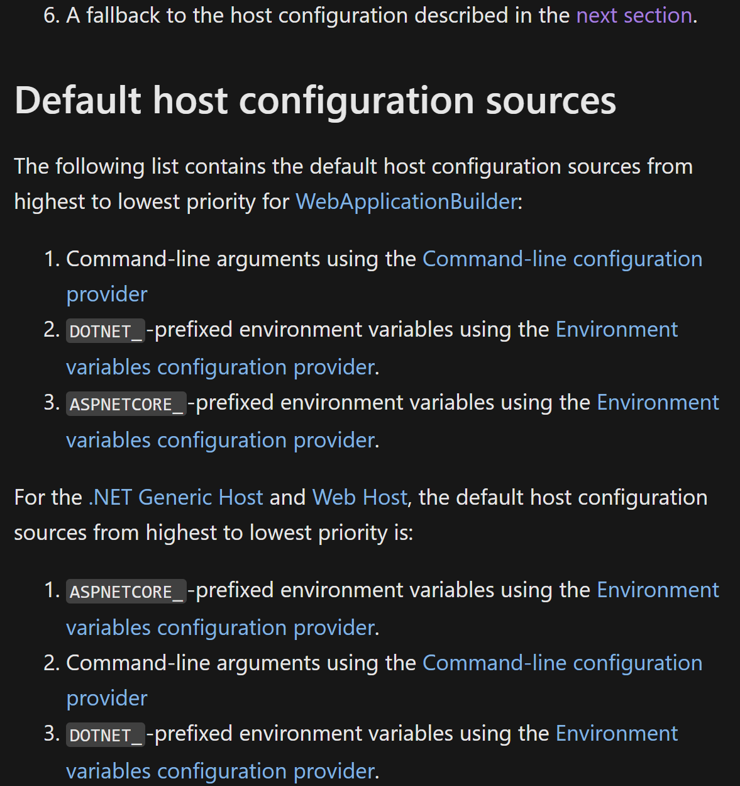

具体怎么选择看环境：

[Use multiple environments in ASP.NET Core | Microsoft Learn](https://learn.microsoft.com/en-us/aspnet/core/fundamentals/environments?view=aspnetcore-8.0)
Secrets and passwords should not be stored for production environments in the configuration files.

Consider using services like key vault on azure or database encrypted configurations or build server variables that will override the environment specific secrets.

还可以注册配置类（这就叫`Options Pattern`了，将配置转化为强类型配置）

```csharp
builder.Services.Configure<FooSettings>(builder.Configuration);
```

[c# - What is the difference between services.Configure() and services.AddOptions\<T\>().Bind() when loading configuration in ASP.NET Core? - Stack Overflow](https://stackoverflow.com/questions/55762813/what-is-the-difference-between-services-configure-and-services-addoptionst)

具体：

[Options pattern in ASP.NET Core | Microsoft Learn](https://learn.microsoft.com/en-us/aspnet/core/fundamentals/configuration/options?view=aspnetcore-7.0#options-validation)

在服务中就可以`IOption<FooSettings>`来获取配置了

注意，`IOption`是只读取一次的。

`IOptionSnapshot`类似于`Scope`，下一次请求会重新读取配置。（无法注册到单例生命周期服务）

`IOptionsMonitor`则会即时读取配置。

Options 三兄弟（`IOptions`/`IOptionsSnapshot`/`IOptionsMonitor`）与配置绑定的更多细节见 [Configurations](Configurations.md)。

通用读环境变量：

`Environment.GetEnvironmentVariable`

可以自己再弄一个`IConfiguration`字典，配置类相关接口，使用提供或自定义的`Configuration provider`加载配置。

- `IConfiguration`: Represents a set of key/value application configuration properties.

- `IConfigurationRoot`: Represents the root of an IConfiguration hierarchy.

- `IConfigurationSection`: Represents a section of application configuration values.

工厂模式创建`ConfigurationRoot`

```csharp
IConfigurationRoot config = new ConfigurationBuilder()
.AddJsonFile("appsettings.json")
.AddEnvironmentVariables()
.Build();
```

### 依赖注入（IoC）

抽象（写一个接口）、实现（实现这个接口）、注册（在容器中注册对接口服务的实现）、使用（在 `controller` 中依赖注入，即写一个 `private readonly` 接口成员，在构造函数里增加一个接口实例参数，然后赋值）。要用`IoC`最好全程都用`IoC` (Inversion of Control)，好处是解耦、屏蔽对象实现细节、生命周期管理与`AOP`。

`ASP.NET Core`中的内置`IoC`容器是`Microsoft.Extensions.DependencyInjection`中的`ServiceCollection`，可以单独使用，但功能有一定局限性（比如只支持构造函数注入），可以换用第三方容器比如`autofac`。

三种生命周期（`AddTransient`/`AddSingleton`/`AddScoped`）、注入兼容性矩阵、手动获取依赖、第三方容器（`Autofac`）与`AOP`（`Filter`）的完整内容已分流至 [DependencyInjection](DependencyInjection.md)。

## 构建RESTful API

`MVC`映射为`RESTful API`，

`Model`，负责处理程序数据的逻辑

`View`，程序里负责展示数据的部分，那么`API`中的角色就是数据或资源的展示，比如使用`Json`。

`Controller`，负责`View`和`Model`之间的交互。如果仅需要通过`ASP.NET Core`进行`Web API`编程，控制器类只需继承`ControllerBase`类即可，提供`API`相关支持，不需要继承`Controller`，因为`Controller`里面添加了对视图层的支持，适用于`MVC Web`应用程序而不是`Web API`。然后类加上特性`[ApiController]`

非强制但有优点：

1. 要求使用`Attribute`属性路由，即不能在`Startup`里面配置路由信息而是在`Controller`类中`Action`单独配置。

2. 验证`Model`含有错误信息时自动`HTTP 400`响应

3. 推断参数绑定源

4. `Multipart/form-data`请求推断

5. 错误状态代码的问题详细信息

数据获取是先写`IService`接口来抽象`Model`的获取然后用一个类继承接口来进行`Model`的获取处理，最后在`Controller`里面依赖注入，使用服务来获取资源，这样才能满足`IOC`。

`ControllerBase`父类里面有针对于`HTTP`返回码的方法，`Ok(资源)`、`NotFound()`

### 属性路由

`Controller`类里面的`action`方法上写上`[HttpGet]`等可以限制只能使用`Get`方法来使用此`action`。然后`[HttpGet("{id}")]`也可以获取到后面的`id`值然后在`action`里面使用

但是若是没有在`Startup`里面配置路由，那么得改用属性路由即`[HttpGet("api/xxx/{id}")]`，即`url`模板，若是一个`controller`类里面的`action`开头都是`api/xxx`，那么可以提取出来，直接在类上再加一个特性`[Route("api/xxx")]`，这样`action`上的`url`模板就不必再写`api/xxx`了。

还有一种可以`[Route("api/[controller]")]`就是类名删去`Controller`之后的名字(需要满足`Controller`命名规范才行)，这样可以做到即使`controller`类名更改，`api`也会变动。

`action`除了用`[HttpGet(xxx)]`来写路由模板，也可以通过`[HttpGet]`再加`[Route("xxx")]`来写

`api`消费者可以在`Header`请求头中写`Media Type`比如`application/json`或`application/xml`来表明自己期望返回的数据格式。如果填写的是服务端没有支持的类型，最好是返回`406 Not Acceptable`（但默认`ASP.NET Core`会返回默认的处理格式，需要配置`Controller`才能自动返回`406`）。与之相对应的请求头中写的`Content-Type Header`就是表明输入格式，`api`消费者给的消息是什么格式的，提醒服务端用那个格式来解析。`ASP.NET Core`里输入输出配置就是`output/input formatters`，默认情况下使用`json`作为输入和输出的格式化器。

配置`Controller`是在`ConfigureServices`中`AddControllers`里面的

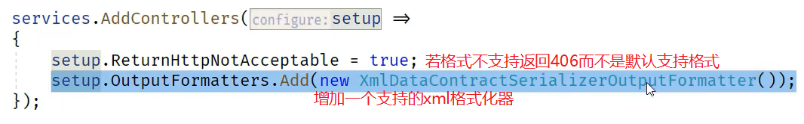

3.0后的写法是

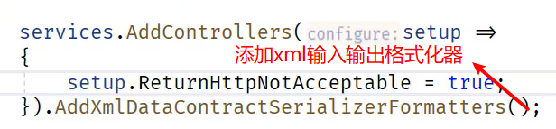

使用`POST`新建资源

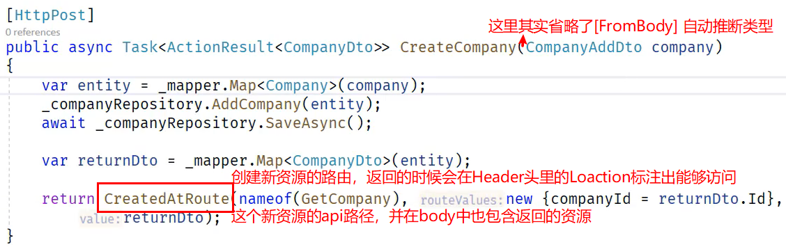

### API属性/字段映射

| Attribute    | 功能                               | 备注                                                                  |
|--------------|------------------------------------|-----------------------------------------------------------------------|
| `[FromBody]`   | `body`头中，`json`序列化，只能有一个   | 默认按照参数名匹配，如果不一致，使用`attribute`内的`Name`属性指明，下同。 |
| `[FromQuery]`  | `/api/controller/get?id=1&name=John` |                                                                       |
| `[FromRoute]`  | `/parameter/value/parameter2/value2` |                                                                       |
| `[FromHeader]` |                                    |                                                                       |

### 外部Model和数据库Model

即数据库映射的`Entity Model`和`api`里面需要面向外部的`model`（可理解为`viewmodel`视图模型），所以它们应该分开，这样数据库更新后，`api`不会频繁受影响，能够更加健壮、可靠、更易于进化。这种面向外部`model`也可以叫做数据传输对象（`DTO`)(Data Transfer Object)。`System.ComponentModel.DataAnnotations`中有很多对于`Model`的验证限制。

另外发现`ASP.NET Core`中的`Dto`类（`Model`）在用于`Controller`中的`body`自动进行`json`反序列化时，默认是都不可为`null`的，如果传过来的`json`字段少了，会直接响应错误`json`。这种情况`Dto`类里面的字段需要加`?`，没错，`string`类也要加`?`才代表这字段可`null`，`json`不必传输。

#### AutoMapper

能够自动映射`object`到另一个`object`。专门为`ASP.NET Core`服务的一个扩展服务是在`AutoMapper.Externsions.Microsoft.DependencyInjection`中，是，在`Startup`中注册服务`AddAutoMapper(xxxx程序集);` 会去程序集中扫描`automapper`配置文件。配置文件的写法是新建一个继承`Profile`（`AutoMapper`中的）的类

配置：

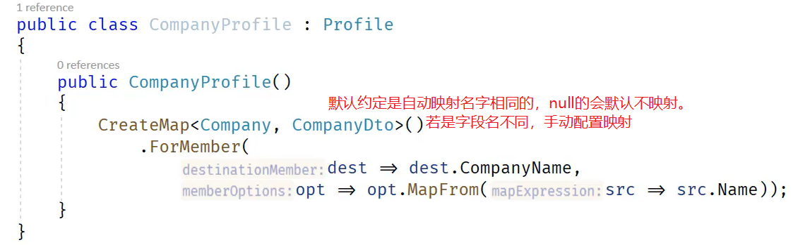

使用（这里是用了依赖注入`IMapper`）：

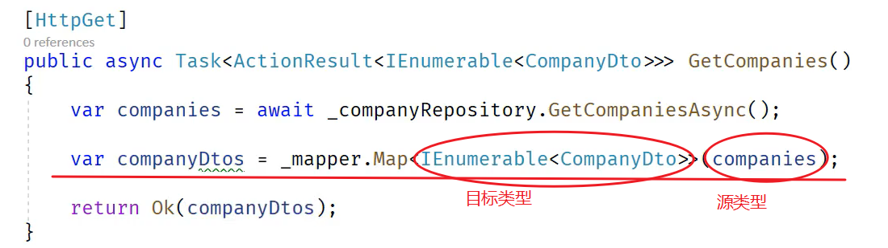

**功能**

1. 支持直接`map`到配置过的目标类型的集合类：`IEnumerable`、`ICollection`、`IList`、`List`、`Arrays`

   ```csharp
   mapper.Map<IEnumerable<XXX>>(源类型);
   ```
2. 处理空集合，源类型中的集合类型为`null`，则会自动映射到目标类型为空集合而不是`null`。
3. 方法到属性映射，可以直接像配置映射到属性一样映射到方法，只要返回值一致，不需要其他配置。
4. 自定义映射，当目标类型和源类型属性名或类型不一致，需要做一些转换时，使用自定义映射

   ```csharp
   var config = new MapperConfiguration(cfg =>
   {
       cfg.CreateMap<Employee, EmployeeDto>()
           .ForMember("EmployeeID", opt => opt.MapFrom(src => src.ID))
           .ForMember(dest => dest.EmployeeName, opt => opt.MapFrom(src => src.Name))
           .ForMember(dest => dest.JoinYear, opt => opt.MapFrom(src => src.JoinTime.Year));
   });
   ```

   例子是`ID`和`EmployeeID`、`EmployeeName`和`Name`属性名不同，`JoinTime`和`JoinYear`不仅属性名不同，属性类型也不同。

   其实用法就是`ForMember(目标字段对象，其值的来源/映射方法（可以用方法计算因为是lambda）)`
5. 嵌套映射，只要注册过的类型的映射，那么源类型里面的注册过的类型就会相应的自动映射。

**其他配置**

1. 可见性（`ShouldMapProperty`）

默认情况下，`AutoMapper`仅映射`public`成员，但其实它是可以映射到`private`属性的。需要注意的是，这里属性必须添加`private set`，省略`set`是不行的。

2. 全局属性/字段过滤（`ShouldMapField`）

默认情况下，`AutoMapper`尝试映射每个公共属性/字段。

### 返回类型

`Controller`返回类型一般是`Task<IActionResult>`，实际上明确写出来就是`Task<ActionResult<T>>`，这种明确的好处是用一些第三方的`api`文档生成器的时候自动生成更详细的文档比如返回类型的属性，比如`Swashbuckle`的`Swagger`文档。

### API文档（使用Swagger）

`ASP.NET Core`安装`Swagger`，是`Swashbuckle.AspNetCore`包中的。

#### 配置Swagger

`Startup`的`configureService`中添加

```csharp
services.AddSwaggerGen(c =>
{
    c.SwaggerDoc("v1", new OpenApiInfo {Title = "Koubot API", Version = "1.0"}); //OpenApiInfo会对API文档增加说明信息
    c.IncludeXmlComments(System.IO.Path.Combine(AppContext.BaseDirectory, "Koubot.Server.xml"));
});
```

添加中间件服务 （注意这里的"v1",必须一样才会找到json）

```csharp
app.UseSwagger(); //启用中间件服务生成Swagger作为JSON终结点
//启用中间件服务对swagger-ui，指定Swagger JSON终结点
app.UseSwaggerUI(c =>
{
    c.SwaggerEndpoint("/swagger/v1/swagger.json", "Koubot API v1.0");
    c.RoutePrefix = string.Empty;//默认访问swagger UI是/swagger，设置为空可以直接通过url访问
});
```

##### 为接口文档添加注释

项目设置中的"生成"，启用XML文档文件，输出最好写`bin\xxxx.xml`，这时会增加一个warning的提示，对公有方法未写xml注释会有波浪线，在"禁止显式警告"中添加1591

注释格式：

```csharp
/// <summary>
/// 这是一个带参数的get请求
/// </summary>
/// <remarks>
/// 例子:
/// Get api/Values/1
/// </remarks>
/// <param name="id">主键</param>
/// <returns>测试字符串</returns>
/// <response code="201">返回value字符串</response>
/// <response code="400">如果id为空</response>
```

`SwaggerUI`可以测试`api`接口

然后运行，访问设定的`json`地址，比如这里就是访问 `http://localhost:port/swagger/v1/swagger.json`，获取`api`的`json`信息。

使用这个`api json`信息复制到`swagger`官网的编辑器中，可以选择生成对应语言的客户端SDK。

C#的SDK有bug，需要做一些修改才能直接使用：

simply override the property BasePath and add a personal static property ApiHost into GlobalConfiguration, and go back to its parent class Configuration constructor and annotate BasePath = "/"; , and just at first define the GlobalConfiguration.ApiHost, then it work for all api without any configure.

就是用`BasePath`赋值一个静态变量

另外生成dll也有bug，需要打开bat文件然后手动下载最新的nuget到目录再运行。但bat还是有bug，所以还是直接复制IO.Swagger项目直接引用使用，记得需要把依赖的三个dll（用bat生成的）复制到项目然后IO.Swagger去引用。

- 版本控制：[swagger版本控制 - 博客园](https://www.cnblogs.com/gdsblog/p/9279814.html)
- token 设置：`JWT`/`Bearer` 认证接入 `Swagger`（含 `RedirectUris` 配置）见 [ASP.NET-Core-认证](ASP.NET-Core-认证.md) 的「Swagger认证」一节（原外部链接：[swagger全局token设置 - CSDN](https://blog.csdn.net/shujudeliu/article/details/82189262)）
- 其他避坑：[ASP.NET Core Swagger 使用避坑 - 博客园](https://www.cnblogs.com/gl1573/archive/2020/04/07/12652708.html)

似乎enum上的注释不支持，只能显示enum类上的注释，所以要把所有数字代表的写在一起…

### 使用配置文件

`Controller`类里面可以依赖注入`IConfiguration`，

然后`_configuration.GetSection("node").GetValue<类型>("子node")`

## 部署

部署相关内容已分流至 [环境部署](../环境部署.md)，含：

- 局域网简单部署（`dotnet xxx.dll --urls` + 防火墙入站规则）
- 公网部署
- `WebAssembly` 部署（`Server` 项目 `Publish`）
- 最好在 `dll` 当前目录下启动服务（`sqlite` 等相对路径问题）
- `HTTPS` 部署（`dev-certs`、`IIS Express` 44300-44399 预留端口）

## 作为前端服务器

使用`app.UseStaticFiles();`默认将当前运行目录下的`wwwroot`作为`baseDirectory`

所以只需要将`VUE`等生成的`dist`文件夹中的内容，拷贝到`wwwroot`下即可。

## SignalR

多种实现双向通信协议的封装与抽象（`WebSocket`、`Server-Sent Events`、`Long Polling`，根据实际`Client`兼容情况向后`Fallback`。后续会根据技术迭代增加`gRPC`等），实时推送解决方案。

所以无法简单的向下兼容使用如原生`WebSocket`直接连接`SingalR`。

强行兼容：[SignalR is an abomination: how to connect using raw WebSockets](https://www.derpturkey.com/signalr-is-an-abomination-how-to-connect-using-raw-websockets/)

优点：

自动选择支持的双向通信技术、新技术迭代后无需改动代码享受高性能协议。

封装方式是`RPC`，代码易读易懂，扩展方便。

多种自带功能，如重连等。

一种适合于`.NET`（也支持`Javascript`）的`RPC`技术，用于构建实时性的`Web app`。

[Use ASP.NET Core SignalR with Blazor | Microsoft Learn](https://docs.microsoft.com/en-us/aspnet/core/blazor/tutorials/signalr-blazor?view=aspnetcore-6.0&tabs=visual-studio&pivots=webassembly)

建议使用强类型

```csharp
public class StronglyTypedChatHub : Hub<IChatClient>
```

[Strongly typed hubs | Microsoft Learn](https://docs.microsoft.com/en-us/aspnet/core/signalr/hubs?view=aspnetcore-6.0#strongly-typed-hubs)

这里`Hub`中的接口`IChatClient`是指`Client method`：

The return value of a client method must be void or of type Task.

`Client`端的强类型暂时未实现：

[Client-side strong typing · Issue #32534 · dotnet/aspnetcore](https://github.com/dotnet/aspnetcore/issues/32534)

连接事件（`OnConnectedAsync`/`OnDisconnectedAsync`）、从 Hub 外（如 `Controller`）发送消息、多 `Hub` 连接等进阶细节见 [ASP.NET-Core-进阶](ASP.NET-Core-进阶.md#signalr)。

## gRPC

`gRPC` 最初由谷歌开发，是一个基于 `HTTP/2` 实现的高性能远程过程调用框架。但由于浏览器没有直接暴露 `HTTP/2`，所以 Web 应用程序不能直接使用 `gRPC`。

`gRPC Web` 是一个标准化协议，它解决了这个问题。

**注意，`gRPC`传输使用`http/2`协议，而`http/2`协议需要`https`。**

[Call insecure gRPC services with the .NET client | Microsoft Learn](https://learn.microsoft.com/zh-cn/aspnet/core/grpc/troubleshoot?view=aspnetcore-7.0#call-insecure-grpc-services-with-net-core-client)

`gRPC`有四种调用方式

[gRPC service methods | Microsoft Learn](https://learn.microsoft.com/en-us/aspnet/core/grpc/services?view=aspnetcore-7.0#implement-grpc-methods)

不过`gRPC`都是只支持一个请求参数（即接口的请求类只能有一个）

### Unary

单项请求响应类，类似普通`RESTful API`。

### Server streaming

客户端发送消息请求后，服务端流式发送，即可以一直保持连接，服务端随意间隔发送消息。客户端可发送取消连接的`CancellationToken`，但无法发送信息给服务端。服务端完成消息发送后结束。

### Client streaming

客户端请求建立连接后，客户端不断流式发送消息给服务端，服务端异步监听获取，直到服务端返回响应后结束。

### Bi-directional streaming

双向流即建立连接后，双方都可以流式的异步发送消息。

服务端可以多线程进行异步读取和异步发送，也可以单线程地异步读取并处理而进行发送响应。

而`gRPC Web`不支持`Client`和双向流。

整体上不建议使用`gRPC Web`。即前端还是老实使用`RESTful API`。

后端服务间调用建议采用`gRPC`

### 概念

[Create .NET gRPC clients | Microsoft Learn](https://docs.microsoft.com/en-us/aspnet/core/grpc/client?view=aspnetcore-6.0)

### 最佳实践

1. Creating a channel can be an expensive operation. Reusing a channel for `gRPC` calls provides performance benefits.
2. `gRPC` clients are created with channels. `gRPC` clients are lightweight objects and don't need to be cached or reused.
3. Multiple `gRPC` clients can be created from a channel, including different types of clients.
4. A channel and clients created from the channel can safely be used by multiple threads.
5. Clients created from the channel can make multiple simultaneous calls.

### Protobuf-net

[protobuf-net/protobuf-net: Contract based serialization library for .NET](https://github.com/protobuf-net/protobuf-net)

可以使用该第三方库从`Class`生成`proto`文件。

`protobuf-net.BuildTools` 该工具可以检查使用`[ProtoContract]`或`[Service]`定义的语法错误

教程及介绍

[Create code-first gRPC services and clients | Microsoft Learn](https://learn.microsoft.com/en-us/aspnet/core/grpc/code-first?view=aspnetcore-7.0)

[protobuf-net.Grpc getting started](https://protobuf-net.github.io/protobuf-net.Grpc/gettingstarted)

#### 效率测试

[protobuf-net.Grpc issue #151](https://github.com/protobuf-net/protobuf-net.Grpc/issues/151)

## Unit Test

### Moq

In simple English, `Moq` is a library which when you include in your project give you power to do Unit Testing in easy manner. Why? Because one function may call another, then another and so on. But in real what is needed, just the return value from first call to proceed to next line. `Moq` helps to ignore actual call of that method and instead you return what that function was returning. and verify after all lines of code has executed, what you desired is what you get or not. Too Much English, so here is an example:


### Cookies

[httpwebrequest - Cookie with empty domain - Stack Overflow](https://stackoverflow.com/questions/4463610/httpwebrequest-cookie-with-empty-domain)

`CookieContainer`是像浏览器一样，可以给多个`HttpWebRequest`复用的，所以需要声明出`Cookie`的`Domain`、`Path`。（即，`request`目标是匹配访问`Domain+Path`的才会使用该`Cookie`，否则不使用）

#### Response中的Cookies

如果`Request`没有使用`CookieContainer`时，那么返回的`Response`也不会有`Cookie`（但可以在`Header`看到）。所以要`Cookie`得需要再`Request`时候新建一个`CookieContainer`。

## 补充

### Blazor / Razor Components

- 来源：`Monica.UI`
- `UseStaticWebAssets()` 更适合本地调试或开发环境，方便直接读取引用库静态资源；生产环境应依赖 `dotnet publish` 输出的静态资源，不要把它当正式部署方案。
- 如果调试时出现 `/_framework/blazor.web.js`、样式文件或其他静态资源 `404`，要先检查当前环境是否真的走到了开发配置，以及项目是否正确启用了 Web Assets 相关设置。
- `MapRazorComponents(...).AddInteractiveServerRenderMode()` 后，如果缺少 `AddAdditionalAssemblies(...)`，站内路由跳转可能正常，但浏览器直接 `F5` 刷新会出现 `404`。
- CSS isolation 最终会按入口程序集生成 `xxx.styles.css`；消费组件库时，样式资源查找应以入口程序集名称为准，而不是组件库自己的程序集名。

```csharp
            // Important pitfall:
            // UseStaticWebAssets is useful for debugging static resources (CSS/JS) from referenced RCLs in Visual Studio,
            // but it can cause 404 behavior in certain build/debug combinations and must not be relied on for production.
            // In production, static web assets should come from published output (`dotnet publish`).
            // https://github.com/MudBlazor/MudBlazor/issues/2793
            webBuilder.WebHost.UseStaticWebAssets();
            // In local/testing scenarios, generated static-web-asset mappings can be inspected via .StaticWebAssets.xml.
            // In production publish output, dependent static assets are copied into the deployed wwwroot content.
            // https://learn.microsoft.com/en-us/aspnet/core/razor-pages/ui-class?view=aspnetcore-8.0&tabs=visual-studio#consume-content-from-a-referenced-rcl

            // If `/_framework/blazor.web.js` returns 404 in Debug, one possible cause is static-web-asset setup.
            // Another cause is an unexpected environment (for example, launchSettings.json not being applied).
            // Also verify `<RequiresAspNetWebAssets>true</RequiresAspNetWebAssets>` in the host .csproj when needed.
```

### Controller 与动态代理

- 来源：`Monica.DependencyInjection`
- 如果希望 `Controller` 参与基于 DI 的动态代理或拦截，仅靠默认 Controller 激活流程可能不够；需要使用 `AddControllersAsServices()` 让 Controller 真正进入容器管理。
- 否则即使普通请求还能工作，代理生成和拦截器注入也可能完全不生效。
