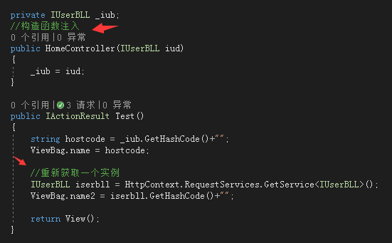
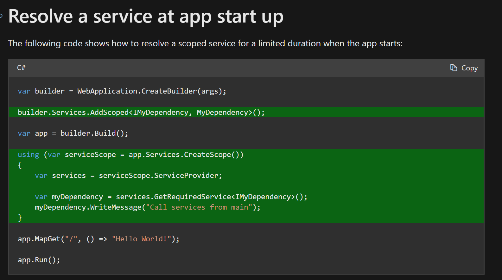
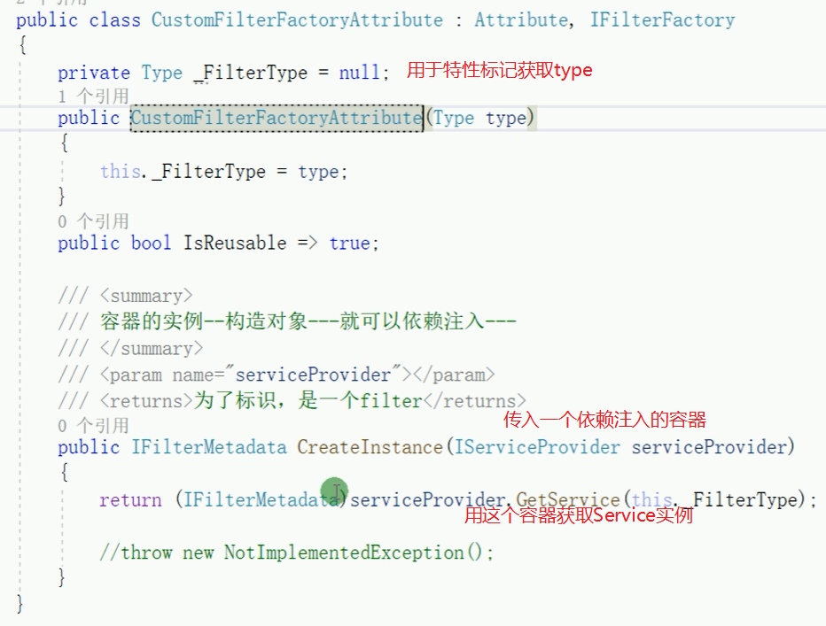
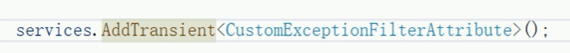
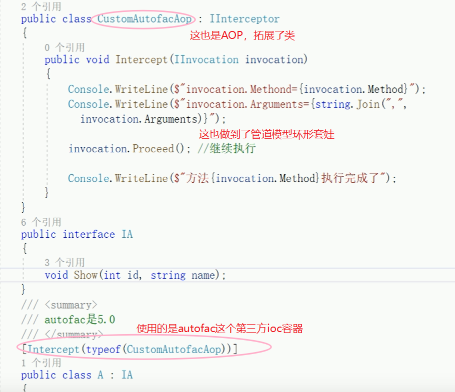
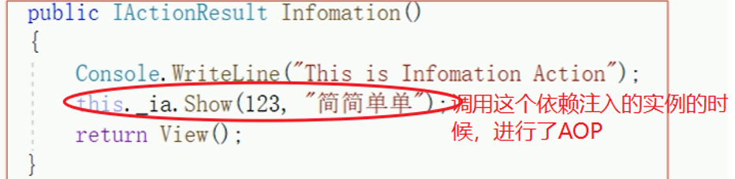

# 依赖注入

> 相关笔记：[ASP.NET-Core](ASP.NET-Core.md)（主笔记，含 DI 简述与家族导航）。

## IoC 概念与 ASP.NET Core 内置容器

抽象（写一个接口）、实现（实现这个接口）、注册（在容器中注册对接口服务的实现）、使用（在 `controller` 中依赖注入，即写一个 `private readonly` 接口成员，在构造函数里增加一个接口实例参数，然后赋值）。要用`IoC`最好全程都用`IoC` (Inversion of Control)。

好处：

1. 去掉对于细节的依赖，方便拓展，减小影响范围，只需要改注册处换一个接口实现实例，甚至可以转移到对配置文件的依赖，只需要修改配置文件。（解耦）
2. 假如没有`IoC`，一种服务如果依赖于其他的服务，比如服务D构造需要服务C，服务C构造需要服务B，服务B构造需要服务A，而且要知道全部实例细节。工程量巨大。但是`IoC`能够屏蔽细节，对象依赖注入（`DI`），要服务D就直接拿服务D，不必关心如何构造。 （屏蔽对象的实现细节）
3. 生命周期管理、`AOP`面向切面编程（`Aspect Oriented Programming`）

`ASP.NET Core`中的内置`IoC`容器是`Microsoft.Extensions.DependencyInjection`中的`ServiceCollection`，可以单独使用，但功能有一定局限性（比如只支持构造函数注入），可以换用第三方容器比如`autofac`。

> [!note] 时效说明
> 下文 `Startup` 的 `ConfigureServices`、`CreateHostBuilder` 等为 .NET 6 之前的写法，此后用 minimal hosting（`Program.cs` 顶层语句直接使用 `builder`/`WebApplication`）；注册与生命周期原理不变。

## 关系矩阵
在 ASP.NET Core 的依赖注入（Dependency Injection, DI）系统中，理解生命周期的**兼容性规则**至关重要。如果配置不当，会引发“捕获依赖（Capturing Dependencies）”问题，导致内存泄漏或逻辑错误。

以下是针对 **Singleton（单例）**、**Scoped（范围内）** 和 **Transient（瞬时）** 生命周期的深度梳理。

---

## 1. 三种生命周期的基础定义

|**生命周期**|**英文名**|**行为模式**|
|---|---|---|
|**单例**|**Singleton**|根容器创建后**只创建一个实例**，直到应用程序关闭。|
|**范围内**|**Scoped**|在**每个请求（Scope）**内创建一个实例。同一次请求内共享。|
|**瞬时**|**Transient**|**每次注入/获取**时都会创建一个全新的实例。|

补充（`AddScoped` 的实现本质）：作用域单例实际上是 `container` 对象 `.CreateScope()` 创建出来的一个"子容器"，所以作用域不同。同一个容器就同一个实例。不过在`ASP.NET Core`中，变成了一个请求一个实例，不同请求不同实例，因为一次请求底层构造了一个子容器实例，一次请求的意思就是一次`http`请求，第二次发同一个请求也算不同请求了。一次请求相同的情况是注册的服务用到多次的时候，注入进去的服务是同一个实例。



- **`AddSingleton`**：单例，进程唯一实例（仅适用于需要单例的比如链接池、配置文件等，摒弃传统单例，即能够用`IOC`容器实现单例就不要自己写了）

---

## 2. 注入规则与兼容性（核心重点）

核心原则是：**长生命周期的服务不能直接注入短生命周期的服务。**

### 注入兼容性矩阵

|**宿主（注入到谁）**|**可注入 Singleton?**|**可注入 Scoped?**|**可注入 Transient?**|
|---|---|---|---|
|**Singleton**|✅ 允许|❌ **禁止**|✅ 允许（但有风险）|
|**Scoped**|✅ 允许|✅ 允许|✅ 允许|
|**Transient**|✅ 允许|✅ 允许|✅ 允许|

---

## 3. 为什么 Singleton 不能注入 Scoped？

这是面试和开发中最常遇到的陷阱。

- **现象：** 如果你在一个 Singleton 服务中注入了一个 Scoped 服务，Scoped 服务就会被 Singleton “捕获”。
    
- **后果：** 这个 Scoped 服务本该在请求结束时销毁，但因为被 Singleton 引用，它会一直存活到程序关闭。这会导致数据库连接无法释放、用户上下文信息错乱等严重问题。
    
- **框架保护：** 在 `Development` 环境下，ASP.NET Core 默认会开启 `ValidateScopes` 检查。如果检测到 Singleton 引用 Scoped，程序启动时会直接抛出 `InvalidOperationException`。
    

---

## 4. 各种组合的副作用梳理

### 1. Singleton 注入 Transient

- **结果：** 这个 Transient 实例会变成“事实上的单例”。
    
- **注意：** 因为 Singleton 只初始化一次，它构造函数里的 Transient 实例也就固定下来了。虽然不报错，但失去了 Transient “每次新建”的特性。
    

### 2. Scoped 注入 Transient

- **结果：** Transient 实例在当前请求范围内是固定的。
    
- **注意：** 只有在当前 Scoped 服务被创建时，Transient 才会生成一次。
    

### 3. 如何在 Singleton 中使用 Scoped 服务？

如果你必须在单例（如 `IHostedService` 后台任务）中使用 Scoped 服务（如 `DbContext`），不能通过构造函数注入，而必须手动创建 Scope：


```cs
public class MySingletonService(IServiceProvider serviceProvider) 
{
    public void DoWork()
    {
        using (var scope = serviceProvider.CreateScope())
        {
            var scopedService = scope.ServiceProvider.GetRequiredService<IMyScopedService>();
            // 业务逻辑...
        } // scope 释放，scopedService 也随之销毁
    }
}
```

---

## 5. 常见组件的默认生命周期

在开发中，请务必留意框架自带组件的生命周期：

- **DbContext (EF Core):** 默认为 **Scoped**。
    
- **IConfiguration:** **Singleton**。
    
- **ILogger\<T\>:** **Singleton**。
    
- **HttpClientFactory:** 内部管理，通常作为 **Transient** 或 **Singleton** 注入使用。
    

---

## 总结图示

- **向下兼容：** 短周期可以依赖长周期。
    
- **向上孤立：** 长周期不可依赖短周期（除非手动开启局部作用域）。
    

## 设置

```cs
  //可用于严格检验注册的依赖注入依赖是否成功；另外还能够检测是否存在生命周期不一致注入的问题  
builder.Host.UseDefaultServiceProvider(options =>  
{  
#if DEBUG  
	options.ValidateOnBuild = true;  
	options.ValidateScopes = true;  //会严格检测生命周期，必须满足要求，有些是运行时才会发现，比如通过工厂方法注册  
	//导致注入这种错误：Cannot resolve scoped service 'Microsoft.Extensions.Options.IOptionsSnapshot`1[Monica.StateStore.StackExchange.Modules.ModuleRedisStateStoreOption]' from root provider.  
#endif  
});
```

## 注意事项

### 使用依赖注入的方式构造实例，且支持部分参数由用户传递（顺序不限）

```csharp
object ActivatorUtilities.CreateInstance(IServiceProvider provider, Type instanceType, params object[] parameters)
```

### Scoped和Transient的须知
`IOptionSnapshot<T>`是`Scoped`的生命周期，如果用`IApplicationBuilder`中的根容器直接`GetService()`其实只算做一次请求，下一次还是同一个实例。需要创建`Scoped`才能真正读取到不同的实例。


### 部分注入
```csharp
var client = DaprClient.CreateInvokeHttpClient(appId);
//方式一
services.TryAddScoped<ICommandFlight>(provider => ActivatorUtilities.CreateInstance<CommandFlightHttpApi>(provider, client));
//方式二 （HttpClient适用，因为被封装）未测试
services.TryAddScoped<ICommandFlight, CommandFlightHttpApi>();
services.AddHttpClient<CommandFlightHttpApi>(_ => client.CreateGrpcService<ICommandFlight>());
```

### 性能比较
性能不会差太远
[c# - ASP.NET Core Singleton instance vs Transient instance performance - Stack Overflow](https://stackoverflow.com/questions/54790460/asp-net-core-singleton-instance-vs-transient-instance-performance)

### TryAdd 系列：“差异”
`TryAdd{lifetime}()` ... for example `TryAddSingleton()` ... peeps into the DI container and looks for whether **ANY** implementation type (concrete class) has been registered for the given service type (the interface). If yes then it does not register the implementation type (given in the call) for the service type (given in the call). If no , then it does.

`TryAddEnumerable`(ServiceDescriptor) on the other hand peeps into the DI container , looks for whether the **SAME** implementation type (concrete class) as the implementation type given in the call has already been registered for the given service type. If yes, then it does not register the implementation type (given in the call) for the service type (given in the call). If no, then it does. Thats why there is the `Enumerable` suffix in there. _The suffix indicates that it CAN register more than one implementation types for the same service type!_

多次注册构造函数获取实例只会获取最后一次注册，需要获取所有实现可以注入`IEnumerable<IMyInterface>` （待验证）

## 手动获取依赖

[Why You Shouldn't Call BuildServiceProvider in .NET Development | by Damien Vande Kerckhove | Medium](https://medium.com/@damien.vandekerckhove/why-you-shouldnt-call-buildserviceprovider-in-net-development-8e25f680d529)
单例不可提前获取

[ServiceProviderServiceExtensions.GetService\<T\>(IServiceProvider) Method (Microsoft.Extensions.DependencyInjection) | Microsoft Learn](https://learn.microsoft.com/en-us/dotnet/api/microsoft.extensions.dependencyinjection.serviceproviderserviceextensions.getservice?view=dotnet-plat-ext-7.0)

[c# - Resolving instances with ASP.NET Core DI from within ConfigureServices - Stack Overflow](https://stackoverflow.com/questions/32459670/resolving-instances-with-asp-net-core-di-from-within-configureservices)



## 使用第三方IOC容器（例 Autofac）

在`ASP.NET Core`的`Program`入口中的`CreateHostBuilder`中使用`UseServiceProviderFactory`替换`IOC`容器，然后`Startup`中的`ConfigureService`可以不再使用，而是另外写一个新的，比如`autofac`容器就可以写：`ConfigureContainer(ContainerBuilder xxx)`。

### 注册服务并创建容器

通过创建 `ContainerBuilder` 来注册组件(类)并且告诉容器哪些组件暴露了哪些服务（接口）。

```csharp
//在委托注册中使用 As<T>()，会明确哪个接口服务使用了哪个注册，并成为了LimitType（只能用As过的服务）。另外其实autofac自动会推断注册的服务支持哪些，As就会限制死（？未验证）
builder.RegisterType<ConsoleLogger>().AsSelf().As<ILogger>().As<IXXXX>;//通过类型注册一个或多个服务，AsSelf是暴露自身的服务（即自身）
builder.RegisterType(typeof(ConfigReader));//是使用依赖注入来构建这个类（比如这个类构造函数有接口用于注入，autofac会去查找容器内注册过的服务用于生成这个ConfigReader）
//组件生命周期
builder.RegisterType<XXX>().InstancePerDependency();//这是默认选项，每次需要服务都会返回一个新实例
builder.RegisterType<XXX>().SingleInstance();//单例（组件将会一直存在）
builder.RegisterType<XXX>().InstancePerLifetimeScope();//在特定的 ILifetimeScope 中请求服务，只返回一个实例
builder.RegisterType<XXX>().InstancePerMatchingLifetimeScope("x");//叫做x的Scope都是同一个实例（就像给子容器命名，同名的都是同一个实例）
//通过实例注册ITextwriter服务
var output = new StringWriter();
builder.RegisterInstance(output).As<ITextWriter>();
//通过Lambda表达式注册，在 Resolve() 调用性能提升10倍
builder.Register(c => new UserSession(DateTime.Now.AddMinutes(25)));//（这是构造函数参数注入）
//如果不止一个组件暴露了相同的服务, Autofac将使用最后注册的组件作为服务的提供方,除非使用PreserveExistingDefaults()
builder.RegisterType<ConsoleLogger>().As<ILogger>();
builder.RegisterType<FileLogger>().As<ILogger>().PreserveExistingDefaults();
```

`IOC`容器最好是单例的。

组件的生命周期与注册时定义有关，一般与容器的生命周期挂钩。为了充分利用自动的明确性释放, 你的组件必须实现 `IDisposable`. 你可以按需注册你的组件然后在组件解析的生命周期的结尾, 组件的 `Dispose()` 方法将会被调用。如果不想让`autofac`控制组件的自动释放行为，注册服务时使用`ExternallyOwned()`，即可以被外部所有者拥有的方式注册组件，它何时释放取决于你

### 解析服务

在注册完组件并暴露相应的服务后，你可以从创建的`IOC`单例容器或其子生命周期中解析服务（`Resolve()`方法）。

```csharp
//通过创建子容器（从生命周期中）解析服务，最好不要从根容器解析服务，可能会造成内存泄露
using(var scope = container.BeginLifetimeScope())
{
    var service = scope.Resolve<IService>();
}
```

## AOP面向切面编程

使用`ASP.NET Core`中的`Filter`来实现`AOP`思想（是使用的特性实现），比如有`IActionFilter`（在`action`执行前、执行后；`controller`调用前调用后，全局…前后?添加方法）、`IResultFilter`（结果前结果后）、`ExceptionFilterAttribute`（捕捉`action`、`controller`、全局发生的异常），特性`Attribute`有三种注册方式，`action`注册，控制器注册，全局注册。执行顺序是类似于中间件的管道模型，就像是"面向环形编程"：灵活扩展，随取随用


前两种是在方法或类上添加特性，第三种是在`Startup`里的`Configure`里使用`Filters.Add`添加`filter`特性类进行全局注册。

若是`filter`要依赖注入，但特性用一般方法是无法实现依赖注入的，`filter`的注入有四种方式：

`Filter`类的写法和控制器的依赖注入一样

1. 全局注册：这种方式会自动注入，

2. `ServiceFilter`（一般的）：`action`、`controller`注册的特性使用`[ServiceFilter(typeof(Filter))]`而不是`[Filter]`。然后在`Startup`里的`ConfigureService`里注册那个类（只有一个参数，不是接口对应实例类两个参数，是让它注意一下自己自动依赖注入实例化一下）。

3. `TypeFilter`（方便的） 与`ServiceFilter`类似，不同的是不需要再去`ConfigureService`里面注册

4. `IFilterFactory`（个性化扩展） 这一种其实就是自己实现一遍`ServiceFilter`，也是要去`ConfigureService`注册。举例`CustomFilterFactoryAttribute`

2、3、4的依赖注入都是基于`FilterFactory`，所以若是自行实现的其他`Filter`的`Attribute`需要实现`IFilterMetadata`接口，不然无法依赖注入





使用第三方的`IoC`的`AOP`实现，这是对一个依赖注入的类进行拓展，当其他类依赖注入这个类并调用的时候，会进行相应的`AOP`，因此这个实现了深入一个方法内部、业务逻辑层进行`AOP`，这种深入的一般都需要用第三方`IoC`容器实现：





## Monica / FIPS2022 补充

### 激活与构造函数选择

- Monica `IMoCurrentUserBase`：实现类存在多个构造函数时，DI 不一定能稳定判断，应使用 `[ActivatorUtilitiesConstructor]` 指定入口构造函数。
- FIPS2022 `DbContextShardingTableExtensions`：需要带运行时参数创建全新 `DbContext` 时，优先 `ActivatorUtilities.CreateInstance`；直接从容器解析可能又拿到同一个单例或缓存实例。

### 注册校验与约定注册

- FIPS2022 `UnifiedAppRunner`：`UseDefaultServiceProvider` 配合 `ValidateOnBuild`、`ValidateScopes`，可以在启动阶段提前抓出缺注册和生命周期错误。
- FIPS2022 `OurClock`：`ABP` 约定注册依赖“实现类名后缀能匹配接口名”；不满足时需要 `ExposeServices` 明确暴露服务。
- 学习要点：后台任务、分片工厂、运行时创建对象这类边界代码，最好尽早开启容器校验，避免把注入错误拖到运行期。
