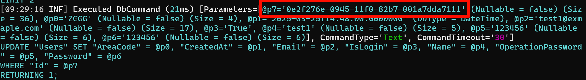

# Entity Framework Core 问题排查

> 2026-09 治理拆分：问题类内容（`Update`/并发/上下文生命周期/ABP 仓储实践/外键/继承/`ChangeTracker`）自 [EntityFrameworkCore](EntityFrameworkCore.md) 拆出；并合入 [Programming/故障排查](../../故障排查.md) 的 `EFCore` 条目（原处改为索引+链接）。

## Update 行为

`Update` 方法会将传入的实体的状态设置为 `Modified`，但它只会处理根实体。`EF Core` 不会自动递归地将所有关联的子实体状态也设置为 `Modified`。

> 实测发现会标记`[Own]`的实体为`Modified`  (有时候又没标记了？？)

`Update` 方法会更改所有实体数据为当前状态，所以一般用于`Disconnected Entity`的设置。

[Modifying data via tracked entities | Learn EF Core](https://www.learnentityframeworkcore.com/dbcontext/modifying-data)

### DbUpdateConcurrencyException

`The database operation was expected to affect 1 row(s), but actually affected 0 row(s).`

问题可通过`EFCore`生成的SQL语句进行排查，**可能实际上使用的SQL语句不一定就是真正执行的SQL**（详见Sqlite的问题）。
1. 一般是因为Update操作时，此数据不存在。此数据可能已经被删除或已经被Update而无法匹配上。
也有可能是需要Add的操作，错误的使用了Update方法。
2. 还有就是SQL语句生成了并发检查相关的问题

其实最根本的原因就是生成的Update SQL语句Where条件不匹配，找不到要更新的数据，然后判断EffectRow不一致。

### AbpDbConcurrencyException

`ConcurrencyStamp`原理是生成SQL语句时带上`ConcurrencyStamp=@old`，然后更新时更新为新的，如果失败证明数据库那边已经被其他修改了（证明版本不一致）。

其他可能：
1. 因为令牌在`AbpContext` `SaveChanges`时进行修改，若这次进行保存数据库失败，下次再进行修改，则也会抛出该异常。
2. 一次请求，A微服务需要修改，A调用B，B恰好也去修改状态，这时候A再进行修改则会取出旧令牌匹配。（逻辑上是串行，其实没有问题）

#### 修改令牌
`GetAsync()`查出的实体实例被修改后，然后又重新多次查询相关实例并客户端侧修改，即使没有使用 `Update` 等方法也会导致并发异常。（这里是同事写了个递归函数）
初步判断应该是令牌修改是ABP客户端侧判断，而非交给数据库判断，然后多次查询修改时发现令牌不匹配，直接在客户端侧触发并发修改异常。

只读查询功能似乎要额外设置。具体看 `GetAsync()`设置。

#### 多线程触发
领域事件中`UpdateAsync`产生`AbpDbConcurrencyException`问题。最后发现其实就是多线程并发异常。眼光不能局限在某个服务，这次是事件多次触发，Redis拿到旧的数据导致的

[abpframework/abp AbpDbContext.cs #L347 (sourcegraph)](https://sourcegraph.com/github.com/abpframework/abp@4f6426add5b69bfb273f601b1ddd9f1f89099a72/-/blob/framework/src/Volo.Abp.EntityFrameworkCore/Volo/Abp/EntityFrameworkCore/AbpDbContext.cs?L347:17&popover=pinned)

[abpframework/abp AbpDbContext.cs #L520 (sourcegraph)](https://sourcegraph.com/github.com/abpframework/abp@4f6426add5b69bfb273f601b1ddd9f1f89099a72/-/blob/framework/src/Volo.Abp.EntityFrameworkCore/Volo/Abp/EntityFrameworkCore/AbpDbContext.cs?L520:28&popover=pinned)

[处理并发冲突 - EF Core | Microsoft Learn](https://learn.microsoft.com/zh-cn/ef/core/saving/concurrency?tabs=data-annotations)

### SQLite相关问题

遇到一个更新用户数据失败问题，随便修改某个字段都会报错。而从`EFCore`的SQL语句也没法看出问题：


`SQLite`对于`GUID`字段的存储是TEXT，是大小写敏感的，但是C# `GUID`对象是大小写不敏感的，日志默认`ToString`是小写的。又因为`EFCore`对于的`GUID`类型生成的SQL是使用大写生成的，所以匹配不上导致更新失败。

> 不要被程序生成的参数列表误导了，这里的参数日志是格式化的程序guid，不是真正的sql参数

相关issues:
[SQLite: Lower-case Guid strings don't work in queries · Issue #19651 · dotnet/efcore](https://github.com/dotnet/efcore/issues/19651)
[Issue with uppercase/lowercase GUID · Issue #25043 · dotnet/efcore](https://github.com/dotnet/efcore/issues/25043)

SQLite解决方案：

```csharp
builder.Property(p=>p.Id).HasConversion(new GuidToStringConverter());
```

## 上下文生命周期

### A second operation was started on this context instance
同一个依赖注入的类的多个仓储共用一个`DbContext`（待确认），因此无法同步执行。**注意异步方法的调用，是否都进行了`await`**。注意入口方法是否是`void`忘记等待。

#### Cannot access a disposed context instance.

>  A common cause of this error is disposing a context instance that was resolved from dependency injection and then later trying to use the same context instance elsewhere in your application.

Repository中的`DbContext`不可以`using`，直接交由ABP框架管理生命周期。
```csharp
await using var context = await _repository.GetDbContextAsync(); //导致错误
//直接使用
var context = await _repository.GetDbContextAsync();
```

### 数据库更新操作异常catch后，在catch块外继续更新别的也会出现异常

实体标记为modified，更新异常后 tracking仍然标记未改变，SaveChanges时仍会导致异常。

## ABP仓储层

### UpdateManyAsync

如果开启跟踪，`UpdateMany`不论怎么传入都将将所有改变的实体进行保存。

```csharp
var list = repo.GetQueryableAsync(); //.. where .. ToList(); 假设返回100个实体
list.Foreach(p=>p.Name = "XX");
repo.UpdateManyAsync(list.Take(20));
```

其中，80个实体将采用如下
```sql
- 其中80个
Update XX SET Name = "XX"

- 其中20个是完整的语句
Update Column1 ... SET Column1...

```

ABP的`UpdateMany`的实现是通过
```csharp
dbContext.Set<TEntity>().UpdateRange(); 
```
批量设置Entity的State为`Modified`。性能较更改跟踪可能更慢。

### GetDbContextAsync
在同一个上下文获取出来的似乎是同一个`DbContext`
所以`SaveChanges`也可以有效。如上面的例子
```csharp
var list = repo.GetQueryableAsync(); //.. where .. ToList(); 假设返回100个实体
list.Foreach(p=>p.Name = "XX");
var context = repo.GetDbContextAsync();
context.SaveChanges(); //可以成功保存。
```

## 外键问题

### 自动生成了Shadow state property

在配置一对多关系的时候，误写成了如下配置：
```csharp
builder.HasOne<Role>().WithMany().HasForeignKey(p => p.GroupId);
```
导致会自动生成`RoleId`列。
应写为：
```csharp
builder.HasOne(p=>p.Role).WithMany().HasForeignKey(p => p.GroupId);
```

### 更新导航属性

[Changing Foreign Keys and Navigations - EF Core | Microsoft Learn](https://learn.microsoft.com/en-us/ef/core/change-tracking/relationship-changes)

因为`EFCore`提供两种方式更新，一种是用导航属性，如`Reference navigation`及`Collection navigation`，即一个是对一的，一个是对多的实体。另外一种方式是操作外键，这种需要显式定义外键并配置才能操作。

只用一种方式更新关系：

> Do not write code to manipulate all navigations and FK values each time a relationship changes. Such code is more complicated and must ensure consistent changes to foreign keys and navigations in every case. If possible, just manipulate a single navigation, or maybe both navigations. If needed, just manipulate FK values. Avoid manipulating both navigations and FK values.

## 继承关系
在`EF Core`中，当实体类之间存在继承关系并使用`TPH`（`Table-Per-Hierarchy`）映射策略时，会自动生成`Discriminator`列。该列用于区分同一表中不同类型的实体，该列的值表示每一行对应的具体实体类型（如基类名或子类名）。
继承关系有多种映射策略，如`Table-Per-Hierarchy`，`Table-Per-Type`等。

如果发现自动生成了`Discriminator`列，一般是因为将基类和子类添加到了当前`DbContext`，如`DbSet<BaseEntity>`，或通过`IEntityTypeConfiguration`自动注册进来的实体。

## 更新与 ChangeTracker

### ChangeTracker

`ChangeTracker`判断更新的原理是在调用`ChangeTracker.Entries()`（内部调用了`ChangeTracker.DetectChanges`）时会与`Originally`值进行对比，如果值不一致才会刷新状态是`Modified`，否则将还是`UnChanged`。
只有开启了跟踪才会变为`Unchanged`状态，也就是正在跟踪，此时的状态进行修改属性会记录下`Original`值。否则是为`Detached`状态，不会进行变化。但有其他方式将`Detached`状态转为其他跟踪状态（待补充），如`Remove`、`Update`等操作。

在实现CDC时发现删除操作未能成功执行（因为CDC是将当前状态要更新到数据库，当前状态已经是`IsDeleted`），`ChangeTracker`发现最后因为软删除置为`Unchanged`后`SaveChanges`时会调用一次`ChangeTracker.Entries()`计算值是否变化， 计算结果为`Unchanged`。

```csharp
public override async Task DeleteManyAsync(IEnumerable<TEntity> entities, bool autoSave = false, CancellationToken cancellationToken = default)
{
    var entityArray = entities.ToArray();
    if (entityArray.IsNullOrEmptySet())
    {
        return;
    }
    
    var dbContext = await GetDbContextAsync();

    dbContext.RemoveRange(entityArray.Select(x => x));

    if (autoSave)
    {
        await dbContext.SaveChangesAsync(cancellationToken);
    }
}

protected virtual void ApplyConceptsForDeletedEntity(EntityEntry entry)
{
    if (entry.Entity is not IHasSoftDelete entity)
    {
        return;
    }

    entry.State = EntityState.Unchanged;
    entity.IsDeleted = true;

    //ObjectHelper.TrySetProperty(entry.Entity.As<IHasSoftDelete>(), x => x.IsDeleted, () => true);
    SetDeletionAuditProperties(entry);
}
```

实际上还可以使用`entry.Reload();`来计算当前状态，原理是先从数据库重新刷新当前实体值，变为`Unchanged`跟踪状态，然后进一步修改`IsDeleted`触发计算为`Unchanged`。但这里采用直接置`entry.State = EntityState.Unchanged`，可以增强性能，但对于CDC场景会失效，因为本身`Originally`就是`IsDeleted`，最终计算还是`Unchanged`，导致无法触发更新。这种软删除的场景可以转为使用`Update`。

还有`Attach()`方法可以标记实体为`Unchanged`状态，即认为当前实体已经在数据库存在（`Originally`标记当前值），然后后续修改都可以被跟踪为`Modified`，就仅更新已更新的字段。

## 模型与映射异常

> 以下条目由 [Programming/故障排查](../../故障排查.md) 的 `EFCore` 章并入（2026-09 治理去重）。

### 发现增加条目时某个字段未被算上

1. `property` 是 `{get;}` 只读字段，它不算上。可以加上 `private set;`

### `System.InvalidOperationException`: The property 'Flight.Id' has a temporary value while attempting to change the entity's state to 'Modified'. Either set a permanent value explicitly, or ensure that the database is configured to generate values for this property.

可能 `Id` 是 `0`，然后调用的是 `Attach`、`Update` 方法，导致无法匹配上。

### The instance of entity type cannot be tracked because another instance with the same key value

[The instance of entity type cannot be tracked because another instance with the same key value for { 'ID'} is already being tracked. · Issue #28822 · dotnet/efcore](https://github.com/dotnet/efcore/issues/28822)

`DbContext` 在整个生命周期 `Scope` 内进行追踪。
在使用 `ABP` 仓储时，也是整个事务为一个范围，所以在两个方法里面查出同一个实体进行更新后再去数据库查相同的实体再更新就会出现此异常。

另外还有一种可能是 `Mapster` 的 `Map` 问题，如果 `Map` 中包含 `ID` 映射的，会将 `ChangeTrack` 中变为 `Not found`，特别是映射嵌套类的时候。所以需要 `IgnoreID` 列。具体原因待查。


### 枚举类型从数据库查出来只有0和1

发现同事在 `mysql` 数据库中的类型是 `tinyint 1`，虽然在数据库这边值正确，但在EFCore这边值只在0和1之间徘徊，改成 `int` 类型后正常。
