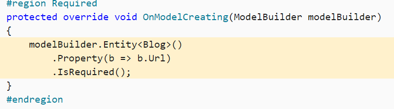
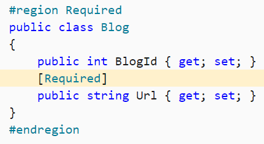
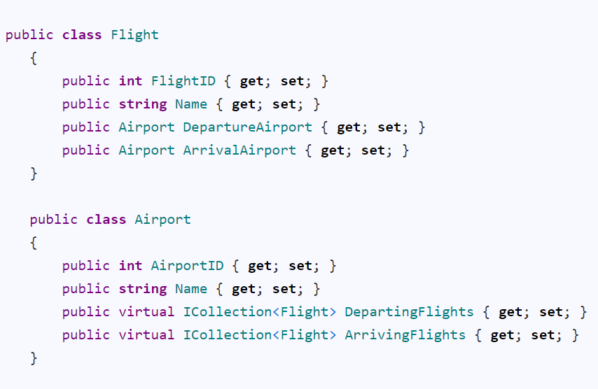
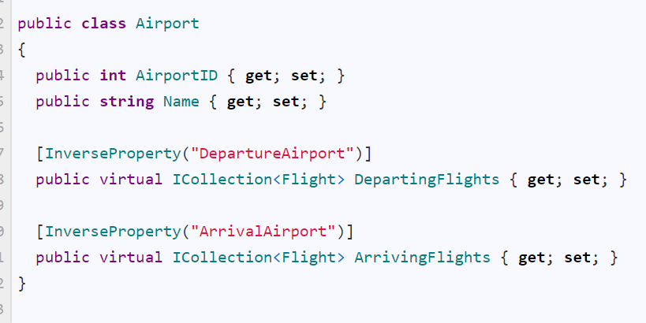
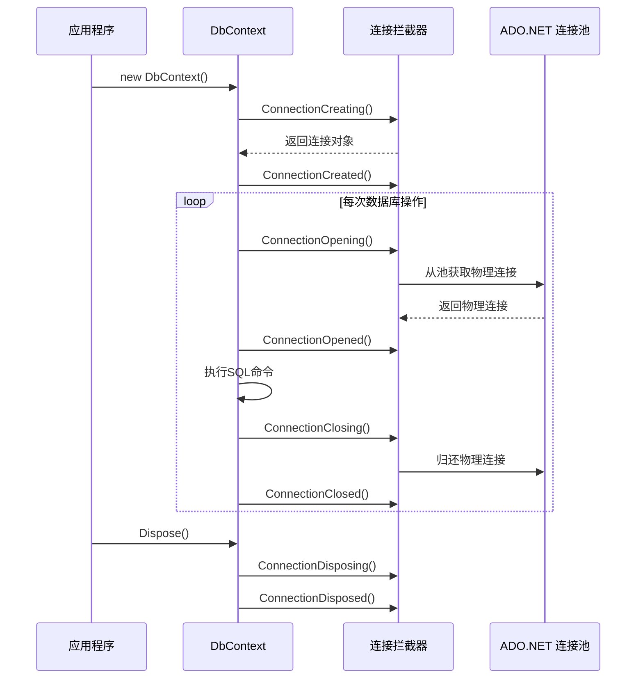

# Entity Framework Core

> 2026-09 治理拆分：问题排查类内容（`Update`/并发异常/上下文生命周期/ABP 仓储实践/外键/继承/`ChangeTracker`/模型映射异常）已拆至 [EntityFrameworkCore-问题排查](EntityFrameworkCore-问题排查.md)，本文件保留基础知识。

`ORM`（`Object Relational Mapping`）框架

注意MySQL数据库不能用`MyISAM`，需要用`InnoDB`，不然不支持外键和事务等，发挥不了EF的效果

## 依赖注入

### DbContext依赖注入

[dbcontext-factory-improvements](https://learn.microsoft.com/en-us/ef/core/what-is-new/ef-core-6.0/whatsnew#dbcontext-factory-improvements)

`IDbContextFactory<SomeDbContext>` contextFactory

这种注入的适合`Actor`等，需要用 
```csharp
using var context1 = _contextFactory.CreateDbContext();
```

注册需要这样：

```csharp
builder.Services
    .AddDbContextFactory<FlightContext>(options => options.UseMySql(connectionString, version))
    .BuildServiceProvider();
```

简单的可以直接用

```csharp
builder.Services.AddDbContext<FlightContext>(
    options => options.UseMySql(connectionString, version));
```

这种在`constructor`内就直接用`FlightContext`即可（适用于`Controller`）

## 配置

### 加载关联数据

#### Lazy loading延迟加载

### 字段配置

By convention, all public properties with a getter and a setter will be included in the model.

默认只会映射含有`get`、`set`字段的`public`属性。

### 模型配置

配置有两种配置方式，一种是使用`fluentAPI`配置，另一种是对模型使用`Attribute`。

#### fluentAPI

可在派生上下文中覆写 `OnModelCreating` 方法，并使用 `ModelBuilder API` 来配置模型。 此配置方法最为有效，并可在不修改实体类的情况下指定配置。 `Fluent API` 配置具有最高优先级，并将替代约定和数据注释。



#### 数据注释（特性）

也可将特性（称为数据注释）应用于类和属性。 数据注释会替代约定，但会被 `Fluent API` 配置替代。



以上两图两者等价，择一配置。

| Fluent API                                                                                              | 数据注释                                                  | 说明                                                                                                                                                                                                                                                                                    |
| ------------------------------------------------------------------------------------------------------- | ----------------------------------------------------- | ----------------------------------------------------------------------------------------------------------------------------------------------------------------------------------------------------------------------------------------------------------------------------------------------------------------------------------------------------------------------------------------------------------------------------------------------------------------------------------------------------------------------------------------------------------------------------------------------------------------------------------------------------------------------------------------------------------------------------------------------------------------------------------------------------------------------------------------------------------------- |
| IsRequired()                                                                                            | `[Required]`                                            |                                                                                                                                                                                                                                                                                       |
| `.HasKey(c => c.xxxxx)`                                                                                  | `[Key]`                                                 | 此键映射到关系数据库中主键的概念                                                                                                                                                                                                                                                                      |
| `.HasKey(c => new { c.xxx1, c.xxx2 }`                                                                    | 无                                                     | 组合键，只能用`fluent api`配置。                                                                                                                                                                                                                                                                |
| `.HasPrincipalKey(b => b.xxx)`                                                                           |                                                       | `Principal key`：The properties that uniquely identify the principal entity. This may be the primary key or an alternate key.                                                                                                                                                          |
| `.HasAlternateKey(c => c.xxx);`                                                                          |                                                       | 除了主键外，备用键还可用作每个实体实例的替代唯一标识符;它可用作关系的目标。 使用关系数据库时，这将映射到备用键列上的唯一索引/约束和引用列的一个或多个外键约束的概念。支持组合键。                                                                                                                                                                                            |
| `HasXXXKey(xxxxx).HasName("xxxx")`                                                                        |                                                       | 配置xxxx约束的名称。                                                                                                                                                                                                                                                                          |
| `.IsConcurrencyToken()`                                                                                   | `[ConcurrencyCheck]`                                    | 并发标记                                                                                                                                                                                                                                                                                  |
| `.HasOne(p => p.Blog).WithMany(b => b.Posts);`                                                          | `[InverseProperty("映射到引用的实体类型的反向导航属性的nameof")]`         | 显式声明反向导航属性（因为有多个同一个类型的导航属性的时候，映射到哪个反向导航属性是二义性的，需要进行显式配置） `HasOne`、`HasMany`是指明配置自己实体类上的引用的导航属性（即对方），`WithOne`、`WithMany`是指明引用的实体类型的反向导航属性（即自身） 逻辑即：我（`Post`）有一个对应的`Blog`（可导航过去），这个`Blog`有很多`Post`（通过这个`Blog`找到`Post`，即自己，叫反向导航，是相对于这个模型而非某个字段而言的）                                     |
| `.HasMany(b => b.Posts).WithOne();`                                                                      |                                                       | 只有导航属性，没有反向导航属性；即导航属性那个类没有自身的引用                                                                                                                                                                                                                                                       |
| `.HasForeignKey(p=>p.BlogForeignKey);` `.HasForeignKey(s => new { s.CarState, s.CarLicensePlate });`（组合键） | `[ForeignKey("BlogForeignKey")]`（仅支持简单键）                | 指明当前多对多/一对多/多对一/一对一的关系的导航属性的外键是根据(依赖)哪个(或多个)属性 注意在`one-to-one`的关系中需要显式配置外键 如果前面使用了只有导航属性没有反向导航属性的，那么`HasForeignKey`无法自动推断，需要使用`HasForeignKey<T>`的泛型形式                                                                                                                                 |
| `HasPrincipalKey(p => p.Id);`                                                                            |                                                       | 指明当前多对多/一对多/多对一/一对一的关系的主键，与外键相应，即这边的外键映射到那边的主键，本来外键默认对应是那边的`Primary Key`，但是可以换成这设定的`Principal Key`。 PS：当该关系所映射的主键与本身表主键设置不一致时才需要指明。                                                                                                                                                   |
| `.OnDelete(DeleteBehavior.Cascade);`                                                                      |                                                       | 配置级联删除                                                                                                                                                                                                                                                                                |
| `.Ignore(b=>b.LoadedFromDatabase)`                                                                       | `[NotMapped]`                                           | 排除一个属性                                                                                                                                                                                                                                                                                |
| `.Property(b=>b.BlogId).HasColumnName("blog_id");`                                                       | `[Column("blog_id")]`                                   | 默认情况下是映射与字段名一致的属性，不一致要指明列名                                                                                                                                                                                                                                                            |
| `.HasColumnType("decimal(5, 2)")`                                                                         | `[Column(TypeName = "decimal(5, 2)")]`                  | 按照数据库的类型方式标注类型                                                                                                                                                                                                                                                                        |
| `.ToTable("blogs")`                                                                                       | `[Table("blogs")]`                                      | 指定映射的数据库表名                                                                                                                                                                                                                                                                            |
| `.ToTable("blogs", schema: "blogging")`                                                                   | `[Table("blogs", Schema = "blogging")]`                 | 指定映射的数据库表的视图名                                                                                                                                                                                                                                                                         |
| `.HasDefaultValue(x)`                                                                                     |                                                       | 指定某个属性有默认值                                                                                                                                                                                                                                                                            |
| `.HasDefaultValueSql("getdate()")`                                                                        |                                                       | 指定某个属性有默认值（用的sql里面的默认值）                                                                                                                                                                                                                                                               |
| `.ValueGeneratedOnAddOrUpdate()`                                                                          | `[DatabaseGenerated(DatabaseGeneratedOption.Computed)]` | This just lets EF know that values are generated for added or updated entities, it does not guarantee that EF will setup the actual mechanism to generate values.                                                                                                                     |
| `.HasComputedColumnSql("[LastName] + ', ' + [FirstName]")`                                                |                                                       | Computed columns In some cases, the column's value is computed every time it is fetched (sometimes called virtual columns), and in others it is computed on every update of the row and stored (sometimes called stored or persisted columns). This varies across database providers. |

术语：

`Post.Blog` is a reference navigation property（引用导航属性，是一个）

`Blog.Posts` is a collection navigation property（集合导航属性，是多个）

`Post.Blog` is the inverse navigation property （反向导航属性）of `Blog.Posts` (and vice versa 反之亦然) 是两者之间的关系，能相互导航过去

显式指明导航属性，有冲突的情况：





#### EFCore跟踪修改

//如果直接使用user则会报错，似乎是因为user也是从KouContext中取出来的，ef认为被修改了，没有取消跟踪。

如果一个Model中的外键对象是用的之前从context中取出的模型而被修改，则会报错，可能是因为不能同时修改外键对象又增加Model。只能从context中取出最新的外键对象然后加到Model中，才可绑定。

### 日志排查

```csharp
optionsBuilder.LogTo(Console.WriteLine);
options.EnableSensitiveDataLogging();
```

### 注意事项

#### 在Context内就SaveChanges

比如blog和posts的关系，首先需要`blog.Incloude(p=>p.posts)`

在两个context下进行修改时，会出现问题。

比如在第一个context中

将`Blog.Posts = new List<Post>();`了

然后将这个Blog对象传到另一个Context中，

```csharp
context.Blog.Update(blog);
```

这里将不会自动trace Blog原有的post，都会当作新的Post加入到表中。

#### Equal重写

重写后的Equal在EFCore的linq to sql中似乎没有用（是使用的设定的候选键对比而不是override之后的），必须转换为Client Evaluation才有效。

EFCore的`Single`、`Update`、`Delete`等等都是通过设定的候选键，而非重写后的Equal。

#### Parameterized constructor

`Navigator property`不会被认为是entity的property，可以使用private constructor，做个无参constructor.

另外如果其他的property无法映射，需要build设置 property 指明它是entity的property.

#### Backing Field

Starting with EF Core 3.0, if the backing field for a property is known, then EF Core will always read and write that property using the backing field. This could cause an application break if the application is relying on additional behavior coded into the getter or setter methods.

即，如果有Name这个property且有_name，会自动的找到它的_name这个Backing Field（需要满足条件才可以自动找到，[Backing Fields - EF Core | Microsoft Learn](https://docs.microsoft.com/en-us/ef/core/modeling/backing-field)），然后读写它而不是通过property的get或者set property。所以如果需要property的读写逻辑，则需要

```csharp
modelBuilder.UsePropertyAccessMode(PropertyAccessMode.PreferFieldDuringConstruction);
```

By default, EF will always read and write to the backing field - assuming one has been properly configured - and will never use the property. However, EF also supports other access patterns. For example, the following sample instructs EF to write to the backing field only while materializing, and to use the property in all other cases:

即，只在初始化阶段使用field。

### 反向工程

自动根据已设计好的数据库信息生成model类以及dbContext

```powershell
Scaffold-DbContext -Connection "Server=127.0.0.1;User Id=root;Password=root;Database=kou;" -Provider MySql.Data.EntityFrameworkCore -OutputDir Models/EFTemp -DataAnnotations -Project Koubot.SDK -force -Verbose -Tables system_global_setting,system_alias_list,system_plugin_enable_setting
```

如果build failed是因为整个解决方案无法build，说明有错误，要解决这些错误然后重新生成解决方案才可以进行反向工程

`DataAnnotations` 这个是生成自动生成model字段的attribute的

`force`是覆盖已经存在的文件的

`outputDir`是生成的文件路径

`Provider` mysql那个是provider

`Verbose` 显示详细

`Tables` 是指定表名（一般更新的时候用）

连接字段是`connection`

详细见：[EF Core 工具参考 - Package Manager Console | Microsoft Learn](https://docs.microsoft.com/zh-cn/ef/core/miscellaneous/cli/powershell)

框架默认具有公共getter和setter的属性会被包括在模型中，可以用NotMapped排除

```csharp
public class Blog  
{  
    public int BlogId { get; set; }  
    public string Url { get; set; }  
  
    [NotMapped]  
    public DateTime LoadedFromDatabase { get; set; }  
}
```

### Migration
| Terminal | 操作 | 解释 |
|------------------------------------------------------------------------------------------------------------------------------------|--------------------------------------------------------------------------------------------------------------------------|---------------------------------------------------------------------------------------------------------------------------------------------------------------------------------------------------------------------------------------------------------------------------------------------------------------------------------------------------------------------------------------------------------------------------------------------------------------------------------------------------------------------------------------------------------------------------------------------------------------------------------------------------------------------------------------------------------------------------------------------------------------------------------------------------------------------------------------------------------------------------------------------------------------------------------------------------------------------------------------------------------------------------------------------------------------------------------------------------------------------------------|
| `dotnet ef migrations add <Alter Operation Name>` | `Add-Migration <Alter Operation Name>` | 每次操作变动需要Add Migration，相当于git中的commit。 `-Project Project.Name` 来指定Target project，当然可以直接在Default Project中选择。Target project实际上是Migration所在Assembly，默认是在Context所在Assembly下，可以通过`DbContextOptionsBuilder`中设置`MigrationsAssembly`，分离Migration到其他项目（Migration所在项目必须是Class Library） 似乎第一次Migration无法识别，需要先在Context项目上生成一次，然后直接复制Migration文件到Migration项目。然后也可以随意更改生成的namespace，下次migrate会自动识别。 默认需要一个启动项目，先获取到Context对象，然后进行模型对比映射，得出变更，进而生成Migration文件。 启动项目是Console或asp.net core等项目，可以通过自定义一个启动入口类，管理启动项目获取到的Context对象是如何构造的：`IDesignTimeDbContextFactory<FlightContext>`  至于terminal中的，需要先移动到启动的项目文件夹下，然后使用`--project`来指定migration项目 |
| `dotnet ef database update` | `Update-Database` | 操作变动后需要同步到数据库，相当于git中的push |
| | `Update-Database [ToSpecificState]` | 可以将数据库回滚到特定的Migration状态 |
| `dotnet ef migrations remove` | `Remove-Migration` | 移除最新一次的Add Migration操作 |
| `dotnet ef migrations script` | `Script-Migration` | 需要到生产环境时，使用该命令进行同步修改 |
| `dotnet ef migrations script AddNewTables AddAuditTable` | `Script-Migration [AddNewTables] [AddAuditTable]` | 生成从指定migration状态到指定migration状态的修改SQL语句 |
| `dotnet ef migrations list` | `Get-Migration` | list all existing migrations |
| `dotnet ef dbcontext scaffold "Data Source=(localdb)\MSSQLLocalDB;Initial Catalog=Chinook" Microsoft.EntityFrameworkCore.SqlServer` | `Scaffold-DbContext 'Data Source=(localdb)\MSSQLLocalDB;Initial Catalog=Chinook' Microsoft.EntityFrameworkCore.SqlServer` | Reverse Engineering 反向工程 DB First  `-Tables Artist, Album`可以指定仅反向给定表名  `-Force` 需要重新进行反向工程  `-Context` 指定Context |


## 数据库连接池 (以下待测试)
### DbContext 生命周期与连接事件详解

（基于 EF Core 的 `IDbConnectionInterceptor` 事件定义）

---

#### **1. 连接创建阶段**

- **`ConnectionCreating`**

    - **触发时机**：EF Core 即将创建 `DbConnection` 对象时（仅当未显式提供连接时）
    - **可操作**：可修改或替换连接创建逻辑（通过 `InterceptionResult<DbConnection>`）
    - **典型场景**：动态生成连接字符串、注入代理连接对象
- **`ConnectionCreated`**

    - **触发时机**：`DbConnection` 实例创建完成后
    - **可操作**：对新建连接进行初始化（如设置超时时间）

---

#### **2. 连接打开阶段**

- **`ConnectionOpening`（同步）/ `ConnectionOpeningAsync`（异步）**

    - **触发时机**：在 `DbConnection.Open()` 执行前
    - **关键控制**：
        - 通过 `InterceptionResult.Suppress()` **阻止默认打开操作**
        - 返回修改后的 `InterceptionResult` 影响 EF Core 行为
    - **典型场景**：实现自定义连接池、链路追踪
- **`ConnectionOpened`（同步）/ `ConnectionOpenedAsync`（异步）**

    - **触发时机**：连接**物理打开完成后**（TCP 连接已建立）
    - **可操作**：记录连接打开时间、更新状态监控

---

#### **3. 连接关闭阶段**

- **`ConnectionClosing`（同步）/ `ConnectionClosingAsync`（异步）**

    - **触发时机**：在 `DbConnection.Close()` 执行前
    - **关键控制**：
        - 可通过 `InterceptionResult.Suppress()` **阻止默认关闭操作**
        - 需确保正确处理资源释放
    - **典型场景**：维护长连接、连接复用策略
- **`ConnectionClosed`（同步）/ `ConnectionClosedAsync`（异步）**

    - **触发时机**：连接**物理关闭完成后**（TCP 连接已断开）
    - **注意**：此事件仅表示**底层连接关闭**，连接对象可能仍未释放

---

#### **4. 连接释放阶段**

- **`ConnectionDisposing`（同步）/ `ConnectionDisposingAsync`（异步）**

    - **触发时机**：在 `DbConnection.Dispose()` 执行前
    - **关键区别**：
        - `Dispose()` 会**完全销毁连接对象**（非物理关闭，而是对象生命周期结束）
        - 拦截后可取消释放（例如实现对象池）
- **`ConnectionDisposed`（同步）/ `ConnectionDisposedAsync`（异步）**

    - **触发时机**：连接对象**完成释放后**
    - **典型场景**：资源泄露检测、对象池回收

---

#### **5. 异常处理事件**

- **`ConnectionFailed`（同步）/ `ConnectionFailedAsync`（异步）**

    - **触发时机**：连接打开或关闭过程中**抛出未处理异常**时
    - **典型用途**：记录错误日志、重试策略

---

### 🔁 连接池与事件的关系

1. **连接对象 vs 物理连接**

    - 事件中的 `DbConnection` 是**逻辑连接对象**
    - 底层物理连接由 ADO.NET 连接池管理（透明于 EF Core）
2. **连接池行为**

    - 当 `ConnectionClosed` 触发时：
        - **物理连接归还连接池**（未销毁，可复用）
    - 当 `ConnectionDisposed` 触发时：
        - **连接对象被销毁**，但底层物理连接仍可能驻留池中
3. **性能优化关键**

    - 高频创建/释放 `DbContext` 时：
        - 实际**重用池中的物理连接**（通过 `ConnectionClosed`→`ConnectionOpening` 循环）
        - 避免 `ConnectionCreating` 和 `ConnectionDisposing` 高频触发

---

### 生命周期流程图



---

## Monica / FIPS2022 补充

### 查询、分页与分片

- Monica `MoAbstractKeyCrudAppService`：`Include` 在 `EF Core 8` 下可能触发自动 `SplitQuery`；再叠加 `Skip/Take` 时必须补稳定排序，最好带唯一键兜底。
- Monica `MoAbstractKeyCrudAppService`：连续 `OrderBy` 的最终效果取决于 provider 翻译，`PgSQL` 一类 provider 可能只保留最后一次排序；追加排序优先用 `ThenBy`。
- Monica `MoAbstractKeyCrudAppService`：分表分页前必须先排序；若 `Select` 后把排序字段裁掉，分片聚合后可能退回内存排序并直接失败。
- Monica `MoAbstractKeyCrudAppService`：`DisableSoftDeleteFilter` 在分表场景可能失效，查已删数据时要单独验证最终 SQL。
- Monica `MoAbstractKeyCrudAppService`：若 DTO 已声明子表字段，`ProjectToType` 可能已把关联数据带出，额外 `Include` 往往只是放大查询。

### 跟踪、状态与保存

- Monica `MoRepository`：实体状态通常在 `ChangeTracker.Entries()` 或 `DetectChanges()` 时刷新；若刷新后发现值与原值一致，会回到 `Unchanged`，所以“删同步 / CDC 风格更新”未必会被判成 `Modified`。
- Monica `MoDbContext`：想在日志里看到真实参数值，`EnableSensitiveDataLogging` 需要放在 `OnConfiguring`，放在别处可能不生效。
- Monica `MoDbContext`：`ABP 8.0.2` 的相关变更判断漏掉了 `ValueGenerated.OnAdd`，依赖该判断发布事件或审计时要自行补齐。
- Monica `MoAuditPropertySetter`：审计或删除属性设置阶段不要再触发依赖同一 `DbContext` 的数据库访问，否则容易出现第二个并发操作异常。

### 事务、分片与 Provider 差异

- FIPS2022 `SqlConfig`：`EnableRetryOnFailure` 可能与分片状态管理器创建的用户事务冲突；要么改用执行策略包裹事务，要么不要直接开启。
- FIPS2022 `DbContextBuilderExtensions`：`EF Core 8` 虽支持对未映射类型做 `SqlQuery`，但接入 `IShardingTable` 等分片组件后可能重新要求类型进入模型。
- FIPS2022 `OurDbContext`：分片保存链路可能重复进入保存前逻辑，需要做重入保护，避免同一轮保存被二次处理。
- FIPS2022 `OurBackgroundJob`：后台任务里显式开启 `UnitOfWork` 后，最终仍要 `CompleteAsync`，否则事务不会真正提交。
- FIPS2022 `DomainMatchFlight`：`PgSQL` 对 `DateTime.Now` 的翻译依赖数据库时区；应用时区和库时区不一致时，筛选条件会静默偏移。

### 模型配置与批量更新

- FIPS2022 `InMessage`：列名或列类型配置对“无可写 setter 的属性”不一定按预期生效，封装型属性要先验证最终模型。
- FIPS2022 `InMessage`：`Owned Type` 目前不适合直接承担跨宿主字段的联合索引，`HasIndex` 能力有限，设计上尽量摊平或改成独立实体。
- FIPS2022 `SeederAlarmCodePermissions`：已跟踪实体本身会自动识别差异；`Update`、`UpdateRange`、`UpdateMany` 属于强制标记 `Modified`，会放大更新面。
- FIPS2022 `DomainEventHandlerEventAlterFlight`：如果缺少 `UnitOfWork`，很容易误以为 `ChangeTracker` 失效；先确认是否处在正确的工作单元边界内。
