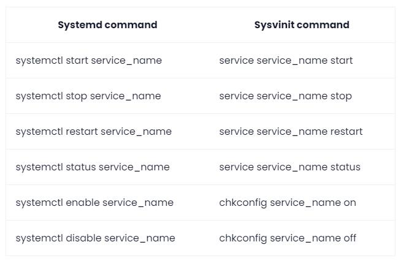

# Kali

> 治理留痕（2026-09-30）：本文件由原 `SoftwareManual/WSL.md` 的 `# Kali` 章拆分而来。原稿见 [_archive/SoftwareManual/WSL-原稿](../_archive/SoftwareManual/WSL-原稿.md)。
> 本次格式修复：裸外链 `<https://...>` 改为带标题链接。

Kali（WSL 发行版）安装与 Win-KeX 图形界面。其中 cryptohack、bkcrack 等 CTF 工具的安装与使用另见 [CTF/Toolbox/工具清单](../CTF/Toolbox/工具清单.md)。

## 安装


```shell
wsl --update
wsl --install -d kali-linux

# 安装好后会新建用户，但不能是root
sudo su # 然后切换到root用户，用本用户密码
passwd root # 修改root用户密码
```

[Kali 桌面版安装（CSDN）](https://blog.csdn.net/tabactivity/article/details/125875242) 桌面版

`locale` 可以查看当前配置的语言环境

dpkg-reconfigure locales

下载语言包，默认Debian的语言包不是UTF-8格式的，所以中文会显示乱码。

可以下载英文UTF-8语言包，也能显示中文

默认JAVA安装在/usr/lib/jvm/目录下
### python环境

用Kex的包安装全套kali后，已经带有python3与python2，
默认`python`指向python3，而python2并不带`pip`

因此还要进行pip2的安装：
`wget https://bootstrap.pypa.io/pip/2.7/get-pip.py`

当分不清pip时，可以采用该命令：
`python2 -m pip ` 进行调用pip

### 问题

#### libcrypt.so.1: cannot open shared object file when upgrading from Stretch to Sid

[debian-bugs-dist 邮件列表相关讨论](https://www.mail-archive.com/debian-bugs-dist@lists.debian.org/msg1818037.html)

```shell
$ cd /tmp
$ apt -y download libcrypt1
$ dpkg-deb -x libcrypt1_1%3a4.4.25-2_amd64.deb  .
$ cp -av lib/x86_64-linux-gnu/* /lib/x86_64-linux-gnu/
$ apt -y --fix-broken install
```

#### linux vim 上下左右只会出现ABCD

``` sh
$sudo apt-get remove vim-common
$sudo apt-get install vim
```

#### System has not been booted with systemd as init system
原因是你想用systemd命令来管理Linux上的服务，但你的系统并没有使用systemd，（很可能）使用的是经典的SysV init（sysvinit）系统。可以使用等效的命令：



## Kex

基于Windows WSL的一个kali linux GUI界面。

To switch to Windows when using Win-KeX in window mode, you can press the **F8** key to open the client's context menu, which allows you to manage the client sessions, such as closing the client, switching between full screen and window, etc. You can disconnect from active sessions by pressing **F8** -> **Exit viewer**, this will close the client but leave the session running in the background. You can re-connect to a session by typing `kex --win --start-client`¹.

I hope that helps!

Source: Conversation with Bing, 6/30/2023

> (1) [Win-KeX Window Mode | Kali Linux Documentation](https://www.kali.org/docs/wsl/win-kex-win/)
> (2) [Win-KeX | Kali Linux Documentation](https://www.kali.org/docs/wsl/win-kex/)
### 问题

#### root似乎不是真正的root，某些仍需要sudo

使用su之后，发生了微小的变化。

通过echo \$PATH可以证明两者不是同一个账户（？

这就导致了很多蜜汁问题。

比如如果不使用sudo kex去启动kex，是无法打开火狐浏览器的

不同的环境变量。

用的不同的bash和zsh造成的问题。

#### VNC问题

VNC是用来连接虚拟桌面的，Linux端用vncserver，然后windows端用vnc client去连接。

出现了一个黑屏问题...
发现用esm模式连不上，是黑屏。
可以去wsl里用`sudo kex`连上（这是windows模式），很奇怪。

记录下vnc的几个命令：

```sh
# 如果不用，删除该目录可能出现 Device or resource busy 的问题
umount /tmp/.X11-unix

# 删除vnc临时文件
sudo rm -rf /tmp/.X11-unix

# 尝试启动一个新 vnc 会话
vncserver

# 查看当前所有会话
vncserver -list

# 移除第几个会话
vncserver -kill :1

# 重新设置vnc密码
vncpasswd 
```
